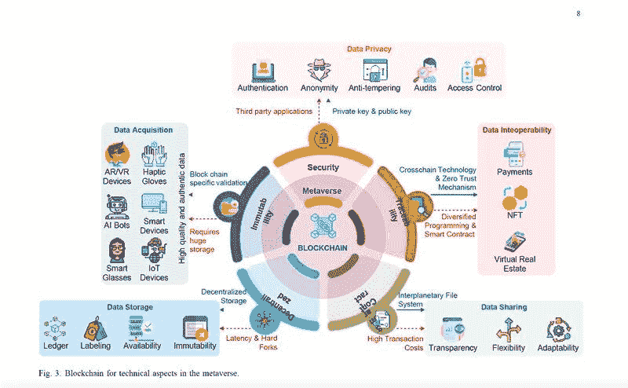

# 区块链——元宇宙的灵魂

> 原文：<https://medium.com/coinmonks/blockchain-the-soul-of-the-metaverse-1d93118182ca?source=collection_archive---------16----------------------->

为了实现互操作和互连的元宇宙的全部潜力，区块链技术是关键。

🔵我们今天看到的

📌在线视频会议

面对面的交流意义重大，人们 70%的表达来自肢体语言而非口头语言。代替在线缩放会议，人们可以利用友好的化身在元宇宙的虚拟空间中四处走动和工作。甚至肢体语言或眼神互动都可以用来从不同角度与工作伙伴交流，这将显著改善
远程办公。

📌数字地产
居住、投资、出租、买卖、娱乐、购物。

📌数字艺术

除了数字艺术的新用例，新兴的区块链技术也将传统艺术品从线下带到了线上。在元宇宙放置的虚拟画廊中，用户可以进入画廊全方位欣赏
。

📌前沿游戏，部分采用区块链技术

还有更多…

🔵区块链在元宇宙有什么作用？

一个用整个经济体系连接现实世界的虚拟世界。数字资产是
区块链提供的核心功能，如基于 ERC-20
的同质化令牌和基于 ERC-721 或 ERC-
1155 的非同质化令牌。

🎯 𝐛𝐥𝐨𝐜𝐤𝐜𝐡𝐚𝐢𝐧 𝐭𝐞𝐜𝐡𝐧𝐨𝐥𝐨𝐠𝐲 𝐢𝐬 𝐭𝐡𝐞 𝐬𝐨𝐮𝐥 𝐨𝐟 𝐭𝐡𝐞 𝐦𝐞𝐭𝐚𝐯𝐞𝐫𝐬𝐞.

📌确保数据隐私和安全

📌确保数据质量

📌实现无缝、安全的数据共享

元宇宙的成功依赖于 AR 和 VR 数据的无缝共享，这使得开发新的高级
应用程序有助于解决现实世界的问题。区块链的高级编码信息系统
使元宇宙的数据共享无缝且安全。

📌实现数据互操作性

由于构建这些虚拟世界的环境不同，它们之间的数据互操作性是有限的。使用跨链协议可以在不同的虚拟世界中的两个或多个区块链上交换数据。由于区块链的互操作性，用户可以更容易地在这些虚拟世界之间迁移。

📌确保数据完整性

元宇宙的数据必须保持一致和准确。如果数据的完整性受到损害，利益相关者可能会对元宇宙失去信心。由于区块链提供的不变性，元宇宙数据作为副本保存在整个链的每个块中，没有大多数参与者的同意，不能修改或删除。区块链的这种机制保证了元宇宙的数据完整性。

🔵有哪些用例？

📌财务系统:
📌智能合同部署
📌所有权

> 交易新手？试试[加密交易机器人](/coinmonks/crypto-trading-bot-c2ffce8acb2a)或者[复制交易](/coinmonks/top-10-crypto-copy-trading-platforms-for-beginners-d0c37c7d698c)