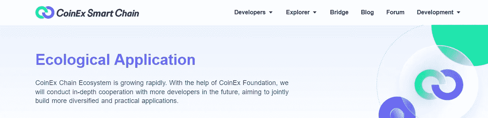

# 区块链工具

> 原文：<https://medium.com/coinmonks/blockchain-tools-36ba13e6c7be?source=collection_archive---------31----------------------->

## CSC 区块链开发工具

区块链由于其多功能性，不仅仅是加密货币。这是最具颠覆性和创新性的技术之一，是第一个永久性的分散记录分类账。这的确是记录系统的一场革命。根据 Upwork Q2 2018 年技能指数，区块链是该平台上增长最快的技能。

CSC 正在推动区块链基础设施的转型，以及 DeFi 等应用生态系统的扩展。毕竟，区块链技术是一个鼓舞人心的空间，具有巨大的创新潜力。这刺激了对熟练区块链专家的需求，他们是目前市场上最有价值的专业人士。

然而，在区块链领域找到一份工作并不容易。你必须首先获得正确的技能，最重要的是，学会使用区块链开发所需的不同区块链工具。此外，如果你希望在市场中保持相关性，并向一个知名的组织提供你的技能，你需要利用区块链开发工具，以发挥它们的最佳能力。

区块链工具不仅简化了区块链开发的过程，也有助于加强你的领域知识。让我们分析一下有助于体验这项技术潜力的顶级区块链工具。

*   [**CSC — CoinEx 智能链— CSC**](https://www.coinex.org/) 是一个去中心化、高效率的公链，它支持极高的 TPS，同时保持较低的交易费用。CSC 为开发人员提供了一个高效、低成本的链上环境来运行分散式智能合约应用程序(DApps)和存储数字资产。

CSC 与以太坊生态系统完美兼容。开发者可以很容易地将 Dapp 迁移到 CSC，这是基于以太坊虚拟机(EVM)，使用成熟的开发工具用户也可以快速访问 CSC 网络。

*   [**Solidity—Solidity**](https://docs.soliditylang.org/en/latest/)是用于编写智能合约的面向对象编程语言，它是以太坊中的运行时环境。它用于在任何区块链上构建和部署智能合约。

有了 Solidity，区块链开发者可以编写应用程序，这些应用程序可以执行智能合同中体现的自我执行业务逻辑，从而留下不可否认的权威交易记录。这对于创建投票、众筹、多签名钱包和盲目拍卖的合同来说很方便。

*   **Solc — Solc (Solidity 编译器)**是用 C++编写的 Solidity 命令行编译器。它的主要目的是将 Solidity 脚本转换成以太坊虚拟机更可读的格式。虽然 Solidity 是一种精简的、松散类型的语言，语法类似于 JavaScript，但用它编写的智能合同需要转换为 EVM 可以轻松阅读和解码的格式。这就是 Solc 出现的地方。

Solc 有两种类型——Solc(用 C++编写)和 Solc-js(它使用 Emscripten 从 Solc 源代码交叉编译 C++到 JavaScript)。Solc 自带了大多数以太坊节点。它也可以用于离线编译。

*   [**Geth — Geth**](https://geth.ethereum.org/docs/getting-started) 是一个充当以太坊区块链节点的程序。Geth 充当输入命令和执行特定功能的控制台。它在三个界面中可用，包括 JSON-RPC 服务器、命令行和交互式控制台。Geth 可以在所有三种主要操作系统(Windows、Mac 和 Linux)上用于区块链开发。

安装 Geth 后，你可以连接到一个现有的区块链，如 CSC。它使用 Go 编程语言，并允许用户执行以下操作:

I —在地址之间传输令牌。

II —通过以太坊虚拟机创建和执行智能合同。

III 探索块历史。

*   [**Remix — Remix**](https://remix-project.org/) 是一个用于小合同的编译器。它支持智能合约的部署、测试和调试。它的代码分析器帮助开发者写出最好的代码。它是开源的，因此任何人都可以免费使用。

Remix IDE 是一个基于浏览器的区块链工具，用于创建和部署智能合同。用 Javascript 写的(所以它可以通过任何现代浏览器访问！)既可以在本地使用，也可以在浏览器中使用。如果你访问 Remix 的网站，你可以看到一个现成的屏幕。除了拥有优秀的文档，Remix 还可以通过 Metamask 无缝连接到 CSC 区块链。

*   [**via wallet—via wallet**](https://viawallet.com/)是 CoinEx 旗下自主研发的多链钱包子公司，支持 CoinEx 智能链(CSC)上的 DApp 访问和资产存储。

ViaWallet 提供广泛的服务，包括多钱包管理、赌注、DApp 浏览器、跨链交换和 TX 加速器。使用 ViaWallet，您可以随时享受一站式数字资产管理解决方案。

在 ViaWallet 中，您可以:

I —轻松赚取闲置资产的利息。

II —一次管理多个加密钱包。

III —随时交换跨链密码

*   [**Stakely — Stakely**](https://stakely.io/en/faucet) 是一款专业的非托管式打桩服务工具，适用于 30 多个网络，以及多芯水龙头服务。
*   **Solium** —安全性在每个工具的开发中都扮演着至关重要的角色。可靠性代码必须是安全的和防篡改的。它有助于格式化可靠性代码，也有助于修复代码中的安全问题，如果有的话。这是一个工具，旨在检查代码中的漏洞。它并不严格遵循坚固性风格指南。它促进已被社区认可的编码实践。
*   [**Truffle — Truffle**](https://trufflesuite.com/) 是一个用于构建智能合约的开发套件。它旨在简化区块链开发，从而帮助开发人员快速轻松地构建分散式应用程序。开发人员可以使用 Mocha 和 Chai 等工具进行自动化测试。这是一个帮助执行迁移和脚本化部署的框架。

它配备了一个庞大的库，提供定制部署，还可以支持智能合约开发，包括链接、编译和部署。此外，它还提供了一个可配置的构建管道来执行定制的构建过程。它的一些特点是:

I —公共和私有网络的网络管理。

II —用于直接合同沟通的交互式控制台。

III —内置智能合同编译、部署和链接。

*   Embark——Embark 是一个开发人员框架，它帮助创建和部署 DApps，并使人们能够创建新的智能契约，然后在 JS 代码中提供这些契约。如果合同更新，Embark 会自动修改合同和相关的 DApps。传统的 web 开发语言如 Angular、Meteor、React 等。用于与 Embark 平台交互。它支持用 Javascript 进行测试驱动的合同开发，从而允许开发者在不同的区块链上管理他们的合同。
*   [**DYOR 审计—**](https://dyoraudit.com/) DYOR 审计是一家提供流动性挖掘、多链发射台、DApp 建设者的服务平台。

了解了这些工具的特性后，我们现在知道使用这些工具是广泛采用区块链的关键一步，尤其是在企业领域。

## 尾注

所以，这是每个崭露头角的区块链开发者都应该尝试的区块链工具/区块链软件的列表。区块链平台相对较新，因此，如果你一直好奇尝试新工具并获得新的区块链技能，你肯定会在区块链领域有一个有前途的职业生涯。

> 交易新手？试试[加密交易机器人](/coinmonks/crypto-trading-bot-c2ffce8acb2a)或者[复制交易](/coinmonks/top-10-crypto-copy-trading-platforms-for-beginners-d0c37c7d698c)
> 
> 加入 Coinmonks [电报频道](https://t.me/coincodecap)和 [Youtube 频道](https://www.youtube.com/c/coinmonks/videos)获取每日[加密新闻](http://coincodecap.com/)

## 另外，阅读

*   [复制交易](/coinmonks/top-10-crypto-copy-trading-platforms-for-beginners-d0c37c7d698c) | [加密税务软件](/coinmonks/crypto-tax-software-ed4b4810e338)
*   [网格交易](https://coincodecap.com/grid-trading) | [加密硬件钱包](/coinmonks/the-best-cryptocurrency-hardware-wallets-of-2020-e28b1c124069)
*   [密码电报信号](/coinmonks/top-3-telegram-channels-for-crypto-traders-in-2021-8385f4411ff4) | [密码交易机器人](/coinmonks/crypto-trading-bot-c2ffce8acb2a)
*   [最佳加密交易所](/coinmonks/crypto-exchange-dd2f9d6f3769) | [印度最佳加密交易所](/coinmonks/bitcoin-exchange-in-india-7f1fe79715c9)
*   开发人员的最佳加密 API
*   最佳[密码借贷平台](/coinmonks/top-5-crypto-lending-platforms-in-2020-that-you-need-to-know-a1b675cec3fa)
*   [免费加密信号](/coinmonks/free-crypto-signals-48b25e61a8da) | [加密交易机器人](/coinmonks/crypto-trading-bot-c2ffce8acb2a)
*   [杠杆代币的终极指南](/coinmonks/leveraged-token-3f5257808b22)