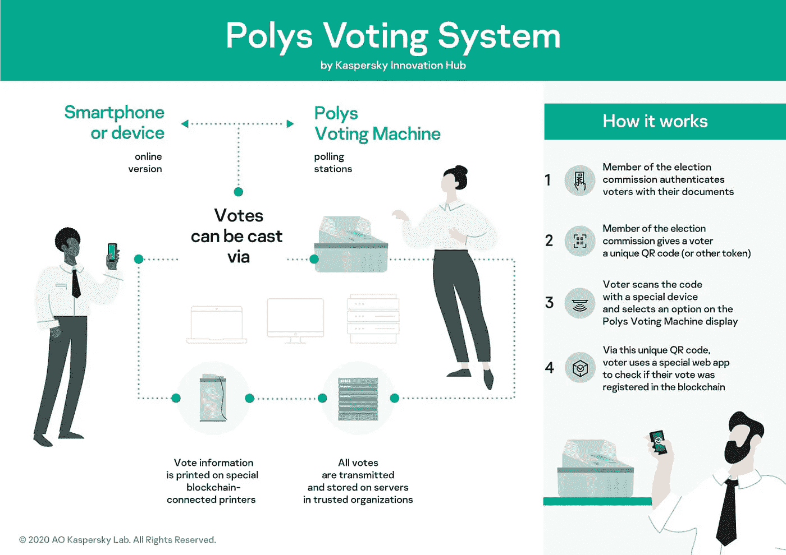
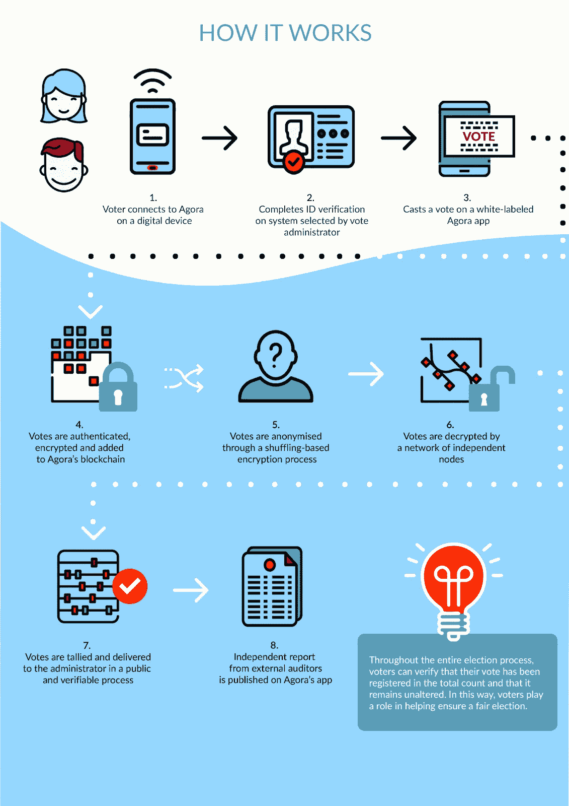
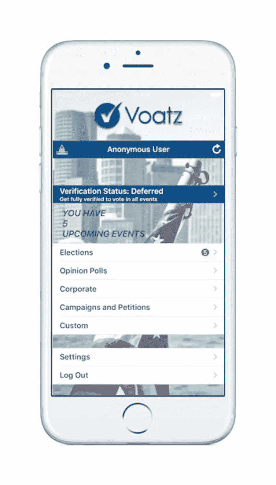

# 区块链投票 IRL 和 Web3

> 原文：<https://medium.com/coinmonks/blockchain-voting-irl-and-web3-63867c4053cd?source=collection_archive---------8----------------------->

*这是有才道作家群的第四篇文章*

对分散投票系统的需求一直是研究人员和学者的热门话题。一方面，区块链投票允许一个分散的民主投票标准，我们可以用于任何选举——甚至是国际民意调查。另一方面，在分散投票被大规模采用之前，一些区块链特有的限制仍然存在。在本文中，我们定义了分散投票，将其与传统投票进行了比较，分析了一些优缺点，并重点介绍了现有的区块链投票项目。

# 什么是分散投票？

分散投票使用区块链和分布式账本技术来改善选举过程。区块链技术的特点是计算机(节点)的去中心化网络，结合了密码学、数学和计算机科学，使网络活动不可改变。因此，区块链适合选举制度。

分散投票系统具有以下部分或全部特征:

1.  匿名:区块链上的交易链接到用户的公共地址(随机生成的字母数字串)，而不是真实姓名。这个特性保证了每个参与投票者的隐私和唯一的可验证性。
2.  数据不变性:如上所述，区块链使用加密技术来保护数据不被操纵和篡改。记录在区块链上的投票不能被编辑或删除以支持某个特定的候选人。
3.  去中心化:每个区块链都由分散在世界各地的无数节点托管。使用区块链使选举过程更能抵御黑客攻击，因为黑客需要攻击每一台连接到区块链的*电脑才能得逞。*
4.  *透明性:每个节点在任何时候都持有区块链的更新副本。这些节点还可以发现并拒绝对区块链的任何恶意更改。因此，选民可以实时关注选举，留意违规行为。*

# *传统投票 vs 区块链投票*

*传统的投票通常耗时、昂贵，并且需要大量的文书工作——这对环境有害。此外，涉及多方和劳动力，这给流程增加了沉重的管理费用。作为一种解决方案，电子投票(e-voting)机被发明出来。但是，这些设备容易受到单点故障(例如，微芯片篡改)和集中操纵(通过数据库调整投票)的影响。*

*此外，电子投票机不解决排长队的问题，选民必须在投票站投票。解决方案是区块链投票系统——它们消除了黑客和投票操纵的机会。此外，选举后，结果是透明的，没有机会隐藏有利于候选人的选票。*

# *区块链投票的好处？*

*引入分散投票制度的一个核心好处是，选民可以不受地理位置的限制参与投票。一个很好的例子是最近新冠肺炎疫情由于全国范围的封锁而限制了选举。此外，传统选举通常会在投票站吸引大量人群。*

*然而，从个人经验来看，大排长龙会阻止潜在选民——如父母、倒班工人和残疾人——出来投票。上述好处还与其他优势相关，如更快、更具成本效益的投票流程，同时降低投票人对投票流程的信任度。*

# *使用区块链投票的挑战*

*分散投票的基础是区块链，像其他技术一样，它也不是没有缺陷，可以影响选举过程。下面列出了一些挑战:*

*   *有限参与:选民需要在线使用基于区块链的投票应用程序。在世界上的一些地区，对互联网的了解和访问是有限的，这可能会大大减少选民的参与。*
*   *无知:区块链非常小众，因此对该技术的一般知识有限。为了避免犯错，用户必须接受适当的教育，例如:保护他们的私钥，以防止身份盗窃。*
*   *低交易速度:区块链因其糟糕的可伸缩性而饱受批评。可扩展性是指网络在不降低质量、安全性和用户体验的情况下处理许多事务的能力。受欢迎的区块链——比特币和以太坊——每秒只能处理 20 笔交易。这个速度很低，无疑会影响区块链在成百上千甚至上百万选民同时投票的选举中的有用性。也就是说，开发者[已经创建了](https://ethereum.org/en/layer-2/)，并且仍在创建区块链扩展解决方案。*

# *现有的分散投票项目*

*虽然区块链的概念是新的，现有的项目已经提供了解决方案。以下是他们的列表:*

# *Luxoft*

*Luxoft Holding，Inc 是一家国际 IT 提供商，与瑞士楚格市和卢塞恩应用科学大学合作设计了 Luxoft，这是第一个在主要经济体中大规模使用的分散式投票系统。Luxoft 的解决方案整合了以太坊的智能合同功能、楚格市的数字身份证注册应用程序和自定义身份平台 uPort。这个组合允许瑞士居民投票防篡改，公开验证和匿名投票。*

# *多边形*

*Kapersky 实验室负责 Polys，这是一家软件和硬件电子投票提供商。Polys 是开源的，以基于云的解决方案[和区块链投票机](https://www.kaspersky.com/about/press-releases/2020_polys-from-kaspersky-innovation-hub-presents-first-blockchain-based-voting-machine)为特色，同时提供客户服务和支持。无论投票过程是智能手机还是终端，投票都会自动记录在区块链上。此外，Polys 整理来自不同设备和终端的同一选举的选票。*

**

# *Agora*

*Agora 成立于 2015 年，是第一个也是领先的区块链投票项目，用于[总统选举](https://impakter.com/agora/)。在 2018 年 3 月的塞拉利昂总统选举中，Agora 减少了投票欺诈和管理费用。该项目纳入了一个具有独特共识的自定义区块链，选民可以用于社区、公共和私人选举。Agora 还带有一个用于投票的本地令牌。具体来说，你需要一部智能手机或电脑来用 Agora 投票。你不局限于一台设备，因为你可以用别人的手机或电脑投票。整个社区可以用一台设备投票；如果设备被盗，你可以用你的加密密钥在其他地方投票。你甚至可以离线投票，因为你的投票是在线上传的。*

**

# *沃阿茨*

*Voatz 是领先的移动分散投票项目之一。该项目结合了区块链技术和生物识别技术来保证投票的安全性、透明性和不变性。Voatz 为用户提供了一个基于区块链的审计门户和仪表板，并在选民的移动或平板设备上提供实时分析。因此，选民可以在世界任何地方安全、匿名地投票。正因为如此，Voatz 近年来一直在[受欢迎](https://www.biometricupdate.com/202211/voatz-surges-past-100-elections-with-biometrics-securing-remote-voting)，这在美国和加拿大 2022 年选举周期的完成中显而易见。*

*在 voatz 网站上，用户必须提供 KYC 的详细信息，包括自拍、生物特征和个人识别码。经过验证后，他们可以使用该应用程序，并检查正在进行的投票。然后，他们可以标记、查看和投票，之后他们会收到一张匿名收据，以确认他们的选择。这些收据也用于选举后审计。*

**

# *快照*

*Snapshot 是一个区块链投票系统，专门用于 crypto、Web3 和 DeFi 项目。该平台独一无二且广受欢迎，因为项目使用它来快速就项目/公会的资金分配、预算、新 Dao 提案等问题达成共识。目前，Snapshot 拥有 11k 个空间(使用该平台的项目)，数以千计的提案被投票支持或反对。*

*快照是如何工作的？*

*传统上，DeFi 协议以两种方式表决:链上和链下。在线投票是指在区块链上进行的投票。不幸的是，这种方法通常需要开发，并要求用户支付天然气来投票。另一方面，离线投票发生在区块链之外。然而，最终决定权通常掌握在少数人手中——拥有大量代币的鲸鱼——这使得它更加集中，并夺走了区块链理工大学的精髓。*

*这些方法各有利弊，但是快照只结合了好的方面。它是离线的，不需要智能契约开发。同时，它可以跨多个区块链使用，并使用 [IPFS 网络](https://docs.ipfs.tech/concepts/what-is-ipfs/)记录用户投票。这些特性为 Snapshot 提供了传统链外投票所缺乏的分散属性。*

# *包装东西*

*正如我们在反对意见部分看到的，在我们看到区块链投票系统大规模采用之前，区块链投票项目还有一些障碍要克服。例如，围绕该技术存在许多误解和错误观念。此外，可伸缩性三难问题仍然困扰着区块链。也就是说，为了让这些项目成为主流，我们需要在当地社区中对分布式账本和分散投票项目的好处进行大量的宣传和认识。*

> *交易新手？试试[密码交易机器人](/coinmonks/crypto-trading-bot-c2ffce8acb2a)或者[复制交易](/coinmonks/top-10-crypto-copy-trading-platforms-for-beginners-d0c37c7d698c)*