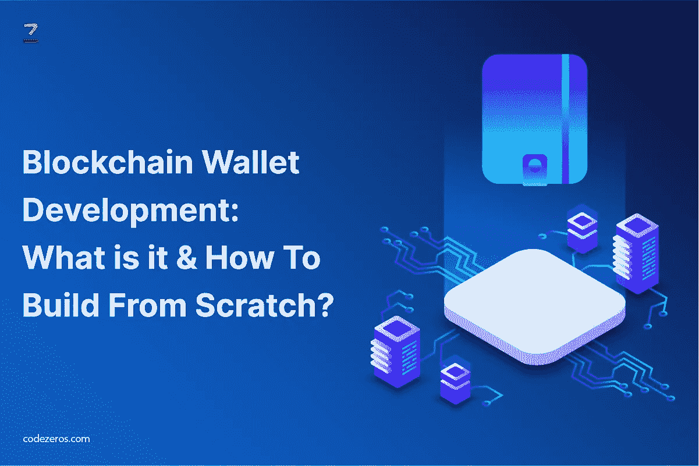

# 区块链钱包开发:它是什么&如何从零开始构建？

> 原文：<https://medium.com/coinmonks/blockchain-wallet-development-what-is-it-how-to-build-from-scratch-729af4fc9c24?source=collection_archive---------17----------------------->

技术革命是人类有史以来最伟大的事情之一。数字货币行业也发生了一场革命，通过整合一个完整的去中心化系统，引入了独立的货币。

比特币使人们有可能拥有现实的虚拟货币，他们可以用虚拟货币兑换产品。本文将教你关于 [**区块链钱包的发展**](https://www.codezeros.com/services/wallet-development) 从头开始。

**比特币的基础和意义:**

区块链是一个主要术语，指的是通过加密链链接的信息数字数据集的协作。区块链机制最好的一点是它不能被改变。

整个过程完全透明。银行和政府等中介机构不会干预。这消除了所有不必要的额外费用和成本。

由于强大的加密功能，获得或存储的数据无法破解，但可以通过现有的大多数设备访问，这积极地影响了 [**加密钱包的开发**](https://www.codezeros.com/services/wallet-development) 。

在全球市场上，有 5000 多种加密货币可供使用，而且这些数字还在稳步上升。

**比特币钱包及其存取方式:**

对于存储、购买和出售比特币或其他形式的加密货币来说，比特币钱包是最安全和最有保障的地方。你需要关注三种主要的方法来使用钱包。它们如下所示:

**论文:**

这种特殊格式的打印件被认为是比特币存在的视觉证据。这使得比特币成为一种负担，因为在 [**加密货币钱包开发**](https://www.codezeros.com/services/) 的过程中，总是存在被销毁或放错地方等威胁。

**硬件:**

硬件设备存储与硬币细节和账户相关的数据。它随时提供更好的可访问性。

**软件:**

它可以被视为钱包或保险箱，可以通过移动设备和桌面访问。

**从头开始创建移动应用:**

在初始阶段，利用现有的技术和方法来开发区块链钱包被认为是一个更好的想法。有一些方法和工具被许多开发者采用，以方便顶级的 [**钱包开发服务**](https://www.codezeros.com/) 。

这些特殊的工具和方法非常适合钱包应用程序，因此非常适合采用。此外，他们还处理通过区块链网络进行的每一笔交易。

构建应用程序需要大量的编码和编程技巧。为了流程的方便，您可以遵循以下步骤:

1.  利用 API 文件和其他工具进行区块链网络同步。
2.  所有必要的编码必须包括开发程序。
3.  为了确保实现的标准得到很好的维护，您可以在每个阶段进行测试。
4.  专注于负责比特币区块链完整节点开发的团队建设。确保开发团队完全同步节点。
5.  基于云的平台是应用程序开发所必需的，因为它有助于管理操作系统、运行时诊断、网络和云基础设施。

**比特币钱包应用的功能:**

基于被称为非对称密钥的具有密码术的特定类型的密钥，比特币钱包交易被处理。它提供了更好的安全性。私钥和公钥可以用来访问它。

在通过钱包进行交易的过程中，从一个特定的账户到另一个账户，在所有者和销售者之间发生硬币的交换。

所有这些交易都被记录在案，并在各自的比特币钱包的帮助下进行分析。

**技术堆栈:**

存在许多丰富的公共库，它们可用于开发内联空间中的区块链应用程序。这些库可用于执行标准功能。

如果你打算构建一个 web 应用来构建前端，那么使用 Angular JS 4.0、CSS3 和 HTML5。另外，从后端使用 Node JS。

为了构建一个扩展的前端，android 应用程序将需要来自 Java 的代码或程序的输入。对于 API 服务，Python 的实现需要为后端的工作正确完成。

swift 技术的实现可以在 iOS 应用程序中使用。它类似于 Python 或 Node JS 到 Android OS 中可用的版本。

为了提高比特币钱包应用程序的安全性，您可以实现两步授权和其他附加功能。将出现与该账户相关的异常活动。这是因为加密货币比特币及其相应的存储钱包的名气越来越大。为了提高钱包的可用性，有必要配置和保护这些特征。

加密世界总是处于升级阶段。所以，跟上所有最新的发展是必要的。对比特币钱包的需求已经激增，因此存在构建比特币钱包的持续努力。你也可以选择钱包开发公司寻求更好的想法。

**结论:**

如果你想选择比特币 app 开发，现在是最好的时机。比特币移动应用的名气和受推崇程度与日俱增，这反过来也提高了市场对比特币钱包应用的需求。人们对比特币钱包的唯一期望是它安全可靠。当然，在可预见的未来，其他货币也将需要加密钱包。

> 加入 Coinmonks [电报频道](https://t.me/coincodecap)和 [Youtube 频道](https://www.youtube.com/c/coinmonks/videos)了解加密交易和投资

# 另外，阅读

*   [AscendEx 保证金交易](https://coincodecap.com/ascendex-margin-trading) | [Bitfinex 赌注](https://coincodecap.com/bitfinex-staking) | [bitFlyer 评论](https://coincodecap.com/bitflyer-review)
*   [麻雀交换评论](https://coincodecap.com/sparrow-exchange-review) | [纳什交换评论](https://coincodecap.com/nash-exchange-review)
*   [支持卡审核](https://coincodecap.com/uphold-card-review) | [信任钱包 vs 元掩码](https://coincodecap.com/trust-wallet-vs-metamask)
*   [TraderWagon 回顾](https://coincodecap.com/traderwagon-review) | [北海巨妖 vs 双子星 vs BitYard](https://coincodecap.com/kraken-vs-gemini-vs-bityard)
*   [Exness 回顾](https://coincodecap.com/exness-review)|[moon xbt Vs bit get Vs Bingbon](https://coincodecap.com/bingbon-vs-bitget-vs-moonxbt)