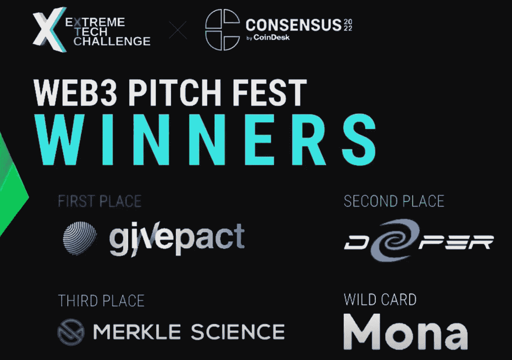
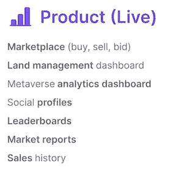

# 区块链全球巡展:第 6 站-共识 2022-投资洞察报告及其他

> 原文：<https://medium.com/coinmonks/blockchain-worldwide-tour-6th-stop-consensus-2022-investments-insights-report-beyond-9454e69d15ec?source=collection_archive---------15----------------------->

**目录**

I .来自共识 2022 的 10 大投资见解

二。来自基金会的关键见解:以太坊，附近，雪崩，宇宙，波尔卡多特，和索拉纳。

三。顶级外卖:元对比和互操作性

四。隐藏的 100xGem: WeMeta

动词 （verb 的缩写）结论

**什么样的平台会让下一个十亿用户进入 Crypto？**

> “我们将看到独一无二的事情，大型媒体公司与 web3 整合”。
> 
> **——迈克·诺沃格拉茨，银河数码**创始人&首席执行官

区块链全球巡演的第六站是“共识 2022 ”,这是一个全球性的区块链足迹，从加密空间的各个角度来看，它都具有前所未有的能量水平。尽管我们正处于熊市，但**社区拥有牛眼**。事实上，这是迄今为止最大的一次会议，大约有 17，000 名与会者，其中包括一些加密领域最杰出的人士，如 Sam Bankman-Fried 和赵昌鹏(ZC)。此外，它本质上是一份关于区块链 IRL 所有事情的**内部半年度报告。**

在奥斯汀索拉纳黑客屋、Dcentral 2022、Consensus 2022(2022 年 6 月 4 日至 2022 年 6 月 12 日)整整一周之后，我有了一个电灯泡时刻；在元诗中，我看到了网络公司早期的回忆。有一件事是毫无疑问的，并且引起了我的注意，那就是所有这三个事件都是正相关的，并且都集中在元宇宙。

**一、共识 2022 十大投资洞察**

1.  **Web2 巨头将支撑 Web3**

> “看到这触及全球采用的门槛…这是一场基础设施革命。为了达到下一个水平，10 亿用户，**谷歌将帮助部署带有节点的基础设施**。期待与 web 3 的建设者合作，实现 web 3 的基本承诺，使所有权民主化”。
> 
> **-里奇·威德曼**，战略负责人，Web3 @ Google。

Google presentation

随着谷歌想要成为 web3 的一部分，很明显，无论市场周期的状态如何，区块链技术都将继续存在，这就是未来。

**2。下一个十亿加密用户**

根据所有发言者和会议小组的说法，下一个 10 亿用户将通过以下方式解锁:

*   UX 经验
*   GameFi，比如 next axle infinity
*   NFT 的

**3。下一轴无穷大**

我亲自问过 Leah Callon-Butler，下一个 Axie Infinity 会是什么？她说，

> “下一个 Axle Infinity 是拉古娜游戏公司的[加密独角兽](https://www.cryptounicorns.fun/)”。
> 
> **-莉娅·卡隆-巴特勒，埃姆斯公司董事**

她在我的紧急问题中强调，这将归功于游戏的强大社区。我当时的反驳是，“你对宇迦实验室的其他 Meta 有什么深刻的反馈？”Leah Callon 表示**她对社区和项目的核心价值持怀疑态度。** Leah Callon-Butler 是一名游戏赚钱专家，是纪录片 *Axie Infinity Game 的编剧和解说员。*

然而，在硬币的另一面，Token Metrics 的首席执行官兼创始人伊恩·巴里纳(Ian Balina)在 2022 年奥斯汀展览中心(Dcentral Austin 2022)的“市场转变的位置:元宇宙”演讲中提到了宇迦实验室的 Otherside Meta。

**4。新的支付轨道，加密支付**

> “在旧的支付方式下进行支付毫无意义。我们进行了一项调查，75%的 PayPal 商家将在未来两年内启用加密支付”。
> 
> **-何塞·费尔南德斯·达庞特，贝宝公司的 SVP 兼区块链总经理。**

再次表明区块链技术是支付的终极技术。

**5。风险投资优势**

> **我们在锈基和实基链部署了几十名工程师。**
> 
> ****——亚历山大·叶，在共和密码****

****Crypto VC 正在增加一批工程师部署到投资组合公司**以巩固他们的投资组合，因为区块链技术是新生的、颠覆性的和开源的，这有助于加速创新和促进高度竞争的环境。**

> **交易新手？试试[加密交易机器人](/coinmonks/crypto-trading-bot-c2ffce8acb2a)或者[复制交易](/coinmonks/top-10-crypto-copy-trading-platforms-for-beginners-d0c37c7d698c)**

**根据会议主持人、CoinDesk 资深记者 Tracy Wang 的说法，正在增加开发人员大军的风险投资家如下:**

*   **共和密码**
*   **多链资本**
*   **范例**
*   **跳跃密码**

**6。风险资本投资**

> **“我投资元宇宙的基础设施。我对 NFT 的货币化感兴趣”。**
> 
> ****-凯尔·萨马尼，Multicoin Capital 联合创始人兼管理合伙人****

****

**凯尔表示，Multicoin Capital **投资元宇宙的一种方式是通过 Ball Multicoin Bitwise 元宇宙指数**，该指数专注于四个领域:互操作性、分类账、DeFi 和社区赋能。该指数中的顶级持股包括，以太坊，Chainlink，Solana，Filecoin 和 Polygon，以及沙盒和分散地。**

> **“我们希望元宇宙运行在加密轨道上，而不是脸书轨道上。Defi rails 将为元宇宙的这些交易提供动力”。**
> 
> ****-凯尔·萨马尼，Multicoin Capital 联合创始人兼管理合伙人****

**在参加了不同的风险投资讲座后，我假设元宇宙是网络效应价值产生的地方，而 T2 是一切都将变得可互操作和可组合的最终游戏。**

****7。2022 年共识大会上的 Web3 推介活动****

**由 Extreme Tech Challenge 和 CoinDesk 举办的 Web 3 pitch Fest Consensus 2022 上宣布的获奖者如下:**

****

*   **第一名:GIVEPACT**
*   **第二名:更深的关系网**
*   **第三名:MERKLE 科学**

**这些获奖者强调，投资者被视为这些领域的利基，如协议的审计和风险管理、网络安全(即硬件 VPN)和通过 DAO 的社会影响。**

****8。密码中的人工智能****

> **“机器学习将在下一波 NFT、Defi 和其他加密资产技术中发挥关键作用……”**
> 
> ****-耶稣·罗德里格斯，IntoTheBlock 的首席执行官****

**所以现在机器学习在吃 crypto。**

****9。规定****

**FTX 的首席执行官 Sam Bankman-Fried 在他的会议中提到，他每两周在华盛顿召开一次会议，以推动加密监管。**

****10。基于 OG 的市场洞察****

> **“三个加密的冬天意味着机会，我是逆向思维者，相信基本面强劲，是加倍下注的时候了”。**
> 
> ****-艾比·约翰逊，富达投资公司董事长&首席执行官****

****

> **“对加密领域的年中投资展望强调了以下几点:**
> 
> **-今年余下的时间市场会很痛苦**
> 
> **-支架在水下**
> 
> **- NFT 将搭载更多基础设施……”**
> 
> ****-瑞安·塞尔基斯:梅萨里公司的首席执行官****
> 
> **“下一个加密牛市是即将到来的最大牛市”。**
> 
> ****-迈克尔·莫罗，创世纪公司的首席执行官****

**总的来说，下一个牛市将是基于密码空间的 OG 数量级最大的一次。**

****二。来自基金会的关键投资见解:以太坊、Near、Avalanche、Cosmos、Polkadot 和 Solana。****

**K 安永投资在蓝图投资框架内的见解 TOCNIV:**

*   **令牌组学**
*   **核心团队中的 OG 开发者**
*   **共识机制对可伸缩性和主要用例的竞争优势**
*   **路线图的下一个里程碑、重点和执行**
*   **VC 内部循环，开发者社区&协议社区**
*   **估价**

****

> **“合并就像**在空中以 600 英里/小时的速度飞行，换了引擎**却没有注意到飞机内部。合并更多的测试来了。”**
> 
> ****-普雷斯顿·房龙，棱镜实验室的联合创始人****

****

*   **合并后，以太坊的货币政策变成了**通货紧缩，**意味着发行低于烧掉的利率。**供应增长将为-1.4%**prism Labs 的联合创始人 Preston Van Loon 说。**
*   **Prismatic Labs 的联合创始人 Preston Van Loon 提到，与 Mainnet 的 13 美元相比，第二层的天然气费用约为 0.27 美元。**
*   **Prismatic Labs 的联合创始人普雷斯顿·房龙(Preston Van Loon)提到，NFT 的销售人员在以太坊占据了最大的街区空间。因此，以太坊中的主要用例是 NFTs。**
*   **Preston Van Loon 表示，合并后，以太坊核心团队将专注于分片和数据可用性。**

****

**Roadmap of the state of research and where Ethereum is heading presented by Preston Van Loon.**

****

> **“其中一个很有吸引力的使用案例是奖励措施，如“玩赚”和“流汗”。**
> 
> ****-Marieke Flament，NEAR Foundation 首席执行官****

****

**Presented by Marieke Flament, CEO at NEAR Foundation**

*   **我在 Near 展台问，Near 可扩展性与其他平台的区别是什么？展台上的一名代表说:“龙葵切片。**
*   **Near 中的 Defi 由三个订单书区分，Mainnet 中的 Tonic 和 Spin 是 live，Tesnet 中的 ordered 是 Near 断言的 Kendall Cole 的力量，Proximity 的联合创始人**
*   **NEAR Foundation 的首席执行官 Marieke Flament 说:“**专注于如何用 DAO 收购运动队。****
*   **在听完 Near Foundation 的所有介绍后，我意识到**生态系统仍然相对较新，尽管有很多正在进行的牵引。****

****

> **“雪崩是金融的互联网”**
> 
> ****-约翰·纳哈斯，艾娃实验室商业发展副总裁****

****

**Presented by Patrick O’Grady, Head of Engineering at Ava Labs.**

*   **艾娃实验室的开发者传道者 Gabriel Cardona 提到，Emin Gun Sirer 已经在康奈尔大学担任了 20 年的教授，人们认为他是 2003 年名为 Karma 的 P2P 虚拟货币 PoW 的创造者之一。**
*   ****竞争优势是子网的可扩展性**在雪崩网络中。**
*   **“通过子网，开发人员可以针对特定的链构建定制的 dapp 来满足他们的需求，可扩展性是无限的，并为 dapp 创造最佳体验”艾娃实验室业务开发副总裁 John Nahas 说道。**
*   **Avalanche 每月交易量的增加是由于 2021 年下半年 native DeFi 和游戏的诞生，Crabara 在 2022 年初提到了艾娃实验室业务发展副总裁 Lydia Chiu。**
*   **艾娃实验室业务发展副总裁 Lydia Chiu 表示:**我们的成功得益于众多机构的合作。****
*   **在雪崩网络中，**主要用例是 Defi，他们仍在构建对生态系统和更多子网至关重要的原语。****
*   **艾娃实验室业务发展副总裁 Lydia Chiu 提到，子网通过以下方式增加了 Avalanche coin (Avax)的价值:**

1.  **需要 2000 个雪崩硬币(AVAX)作为验证器，并且子网的验证器是主网络的验证器。**
2.  **煤气费用 Avax 支付。**

****

> **“不是多链世界，多链世界是对目前存在的许多链的悲观看法。**未来是连锁的，**期待与区块链的配置…没有筒仓区块链”**
> 
> ****——Billy Rennekamp，宇宙网络宇宙中心领导链间基金会。****

****

**Presented by Osmosis**

*   **主持人 Jodie Gunzberg 问道:Cosmos 是如何整合可伸缩性的？”比利·雷内坎普回答道:**

1.  **关键特性，PoS 更易于扩展；**
2.  ****每个 Dapps 都有自己的区块链，你没有共享块空间，所以你有一吨杠杆；****
3.  **面向垂直可扩展性的 Tendermint**
4.  **就有限的 TPS 而言，水平可伸缩性方法，即众所周知的分片。**

*   **他还表示,**Cosmos Network 的主要优势是集成区块链间通信** (IBC ),这不需要 Cosmos coin (Atom)或成为 Cosmos Hub 的一部分。**
*   **Regen Network Development 首席执行官 Gregory Landua 表示: **Cosmos SDK 是世界上用于构建区块链的最常用框架**。**
*   **“我们正在**关注宇宙中心**”宇宙网络**的宇宙中心领导链间基金会的 Billy Rennekamp 说。****
*   ****最令人期待的功能是链间安全** (share security)，这使得新区块链推出的 Cosmos Hub 验证器的安全性得到了 Billy Rennekamp 的肯定。**
*   **比利·雷恩坎普提到，Cosmos 正在努力实现与 substrate、solidity 和 IBFT (Celo)等新客户的本地集成。**

****

> **“大约 25+”的衬底独立链。**
> 
> ****——moon beam Network 创始人德里克·柳****

****

**Presenterd by Derek Yoo, Founder at Moonbeam Network.**

*   **Moonbeam Network 创始人 Derek Yoo 表示:“异步支持，**我们预计系统范围内至少有 100k tx/s 的传输速率**。**
*   **波尔卡多特的限制是拍卖过程。然而，即将到来的里程碑，Parathreads:pay as you go parachains(由 EOY)将解锁 Moonbeam Network 上的 grow the ecosystem，因为你不必经历拍卖的过程，Moonbeam Network 的创始人 Derek Yoo 承认。**
*   **Moonbeam Network 的创始人 Derek Yoo 表示:“我们不像其他生态系统那样吵闹，但在幕后发生了很多事情”。**

********

***Solana Hacker House in the week of Consensus 2022***

*****主旨:*** *索拉纳未出席共识 2022；然而，索拉纳在同一周建造并推出了奥斯汀黑客屋。在 2022 年达成共识之前，我在 6 月 4 日&5 日参加了前两天的会议。***

*   **与维塔利·布特林相比，你对阿纳托利·亚科文科的评价如何？我问索拉纳实验室的工程师贾里·希欧。他说:“阿纳托利非常注重实际，维塔利克·布特林是理论型的。**
*   **然后我问索拉纳实验室的工程师 Jarry Xiou:你对索拉纳最近的断电有什么看法？“**他们正在集中精力解决这个问题，并试图在未来几个月内解决这个问题**”他回答道。**
*   **在黑客之家期间，索拉纳**主要关注的用例是 NFTs** 。他们甚至主持了一个题为“为什么开源开发是 Solana NFTs 的制胜策略”的会议。**
*   **索拉纳风险投资公司提供建议，并期待在索拉纳奥斯汀黑客之家找到潜在的投资。**
*   **导师和开发者社区充满活力。**

****Consensus 2022 智能合约平台趋势****

**-采用先玩后赚的方式**

**-聚焦 NFT、定义和再生经济学。**

**-勇敢浏览器与大多数智能合约平台建立了合作关系。**

****总之****

****一直以来的燃眉之急****

**如何以一致的方式扩展更多的块空间，以实现更高的 TPS 和最快的终结性？**

****

1.  **对于**建造 dapps 的优势来说，最好的选择是 Solana 和 Near** ，因为他们有更高的 TPS 和最快的终结速度。其次是雪崩。**
2.  **智能合约平台**完全增加了本地硬币的价值，包括以太坊索拉纳、Near 和雪崩。**尽管如此，像 **Cosmos 和 Polkadot 这样的平台并不一定会增加本地硬币的价值**。这是因为 Cosmos 不需要 Cosmos 的本地加密货币(ATOM ),也不需要成为 Cosmos Hub 的一部分才能成为 IBC 的一部分。同样，基于 Polkadot 基底的链可以作为单链存在，这意味着您需要 Polkadot (DOT)的本地加密货币，因为它们是独立的链。**
3.  **与以太坊**相比，Solana、Near 和 Avalanche** 更有可能获得**更大的回报潜力，这是由于以太坊的市值**和上述因素。例如，根据下面的 Messari 筛选，以太坊的交易价格大约是 Solana 市值的 11 倍。就相对估值分析而言，市值很重要，因为它让投资者通过与同行进行比较，了解一个项目可以合理增长到多大规模。**

****

**As of 07/03/2022**

**4.最后，智能合约平台有**更多的概率跑赢阿尔法**比同行集团**是索拉纳，由于高通胀率的近和雪崩**和前述。**

> **“与上半年相比，Near 和 Avalanche 是下半年通货膨胀率较高的两个标志……如果没有额外的买家流入，标志排放将继续对价格产生影响。”**
> 
> ****-迈萨里研究报告:了解市场上限和流量，2022 年 6 月 12 日****

****

****三世。要点:元对比&互操作性****

> ***谁在为元宇宙标准石油公司制造*油罐车*？***
> 
> ****-威斯顿·罗德森，WeMeta 首席执行官****

****

**罗布森的上述陈述，让我意识到坦克车的建造者，以及元宇宙正在开发的一切，都是来自网络 3 的建造者。例如，DeFi rails 将为元宇宙的交易提供动力。因此，**最关键的一点是，加密的最终游戏是元宇宙**；在那里，DeFi、NFT、社交令牌和内置于 web3 的一切更有可能实现互操作，展现复合网络效应价值。**

**上述小组会议是一次关于区块链技术的未来和元宇宙初期的令人大开眼界的会议。该小组成员代表了在 metaverses 堆栈中发挥关键作用的平台，这些平台为具有非孤岛环境的开放元宇宙铺平了道路。**

****

**[**we meta**](https://wemeta.world/)**:**元宇宙的原子数据层。面向建筑商&投资者的元宇宙首个搜索引擎分析。借助游戏分析和经济学分析，能够深刻理解元经文。**

****

**[**axel ar**](https://axelar.network/)**:**使用户和开发者能够安全地与来自任何链的任何资产或 dapp 进行交互。**

****

**[**不大可能:**](https://www.improbable.io/) 开创了跨互联虚拟世界连接、游戏、创造和构建价值的新方式。**

****

**[**Adrewseeen Horritz**](https://a16z.com/)**:**区块链科技顶级风投之一，投资元宇宙。**

**另一方面，在我的区块链全球巡回赛 2022 期间，我期待找到一个终极平台，开发人员可以通过与任何资产或来自任何链的 dapp 安全地无缝交互，插入并构建他们的开放 dapp。到目前为止，Axelar 是一个很有前途的平台，可以实现前面提到的 LayerZero。**

****四。隐藏 100xGem****

**你想感受一下 2008 年投资比特币的感觉吗？**

****

> **“WeMeta 是元宇宙开发堆栈的重要组成部分”**
> 
> ****-** [**数字电流组**](https://dcg.co/)**

****

**WeMeta had a booth at Metaverse Zone & the CEO was a speaker at Consensus 2022**

**潜在的问题是:在元宇宙，你在哪里投资、建造和发布活动？**

****

**[https://wemeta.world/](https://wemeta.world/)**

****投资区块链科技的蓝图框架****

****一、投资主题**围绕着投资将成为互联网/web3 整个基础设施的项目。**

**WeMeta:**

*   ****原子数据层**面向元宇宙的建筑商、投资者和品牌网络。**
*   **对于建设者/开发者:是**谷歌分析，**深刻了解元宇宙的真实状态。**
*   **对于投资者、合作伙伴和品牌:是 Zillow(T21)(它是管理你的 NFT 土地投资组合的最佳整合工具)以及元宇宙的谷歌分析。**

****二。基本面因素:TOCNIV****

****记号组学****

**WeMeta 通过私募股权筹集资金尽管如此，WeMeta 设想拥有一个忠诚的公用事业令牌。**

****核心团队中的 OG 开发人员有一个受驱动的任务****

*   **我问 WeMeta 的首席执行官温斯顿·罗布森，你在 WeMeta 的使命和目标是什么？他说，“由于人口过剩和其他环境问题的警告，我从小就想建造火星。**
*   **WeMeta 的首席执行官 Wiston Robson 是一名开发人员，他在 2021 年 5 月作为 WeMeta 项目的决赛选手之一在 ETHGlobal 的 Web3Weekend 上崭露头角。**
*   **此前，他是几家公司的首席数据科学讲师和数据科学家，包括 Coding Dojo 和 BlazingSQL。在从事数据科学之前，他曾在伯克希尔哈撒韦家庭服务公司 Drysdale Properties 担任推荐代理。因此，他的**独特背景与他目前在 WeMeta 的职位**和愿景完全匹配。**
*   **是原生游戏玩家。**
*   **WeMeta 团队由以下成员组成:Ali Vira，WeMeta 的联合创始人和首席运营官，他在微软担任了四年的高级产品经理。以及另一位联合创始人兼首席技术官尼克·布朗斯(Nick Brons)，他曾是 Sun Machine Games 等游戏公司的软件工程师，是一只会思考的猿。**

****

**WeMeta Presentation**

*   **WeMeta 的核心团队是区块链科技和元宇宙所有初创企业的技术人员。**

****

**WeMeta Presentation**

****竞争优势****

*   **WeMeta 的竞争优势在于它**开创了元宇宙**的第一个搜索引擎分析，并且更有可能成为元宇宙的标准数据层。**
*   **它的主要神奇特性之一是:**

****

*   **WeMeta Builder Tag——用于元宇宙场景分析的**第一插件&游戏解决方案，包含在构建场景中，根据 we meta 在分散地举办的 MetaFest 2022 (NYE2022)的执行摘要，在活动之前、期间和之后收集数据，如客流量和玩家活动。****
*   **WeMeta bootstrap 以太坊，图形，开放海洋 API。**

****一年内的下一个里程碑和路线图的执行****

*   **下一个里程碑是游戏分析引擎，正在开发中，预计将于 2022 年第四季度发布**
*   **路线图的执行有很好的记录。**

****

**WeMeta Presentation**

****风险投资的核心圈子&社区****

*   **WeMeta 由 DCG 资助，他建立了共识 2022，它是加密领域的顶级风险投资之一。**
*   **风投资助了 WeMeta**

****

**WeMeta Presentation**

*   **韦梅塔的凝聚力社区**

****

**WeMeta Presentation**

****从元宇宙搜索分析引擎的角度看 WeMeta 值****

**TechCrunch 称:“**旨在推动开放互操作性的元宇宙标准论坛**可以让开发者更容易地跨平台构建”。**

****

**很明显，在元宇宙标准论坛的新闻发布之后，metaverses 将会产生价值。大概没什么！**

****

**[Citi Metaverse](https://www.slideshare.net/loukerner2/citi-metaverse)**

****

**WeMeta Presentation**

****

**[Chainalysis Report](https://blog.chainalysis.com/reports/metaverse-gaming-web3/?utm_campaign=twitter&utm_source=OrganicSocial&utm_content=Thread)**

**100 倍复利阿尔法很有可能在元宇宙， **尤其是在 NFT。**你可以在沙盒&分散投资中利用这个投资机会。您还可以利用 WeMeta 的搜索引擎分析工具来了解 metaverses 之间的 NFT 土地的内在价值，以便建立、投资和发布活动。**

**总体而言，从投资角度来看，WeMeta 是元宇宙 NFT 土地的彭博。**

**回想一下，在密码世界里，你知道的越多，你能得到的就越多。**

****

**Consensus 2022**

****结论****

**5 共识 2022 的关键要点**

*   ****最终的游戏是元宇宙，这是网络效应价值产生的地方**来自 NFT 的 DeFi，&所有这些都有可能在 web3 中建立，并将成为未来领先的社交平台。**
*   **以太坊、Solana、Near 和 Avalanche 是领先的可伸缩性智能合约平台，具有更大的回报潜力。从长远来看，也许宇宙和波尔卡多特。**
*   ****下一个牛市将是最大的数量级**,因为加密空间的原语和构建块相对更成熟，可以构建卓越的 UX 和创新的 dapps，这将使主流采用成为可能。**
*   **释放**下十亿用户的平台可能是终极 UX、GameFi 或 NFTs。****
*   ****下一个 100 倍复合阿尔法是在元宇宙。**也许 NFT 像沙盒或分散土地一样在元宇宙登陆。**

****最终想法****

**虽然我没有水晶球，但在亲身感受了无与伦比的充满活力的社区和共识 2022 周的焦点后，我相信在这个熊市中建立的下一个大事件很有可能是元宇宙，这将是激励人们加入加密空间的宏观趋势。因此，你认为一切皆有可能的下一个科幻时刻，更有可能是在元宇宙的下一轮牛市。因此，中国将会突然成为下一个世界最大的经济体。**

****秘密的不公平优势****

**强烈建议利用数据分析平台。事实上，它将把你放在密码空间的闪电速度的前面字体。举个例子，比如 [Token Metrics](https://medium.com/u/22a92e81f6b1?source=post_page-----9454e69d15ec--------------------------------) **，** [**Messari**](https://medium.com/u/7cf93d3c3400?source=post_page-----9454e69d15ec--------------------------------) ， [TheTIE 开发团队](https://medium.com/u/1089eb3939c0?source=post_page-----9454e69d15ec--------------------------------) **，而对于元宇宙的 NFT 土地比如**[**we meta**](https://wemeta.world/)**。****

**在这个熊市中，上涨的空间是无限的，下跌的空间是有限的。在元宇宙令人大开眼界。WAGMI！**

****

**10 Years Later, Bitcoin’s OGs: Charlie Shrem, Jered Kenna, Jonathan Mohan &Adam B. Levine**

**特别感谢 [CoinDesk](https://medium.com/u/f2fa6f2d51a6?source=post_page-----9454e69d15ec--------------------------------) 和[数字货币集团](https://medium.com/u/a6be2334cd52?source=post_page-----9454e69d15ec--------------------------------)团队推动了这个行业的发展，并主办了历史上最完整的区块链会议。**

**我希望明年能见到你。**

> **“在别人贪婪的时候恐惧，在别人恐惧的时候贪婪。”**
> 
> ****——沃伦·巴菲特****

***愿原力与你同在！***

*****P.S.*** *我目前正在进行区块链全球巡演，名为 100x & beyond。值得注意的是，我是一个全球数字公民，我是一个区块链最大化主义者。我的投资理念专注于价值投资。***

*****免责声明:这不是宪法投资建议。*** *作者或本文中提及的任何人表达的投资观点和最新见解，仅供参考，不构成财务、投资或其他建议。投资加密资产会带来财务损失的风险。***

****