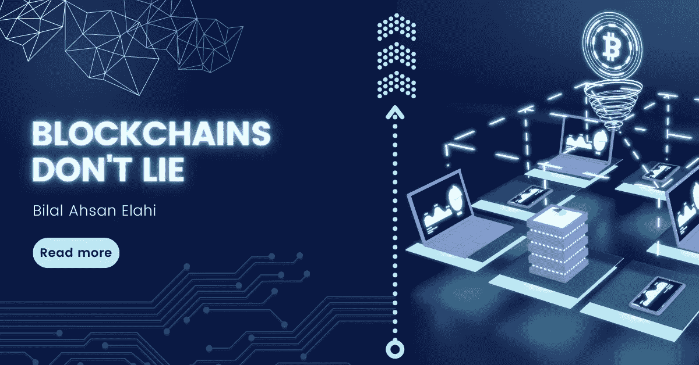

# 区块链不会说谎

> 原文：<https://medium.com/coinmonks/blockchains-dont-lie-2637d8cb7723?source=collection_archive---------31----------------------->

这篇文章带你了解区块链不会说谎，区块链是如何工作的，以及权力下放的特点。

1991 年，公证人图章提出通过给文件打上时间戳来保护文件的真实性，但后来没有成功。然而，在 2009 年，中本聪采纳了这一概念，并开发了一种被称为比特币的数字加密货币。在计算机网络节点之间共享的分布式数据库或分类帐是区块链。像数据库一样，信息以电子形式保存在区块链上。区块链通过维护安全和分散的交易记录，在比特币等加密货币中发挥了至关重要的作用，这一点得到了广泛认可。区块链的独特之处在于，它在确保数据记录的安全性和准确性的同时，无需信任第三方就能增强信心。

# 区块链是如何工作的？

区块链是一个分布式数据库，是加密货币的账本。每当发生新的交易时，具有交易的数字信息的新块被添加到链中。信息块不能被更改、删除或销毁。由于这个原因，区块链被称为分布式账本技术(DLT)。

# 区块链中的去中心化

想象一个新的交易发生在一个特定的区块链，例如比特币的区块链。交易的数字信息是不是瞬间就变成了可以添加到比特币的区块链的链上的信息块？不，数据需要验证，这将我们带回去了去中心化的概念，分布式计算机网络确保控制和决策不在个人或团体手中，而是均匀分布在网络中，以消除偏见的考虑。

通过分散节点连接的网络在新信息块被添加到链中之前验证其真实性。任何考虑改变区块链的人都必须修改整个链，使其变得不可能，并使区块链安全可信。

# 为什么区块链不说谎？

区块链不说谎的一个重要原因是因为他们的分权观念。以下可能的原因导致了“区块链不会说谎”的观点:

**消除错误和偏见的可能性:**去中心化确保任何管理机构或个人都不会控制区块链，数据系统地分布在网络中，这表明没有人可以编辑它，这就是为什么区块链中提供的信息成为没有任何错误和偏见的事实。

**数据的实时对账:**区块链中的数据被投资者和挖掘者实时访问，不会留下任何数据丢失或数据添加不正确的空间，反映了数据保持不变的事实。

**透明和资源的最佳分配:**区块链以开源软件的形式出现，这意味着任何人都可以查看它的代码。此外，它还确保区块链的整个网络均匀分布在各个节点上，便于用户最佳利用资源。

**智能合约和验证:**区块链提供了一套控制保留在区块链上的业务交易的法规，区块链根据 if-then 逻辑自动执行自动执行程序。充当验证，并确保数据库中填充了之前发生的每个交易的信息。

**安全和私人交易:**交易一旦发生，就会被区块链网络验证，之后被加入区块链。区块链上的每个区块都由印在区块上的唯一哈希组成。块中的任何变化都会导致哈希的调整，这意味着任何变化都不会被忽略。此外，进行交易的用户是保密的，这意味着区块链数据库中信息的真实性。

# 结论:

“区块链不说谎”的理念围绕着“去中心化”的概念，即区块链的每一个特征都带来了不可更改或编辑的透明度和数据，从而产生了一个充当概况介绍的数据库。通过其实时核对和验证系统使信息流更容易访问。

# 免责声明:

我是一名金融分析师，分享观点仅供学习和参考。我不是你的顾问，你也不应该根据我的工作进行交易。在进行任何金融交易之前，一定要咨询你的独立财务顾问。我假设市场参与者的任何交易都没有造成损失或损害。

# 最后:

如果你喜欢我的作品，请为我鼓掌！这将有助于我接触更多的人。也会提升我的士气，我会更多的分享我的作品！非常欢迎你的评论。也欢迎你不同意我的观点！

> 交易新手？尝试[加密交易机器人](/coinmonks/crypto-trading-bot-c2ffce8acb2a)或[复制交易](/coinmonks/top-10-crypto-copy-trading-platforms-for-beginners-d0c37c7d698c)