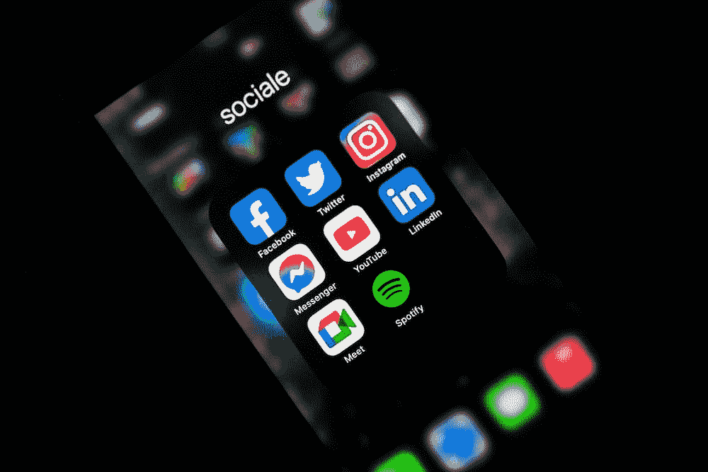

# 蓝天社交——一个去中心化的社交媒体平台

> 原文：<https://medium.com/coinmonks/bluesky-social-a-decentralized-social-media-platform-678c8cd6526f?source=collection_archive---------11----------------------->

在一个由集中式社交媒体平台主导的世界里，Bluesky Social 是一股新鲜空气。这个分散的社交媒体平台建立在区块链上，这意味着它是完全安全和透明的。因为它是分散的，用户可以完全控制他们的数据。