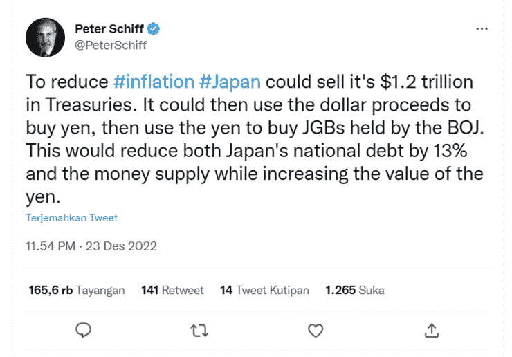
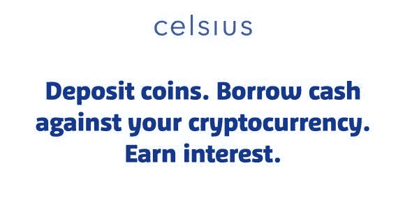

# BOJ(日本银行)的策略可能是摄氏$CEL 策略

> 原文：<https://medium.com/coinmonks/boj-bank-of-japan-strategy-likely-to-celsius-cel-strategy-fc5e2473e817?source=collection_archive---------33----------------------->

最近，我在彼得·希夫的推特频道(皮特·戴维·希夫是一名美国股票经纪人)上发现了一些非常有趣的东西，其中包括:

[Peter Schiff di Twitter: “To reduce #inflation #Japan could sell it’s $1.2 trillion in Treasuries. It could then use the dollar proceeds to buy yen, then use the yen to buy JGBs held by the BOJ. This would reduce both Japan’s national debt by 13% and the money supply while increasing the value of the yen.” / Twitter](https://twitter.com/PeterSchiff/status/1606332431736373249)

如果我注意到日本央行(BOJ)的策略类似于 Celsius $ CEL 借贷平台之一。当我欠下 1.2 万亿美元来购买日元时，之后我将购买日元国债/日本国债 10 年期收益率

这种策略看起来类似于**“以债补债”**。彼得·希夫本人的方式，在我看来，就是自杀的方式。日元要用黄金计价，这样才不会贬值，也不容易不小心印出来。

如果给的回报太大会怎么样？？

1.  **当承诺的回报过大时，一个问题是当国家拖欠以债券形式向公众借贷的债务时。**也许会减少人民福利，减少国家经济本身。
2.  **另一件不好的事情是，有人会从这些巨额回报中寻找漏洞。乔治·索罗斯(震撼英国和亚洲经济的人)也是如此**

> 加入 Coinmonks [电报频道](https://t.me/coincodecap)和 [Youtube 频道](https://www.youtube.com/c/coinmonks/videos)了解加密交易和投资

# 另外，阅读

*   [Bookmap 评论](https://coincodecap.com/bookmap-review-2021-best-trading-software) | [美国 5 大最佳加密交易所](https://coincodecap.com/crypto-exchange-usa)
*   [加密交易机器人](/coinmonks/crypto-trading-bot-c2ffce8acb2a) | [造币评论](https://coincodecap.com/coingate-review)
*   最佳加密[硬件钱包](/coinmonks/hardware-wallets-dfa1211730c6) | [Bitbns 评论](/coinmonks/bitbns-review-38256a07e161)
*   [新加坡十大最佳加密交易所](https://coincodecap.com/crypto-exchange-in-singapore) | [购买 AXS](https://coincodecap.com/buy-axs-token)
*   [红狗赌场评论](https://coincodecap.com/red-dog-casino-review) | [Swyftx 评论](https://coincodecap.com/swyftx-review)