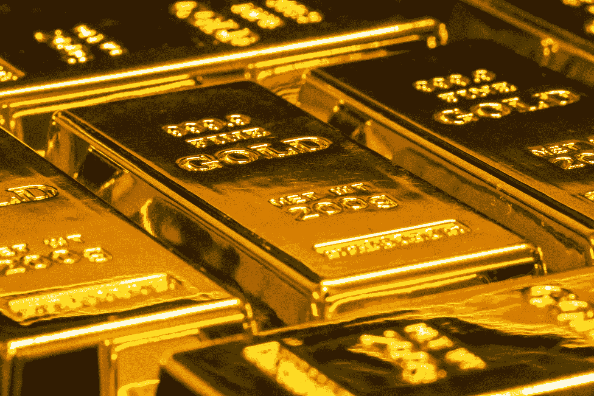

# 繁荣的金属和俄罗斯制裁

> 原文：<https://medium.com/coinmonks/booming-metals-and-russia-sanctions-625f8a7201b2?source=collection_archive---------27----------------------->

Photo by [Jingming Pan](https://unsplash.com/@pokmer?utm_source=medium&utm_medium=referral) on [Unsplash](https://unsplash.com?utm_source=medium&utm_medium=referral)

我写这篇文章，是为了回应分析师所称的“国家冠军”，即捍卫俄罗斯镍产业免受乌克兰战争导致的制裁的经济影响。据多个消息来源报道，受到制裁的俄罗斯商人 [**弗拉基米尔·波塔宁**](https://www.reuters.com/markets/deals/potanin-seen-major-obstacle-russian-60bn-metal-merger-2022-07-06/) 呼吁俄罗斯最大的两家金属生产商——nor nickel 和 Rusal 进行 600 亿美元的合并。

据*路透社*报道，由于两家公司在钯、镍和铝方面的风险敞口，这项拟议中的金属合并有可能达到 300 亿美元的收入。这三种**金属对全球经济至关重要，因为世界正在努力实现能源转型和一个更加以大宗商品为中心的投资者市场。**

***Mining.com*随后于[**2022 年 7 月 22 日**](https://www.mining.com/web/lme-wont-ban-nornickels-metal-as-russian-firm-isnt-under-uk-sanctions/) 报道称，伦敦金属交易所(LME)公开宣布不会立即禁止拟议中的金属合并。**

**然而，为了理解俄罗斯金属并购的意义，需要深入了解地缘政治和大宗商品如何融入一个国家的整体战略。**

> **通过这篇我写的关于 [**金属 2.0**](/coinmonks/metals-2-0-the-game-changers-in-geopolitics-da643974401f) 以及伦敦金属交易所(LME)的的影响的文章，可以更广泛地了解金属行业正在发生的事情。它包括关于中国，印度尼西亚，澳大利亚，特斯拉和更多的信息。**

**就俄罗斯而言，对抗制裁是该国未来经济发展的关键部分。这一金属合并旨在成功实现将两家大型(国有)公司合并为一家由俄罗斯政府控制的大型实体的战略。**

**这些金属对全球经济变得如此重要，以至于俄罗斯(以及其他国家)必须仔细考虑其工业如何避免美国和欧盟的制裁。避免因俄罗斯入侵乌克兰而遭受制裁的巨大打击，将是他们捍卫俄罗斯民族主义政策的整体战略中的一大成就。**

** [## 星巴克正在离开俄罗斯..并以新的品牌在莫斯科重新开业

### 在早先一篇关于麦当劳在俄罗斯重新开业的文章中，我们详细观察了西方的双重标准…

medium.com](/@antonkrutikov/starbucks-is-leaving-russia-and-reopening-in-moscow-under-a-new-brand-f26ec689a188) 

# **中国因素**

俄罗斯商品的走势以及制裁对相关产业的影响，都将影响到俄罗斯与中国的关系，这也将引起美国和欧盟的高度关注。

事实是，俄中战略仍不确定会走多远，尽管中国国家主席和习主席近平支持袖手旁观弗拉基米尔·普京，不考虑乌克兰战争。在我看来，这在很大程度上表明了两国在世界政治中的共同利益。

奥运会无疑是做出这种声明的最大舞台之一。

我认为，中国未来可能会面临艰难的决定，即增加对俄罗斯大宗商品**的敞口会带来什么后果，特别是铜和镍等金属，俄罗斯拥有这些金属的产能和战略储备，可以在未来继续向中国供应这些关键金属。**

**中国也不太可能卷入 [**ESG 范式转变**](/coinmonks/paradigm-shifts-indigenous-groups-mining-projects-during-global-commodity-supercycle-44b5d3b34aaf) 以及与依赖俄罗斯这些重要商品出口的海外经济项目相关的问题。这将有利于中国未来面对美国的战略困境。**

> **阅读更多关于俄罗斯和中国之间的战略关系的文章，这篇文章发表在《国会山》上，“中俄联盟深化的三个原因”。[https://the hill . com/opinion/international/599644-three-reasons-why-the-China-Russia-alliance-is-deeping/](https://thehill.com/opinion/international/599644-three-reasons-why-the-china-russia-alliance-is-deepening/)**

# ****总结思路****

**根据最新的 [**OFAC 食品安全概况**](https://home.treasury.gov/system/files/126/russia_fact_sheet_20220714.pdf) 美国财政部已向公众澄清，政府没有也不会对农业或医疗商品实施制裁，包括农产品、设备和化肥的出口。**

**俄罗斯-乌克兰冲突告诉我们，国际前景不再像以前那样不确定。G7[**团结一致**](/@44jmonroe91/while-g7-tackles-global-food-security-putin-flexes-at-st-petersburg-d09b4ea50c65) 谴责并智取俄罗斯的侵略，而发展中国家寻求与俄罗斯这个更加以能源和商品为导向的经济大国进一步合作。**

**必须指出的是，即使最大的公司都在努力在全球范围内成功实现能源转型，但随着时间的推移，通过液化天然气生产和出口天然气的承诺将继续增长。**

**随着 [**全球大宗商品超级周期**](http://It's essential to point out that even when the largest companies are pushing for ways to successfully carry out Energy Transition around the globe, that commitments to natural gas production and exports via LNG will continue to grow over time. And as the Global Commodity Supercycle continues to drive demand for offshore oil and iron-ore, among other commodities, there going to be a lot more attention on how Russia extends its political agenda.) 继续推动对广泛大宗商品的需求，人们将更加关注俄罗斯如何根据美国和欧盟面临的政治议程扩大其经济出口。**

**从这个角度来看，很明显，在一个国家规划未来的工业时，金属市场将成为其战略中的一个更大的因素，而特斯拉和必和必拓集团等公司必须准备好承担卷入地缘政治十字路口的负担，特别是在俄罗斯入侵乌克兰之后，这使得几家国际公司处于国际问题的前沿。**

**事实上，面对小麦和谷物等主要原材料来源和食品供应日益增长的威胁，俄罗斯的行动促使 G7 优先考虑食品和能源安全。**

**最后，我要说，对原材料、商品和能源的需求正在影响当今许多国家的外交政策领域，包括发展中国家和发达国家——只要看看我下面提供的关于美国国际贸易法庭和巴西化肥外交的例子就知道了。**

** [## 美国化肥生产商马赛克公司反补贴战略前瞻…

### 马赛克公司对俄罗斯和摩洛哥的磷肥补贴进行反补贴调查…

medium.com](/data-driven-fiction/a-strategic-foresight-look-at-american-fertilizer-producer-the-mosaic-companys-countervailing-242caf593d43)  [## 美国化肥生产商 CF Industries 的 UAN 反倾销之策略要素…

### CF Industries 在美国国际贸易法庭(USITC)与美国农民争吵

medium.com](/data-driven-fiction/the-strategic-elements-of-american-fertilizer-producer-cf-industries-uan-antidumping-dispute-58fe00384405)  [## 用防御性现实主义理论解读巴西的肥料外交

### 我引用乔治敦大学外交研究所的实证分析作为理由…

medium.com](/data-driven-fiction/unpacking-brazils-fertilizer-diplomacy-with-the-defensive-realism-theory-f368f89f3f50)  [## 肥料外交的概念

### 2022 年 5 月 3 日，巴西宣布政府将出访北非，目的是参与…

medium.com](/@44jmonroe91/the-concept-of-fertilizer-diplomacy-b710b2fb1a35) 

> 交易新手？试试[加密交易机器人](/coinmonks/crypto-trading-bot-c2ffce8acb2a)或者[复制交易](/coinmonks/top-10-crypto-copy-trading-platforms-for-beginners-d0c37c7d698c)****