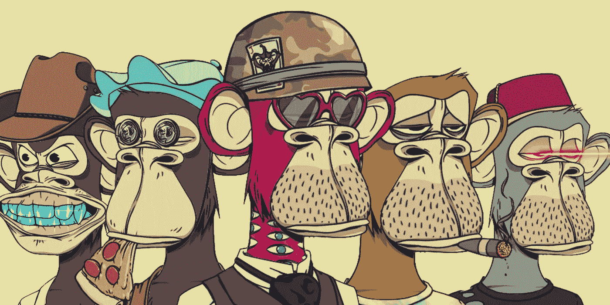
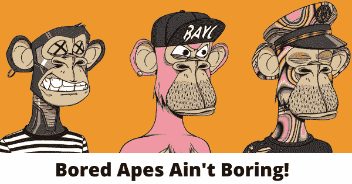
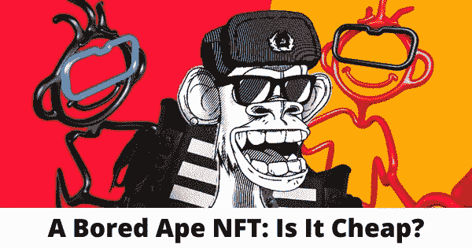

# 无聊的猿 NFT:为什么它很贵？

> 原文：<https://medium.com/coinmonks/bored-ape-nft-why-is-it-expensive-61598dc65185?source=collection_archive---------36----------------------->

无聊的猿 NFT 是最著名的 NFT 标志之一，吸引了许多有影响力的艺术家交易或展示他们独一无二的艺术品的所有权。这是什么？为什么很多名人都爱？ ***百无聊赖的猿 NFT 多少钱一只？*** *本博客将详细阐述这些方面，让你更好地了解这个在 NFT 世界崛起的俱乐部。*

# NFTs:它们到底是什么？

Have you known about Bored Apes? — Image Source: CryptoABC

# 定义

[NFT](https://libraryoftrader.net/nft-explained) 是不可替代令牌的缩写。它是区块链上的加密资产，具有唯一的代码和元数据。NFT 的独特性解释了它的“不可替代性”——其他任何东西都无法替代。

以[比特币](https://libraryoftrader.net/product/full-cryptocurrency-course)为例，它是加密世界的突出代表之一。它也是一种加密资产，但它是可替换的，因为你可以用一个比特币换另一个比特币。此操作与 NFTs 不同。

因此，人们也称 NFT 为独一无二的交易卡。当你决定交易 NFT 时，你仍然会得到一个 NFT，但是是不同的。与[加密货币](https://libraryoftrader.net/day-trading-crypto)相同但不同。

# 它们是如何工作的？

NFTs 的前一版本是 ERC-721 标准，它确定了所有权细节、元数据和安全性的最小接口，以交换和分发游戏代币。

然后，ERC-1155 标准将该系统升级为将各种类型的不可替代令牌批量化到单个合同中。因此，交易和存储所需的成本可以降低。

非正规金融交易省去了中间人，允许参与者或相关方直接相互联系。因此，它不仅减少了开支，而且还简化了交易过程。

NFT 现在作为一种房地产和艺术品的数字表现形式而受到欢迎。其中一个很大的优势是 NFTs 是基于[区块链技术](/@libraryoftrader/blockchain-technology-everything-you-want-to-know-8539f1771d61)的，该技术增强了安全性以及艺术家或所有者与观众之间的直接联系。

每个 NFT 都是独一无二的，这改变了加密模式。简而言之，你不能等价交易或交换它们。你不能用另一个 NFT 来代替一个，但是你可以把它们结合起来“繁殖”出一个新的独特的 NFT。

# NFT 艺术有哪些类型？

NFT 艺术主要有两种类型。第一种类型包括 NFTs 中的独家视觉效果，可以被视为现实生活中的绘画。第二个是 NFT 艺术收藏，比如无聊猿游艇俱乐部——一种在社交媒体上展示图片的形式。

# 无聊猿游艇俱乐部:名人的 NFT 选择

*What do you know about this key NFT symbol?*

无聊猿游艇俱乐部(BAYC )，又名无聊猿和无聊猿，是一个简单的基于[以太坊](/@libraryoftrader/ethereum-vs-bitcoin-which-is-a-better-investment-668b59d411a7)区块链的 NFT 系列。它的工作方式与 NFT 一样，让买家能够证明他们对一次性艺术品的所有权。

 [## 以太坊与比特币:哪个是更好的投资？

### 投资以太坊还是比特币可能是许多有抱负的加密交易者关心的问题。这两种硬币都被誉为…

medium.com](/@libraryoftrader/ethereum-vs-bitcoin-which-is-a-better-investment-668b59d411a7) 

这个俱乐部于 2021 年 4 月 23 日首次向公众开放，作为一个艺术品知识产权的私人在线俱乐部。“无聊的猿”这个名字解释了为什么买家会有一个看起来无聊的猿的插图，它戴着配饰，有着随机的特征。

你可以发现许多名人加入这个俱乐部，如贾斯汀比伯、吉米·法伦、史努比·道格、阿姆、麦当娜、内马尔、提姆巴兰、史蒂夫·青木等。

值得注意的是，BAYC 并不是名人在 NFT 的唯一选择，因为许多其他人也有类似的结构和运作方式，如 CyberKongz、Doodles、Cool Cats 等。

# 有多少无聊的猿 NFT？

BAYC 现在包含大约 170 项资产的 10，000 个独特的 NFT。对所有这些无聊的猿类来说，仅仅 12 个小时后，NFT 就以 190 美元(0.08 以太坊)的价格出售。这种 NFT 也是游艇俱乐部的会员卡，包括进入浴室和数字涂鸦板。

无聊的猿类出现在社交媒体上，用无私的猿类的独特头像来展示各种数字兄弟关系。无聊猿类游艇俱乐部的 NFT 成员完全有权将他们的猿类商业化。

更重要的是，获得额外的 NFT 收藏品使持有者能够出售它们以赚取潜在的巨额现金。此外，持有者可以将一只无聊的猿变成他们想要的电影、电视节目、书籍等。这个特点让这个俱乐部脱颖而出。

# 是什么让这个社团受欢迎，有价值？

BAYC 的卓越特性包括基于以太坊的技术、将无聊的猿猴旋转成想要的艺术品(如电影或书籍)的能力、完全的商业化权利等。然而，真正有助于这个俱乐部人气飙升的因素是名人影响力、潜在的公众曝光率和会员的便利性。

# 名人的参与

名人无聊猿有帕丽斯·希尔顿(1630 万粉丝)、阿姆(2260 万粉丝)、吉米·法伦(5130 万粉丝)、小内马尔(5500 万粉丝)、贾斯汀比伯(1.141 亿粉丝)等。

贾斯汀·比伯在 2 月份以 129 万美元的价格收购了贝可·NFT。六月，阿姆和史努比·道格制作了一段说唱视频，分享他们对无聊猿类的看法。

A 星名单似乎足以吸引大众的眼球。当如此惊人的数字加入游戏时，交易的热度或热门交易会更高。

成员之间的聚会在纽约、加利福尼亚、香港和英国举行。阿姆、史努比狗狗、液晶音响系统、艾米·舒默等的表演。在猿节的最后一个六月，有一些引人注目的活动。

# 接触更多受众的巨大潜力

公众的关注表明有更多的机会接触到更多的人。市场越拥挤，就越有可能获得更高的回报。名人的参与导致了销售和炒作。这些特征将描述一个竞争激烈但有利可图的市场。

# 灵活的加入方式

作为 BAYC 的会员，你可以使用“玩赚”的方式。此外，你可以用一个 NFT 来换取相关的加密货币。这种灵活性为 NFT 持有者提供了便利。

# 一只无聊的猿 NFT 值多少钱？

*How Much Is the Bored Ape Worth?*

# BAYC 的下一步是什么？

在成长之流中，无聊猿类游艇俱乐部背后的大脑有着期待动态突破的计划。

它已经发布了 Ape Coin，即 BAYC 的加密货币，在推出期间发行了超过 10，000 枚 Ape Coin。当时的价值约为 100，000 美元，由于加密市场崩溃的深刻影响，现在已降至约 70，000 美元。

另一个令人兴奋的计划是无聊猿的元宇宙正在进行中。元宇宙仅仅是一个虚拟的和区块链整合的空间，成百上千的人在这里拥有非功能性物品。宇迦实验室已经出售了元宇宙的土地，并在几个小时内收回了超过 3 亿美元。

无聊的猿类在数字世界里似乎不太稳定…..

【阅读全文:【https://libraryoftrader.net/how-much-is-a-bored-ape-nft】

****关注我们的 [Medium profile](/@libraryoftrader) 以获得更新和关于交易和投资的深度文章。另外，你可以找到我们👇****

****交易者博客库:[https://libraryoftrader.net/blogs](https://libraryoftrader.net/blogs)****

****https://www.facebook.com/libraryoftrader****

****推特:[https://twitter.com/libraryoftrader](https://twitter.com/libraryoftrader)****

****领英:[https://www.linkedin.com/company/library-of-trader/](https://www.linkedin.com/company/library-of-trader/)****

****https://www.reddit.com/user/Library_Of_Trader****

****quora:【https://www.quora.com/profile/Library-of-Trader】T4****