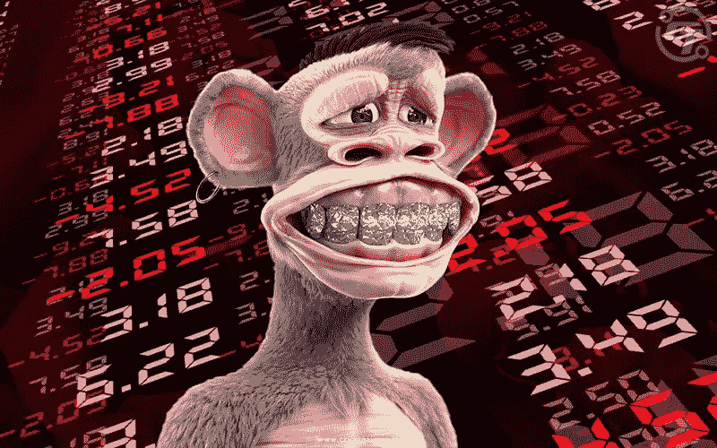

# 清算危机下的无聊猿 NFTs！！

> 原文：<https://medium.com/coinmonks/bored-ape-nfts-under-liquidation-crisis-e95d7e183ae9?source=collection_archive---------1----------------------->

BAYC NFT

BAYC 清算！！！不，这不是虚惊一场，在这个不可预测的加密市场，即使强大的 BAYC NFT 收集也未能幸免于挫折。如果说 NFT 顶级收藏 Bored Ape Yacht Club (BAYC)下降的底价还不够糟糕的话，它还有倒闭的危险，因为它在 NFT P2P 贷款市场 BendDAO 上获得了未偿还贷款。

随着市场试图从漫长的加密冬天中复苏，蓝筹股 NFT 项目处于最低点。NFT 市场即将开始一项有趣的实验，看看有多少买家在关注 BAYC 的清算。

有几个迹象表明市场可能会被清算，但是来自青岛开发商和 NFT 社区的快速反应。

坏消息是，对于那些没有准备好的人来说，这可能意味着更大的崩溃——如果你还没有准备好，那么你可能要在情况变得更糟之前开始存钱了！！

# **为什么 NFT 北汽会陷入清算危机？**

人们的担忧主要集中在 BendDAO，这是 NFT 贷款协议之一，旨在加速 NFT 行业的金融化。BendDAO 允许他们的用户提供蓝筹 NFT，如无聊的猿，加密朋克，志那都红豆，酷猫等作为抵押，并获得贷款。

联邦储蓄银行的储户可以提供流动性以赚取收益，它现在在联邦储蓄银行和本德银行支付 8.15%的年利率，而 NFT 的持有者可以在锁定资产时借入联邦储蓄银行。

作为交换，收藏家从他们的资产中获得效用，而不仅仅是为了艺术本身而展示或拥有一件作品。当有人在本岛获得一件 NFT 时，他们可以选择借用藏品底价的 40%。

但是，如果底价下降并接近贷款的初始价值，NFT 可能会被清算并拍卖。在这种情况下，借款人有 48 小时偿还债务，否则将面临清算风险。

在 Crypto Twitter 上，一位化名为 Cirrus 的 NFT 收藏者提出了对 BendDAO 的担忧，指出价值 5900 万美元的 NFT 作为抵押品存入了该协议，其中许多都面临清算的风险。

https://twitter.com/CirrusNFT/status/1559954449002401792

即使是那些想撤回资产的人也无法这样做，因为送到本道的 ETH 现在几乎已经完全用完了。这是一个大问题，超过 15，000 ETH 被借给了那些以非金融资产作为抵押的人。

DeFi 的无缝特性和无单点故障应该是其主要销售优势之一。本道商业模式的可行性相当可疑，因为没有足够的 ETH 让所有贷款人退出。

对于借款人来说，维持未平仓债务头寸的成本非常高，因为已经有太多针对非金融交易的借款，而且本道仍有大量杠杆。目前，借款人被要求支付高于 100%的利率，仅仅是为了维持他们的贷款头寸。

这有许多原因。事实上，这是缺乏流动性的一个症状，贷款人将很难收回他们的 ETH，这使得它首先成为一个问题。贷款人借出的 ETH 获得了非常高的收益，但他们可能拿不回多少。

问题在于，这表明非金融信托不是很好的抵押品。由于其高价格波动性和固定上限，它们的流动性不足；由于缺乏可替代性，它们的流动性不够。

许多 NFT 已经出现债务违约。MAYC、BAYC、CloneX 和 Doodles 都是在本道上 24 小时内清算的收藏品。

有趣的是，这些 NFT 很难找到出价，这是一个大问题，因为如果 NFT 不能适当清算，DAO 将没有任何流动现金流，也不能声称他们的系统是有效的。

违约机制的运作方式是——bend Dao 要求出价的价值高于借款人的债务，也高于 OpenSea 的底价——此前还没有出现过任何违约的 NFT 出价。

事实上，当抵押品不可替代时，清算更具挑战性，这是以非金融交易为中心的贷款协议的关键问题之一。当抵押品是可替代的时，套利者可以很容易地自动化快速贷款机器人，以快速进行清算。

这对于 NFTs 是不可能的，因为每个 NFT 需要来自不同方的特定报价；如果在某个特定的价格没有人出价购买 NFT，价格就会下跌；如果担保品持续低于所存担保品的价值，则协议破裂；借款人的高年利率并不总能解决这个问题。

# 无聊的猿鲸导致 FUD

在发现一个名叫富兰克林的著名无聊猿游艇俱乐部成员从本道借了 10，245.37 ETH 后，社区的担忧增加了。

富兰克林是世界上最大的 NFT 鲸之一，他有 60 只无聊的猿。人们担心的是，因为富兰克林拥有如此多的猿类，他可以降低底价来偿还他的 ETH 债务。

值得注意的是，任何收藏品都可能发生清算级联，但很少有像 Bored Ape Yacht Club 这样有价值或经常被用作抵押品的。当藏品底价下降时，这可能会导致其他转移到本道的猿类折价出售。

富兰克林在推特上澄清说，他已经向本道支付了他们应得的费用，但这并没有减轻人们的担忧。尽管 NFT 市场尚未出现任何重大清算，但过去一年，过度使用杠杆已导致该领域其它部分出现重大亏损。

[https://Twitter . com/franklinisbored/status/1562862216092606464](https://twitter.com/franklinisbored/status/1562862216092606464)

# BAYC 清算如何影响 NFT 市场？

随着 NFT 银行业人气飙升，过去一年声名狼藉的其他 NFT 贷款公司可能会受到 BAYC 大规模清算事件的影响。

此外，无聊的猿类是最著名的 NFT 收藏品之一，如果不是最重要的话，因此该领域的级联清算可能会产生广泛的影响，不仅仅是无聊的猿类。

面临清算的大多数无聊的 ape 所有者在几个月前购买了他们的 Ape 图像，当时底价是 125 ETH。随着更宽的 NFT 航线的出现，它已经下降到略高于 75 ETH。以无聊的猿猴作为抵押的收藏者可以通过偿还贷款和利息的方式将非功能性昆虫从网站上移除。

一些问题是由 NFT 交易的运作方式造成的，在这种方式下，底价将随着 ETH 相对于美元价格的变化而变化。

尽管 ETH 的价值在过去的一个月里从 1000 美元增加到了近 2000 美元，但像 BendDAO 这样的贷款服务仍然与他们最初借出的令牌挂钩，迫使一些无聊的猿类以高于原始购买价格的价格出售。

随着更昂贵的 NFT 通过清算拍卖出售，收藏家们开始以更低的价格浏览橱窗。不管出价有多诱人，都必须在藏品底价的 5%以内，才能在本道拍卖的 NFT 上被接受。

# 【BAYC NFTs 如何逃脱清算失败？

随着流动性危机有失控的危险，本道采取措施扭转其轨迹。Bend DAO 发生的事件暴露了允许借款人使用无聊的 Ape NFTs 作为抵押品的弊端。

[本道发起了一项全新的提议](https://www.cryptotimes.io/benddao-initiates-proposal-to-reduce-liquidity-threshold/)，在资不抵债的担忧中降低流动性门槛。根据该提案，抵押品的清算门槛将从 85%降至 70%，目前该提案已获得 97.13%的法定票数(6000 万欧元)支持修订。

[https://twitter.com/BendDAO/status/1562097829841055745](https://twitter.com/BendDAO/status/1562097829841055745)

这意味着，如果抵押品头寸达到 70%，则被视为抵押不足。该提案还指出，取消了在 OpenSea 拍卖的底价的 95%的出价上限，并将拍卖时间从 48 小时减少到 4 小时。

清算人目前必须出价高于借款人到期债务，且在 NFT 当前底价的 95%以内，才能对本道发起竞购。向投标支付 5%的费用，借款人有 48 小时来决定他们是否可以偿还贷款，以要求他们的 NFT。

向投标支付 5%的费用，借款人有 48 小时来决定他们是否可以偿还债务和收回他们的 NFT。然而，随着 NFT 底价的下跌，清算人不想冒险将其 ETH 锁定 48 小时。

通过将拍卖持续时间缩短至 4 小时，快速清算成为可能，有助于避免坏账。

为了鼓励存款人通过赚取利息来贷款，并鼓励 NFT 业主迅速退还他们的 ETH，该提案建议将贷款的基本利率从 100%降至 20%。所有关于坏账的决定都将提交给本道社区，由他们投票决定如何分配收入。

与此同时，分散加密货币交易所 [Uniswap 正在与七家 NFT 贷款协议](https://www.cryptotimes.io/uniswap-in-talks-with-nft-lending-protocols-for-nft-financialization/)就 NFT 金融化进行谈判。Uniswap 正在努力解决该领域的两个主要问题:流动性分散和信息不对称。

基本上，拥有基础 NFT 的人不仅可以从这些 NFT 的增值中获利，还可以在 Uniswap 这样的分散交易所提供流动性。

依赖于 NFT 底价的 DeFi 协议正在探索继续运营的策略，因为它们在熊市期间仍然不稳定。本道管理其清算危机的方式将影响类似的协议。

> 交易新手？试试[密码交易机器人](/coinmonks/crypto-trading-bot-c2ffce8acb2a)或者[复制交易](/coinmonks/top-10-crypto-copy-trading-platforms-for-beginners-d0c37c7d698c)