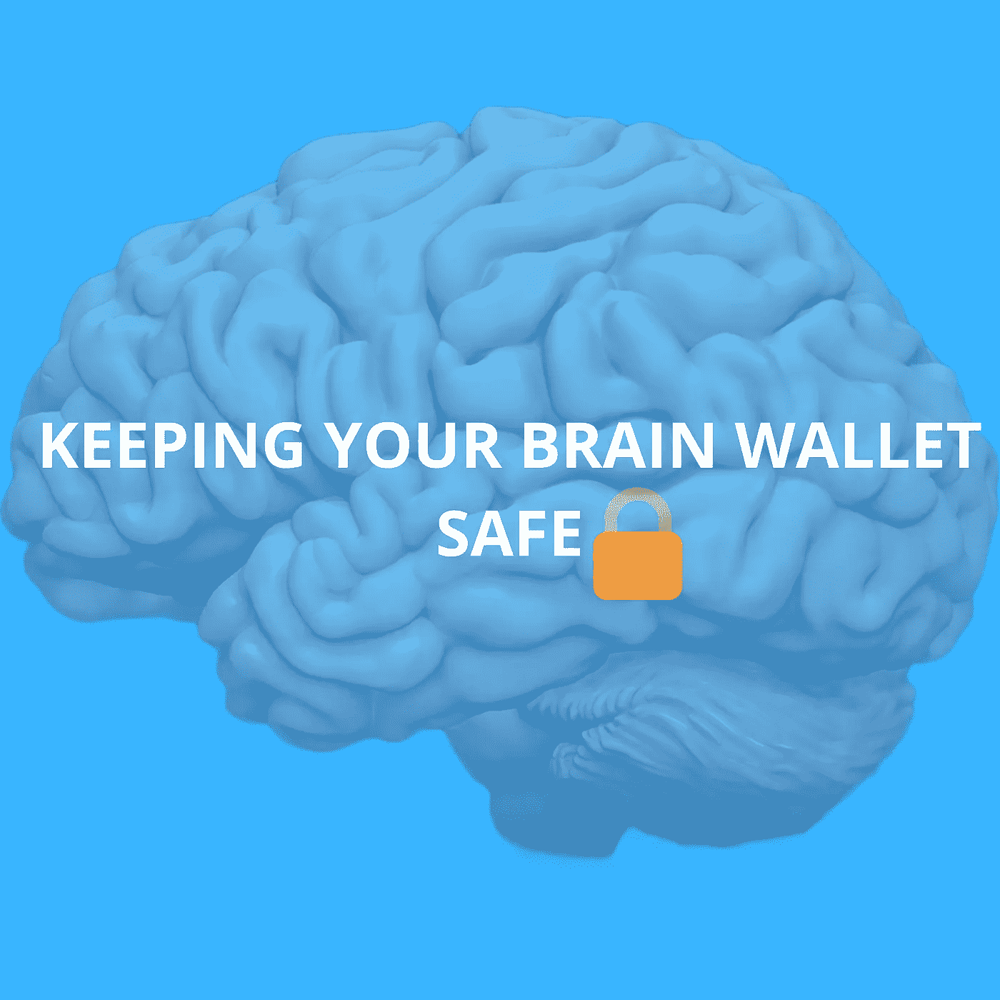

# 大脑钱包||这是什么

> 原文：<https://medium.com/coinmonks/brain-wallets-what-it-is-f0f313be5d95?source=collection_archive---------19----------------------->

不是热钱包，不是保管钱包，也不是纸钱包。是啊！这是一个大脑钱包；不太出名的那种钱包。

想象一下，有一个超过 50 万美元的加密资产组合，只有你的大脑掌握着打开这些宝藏的钥匙；乍一看，这似乎很神奇，但仍有一些问题需要解答。

1.)为什么会有人想弄个大脑钱包？

2.)如何打造大脑钱包？

3.)安全吗？

4.)大脑钱包未来的采用情况是怎样的？

**从基础开始:**

# 什么是大脑钱包？

大脑钱包是一种需要用户生成密码并将其存储在内存中的钱包。用户将不必把它写在纸上或日记中，只要他们有互联网连接并能记住记住的短语，就可以更容易地从世界任何地方访问他们的加密货币。

> 交易新手？试试[密码交易机器人](/coinmonks/crypto-trading-bot-c2ffce8acb2a)或者[复制交易](/coinmonks/top-10-crypto-copy-trading-platforms-for-beginners-d0c37c7d698c)

# 大脑钱包是如何工作的？

就像所有其他的钱包一样，大脑钱包需要一个私人密钥(密码)，但与其他钱包不同的是；这个私钥由用户生成并存储在他们的大脑中。私钥变得非常灵活——无论主人去哪里，它都会跟着去；只要它不被遗忘。

# 如何做一个大脑钱包？

创造一个大脑钱包不需要复杂的过程。用户可以简单地在信任钱包上创建一个钱包，生成一个种子短语，记住它，然后简单地开始使用钱包。在他们不能使用他们第一次制作钱包的设备的情况下；他们可以通过另一个设备轻松访问它；假设他们没有忘记记忆的种子短语。

另一种创建大脑钱包的类似方法是使用专门为制作大脑钱包而设计的比特币钱包软件。这种钱包允许用户创建自定义密码。这让用户更容易记住，但也让他们的钱包面临更高的被黑风险。

# 大脑钱包的好处

1.)大脑钱包最明显的好处就是免费。

2.)如果一切顺利的话——对于经常出差的人来说，大脑钱包是个不错的选择。鉴于钱包的性质；从任何地方访问他们的加密资产都非常容易。

3.)脑洞是没法黑的(至少在写这个时候不行)。

4.)它为用户节省了将他们的私钥保存在可能被窃取的论文或日志中的压力。

> J **就像加密领域的其他因素一样；任何有收益的东西都会有风险。**

# 大脑钱包的风险

1.)如果用户忘记了记忆的种子短语；用户不可能访问钱包和它们的密码。

2.)人类使用的词汇有时是可以预测的——统计数据证明，大多数人都把自己的生日当作自己的手机锁。如果他们的短语组合很简单，黑客可以很容易地进入用户的钱包(在暴力破解方法的帮助下)。

3.)考虑到用户的可预测性——使用大脑钱包可能会使他们的密码面临更高的漏洞风险。

# 如何保证大脑钱包的安全

对于任何决定创造一个大脑钱包的人来说；有一些安全提示需要注意:

首先，当在大脑钱包中创建种子短语时；使用更复杂的组合有助于保护钱包。

用户应采用记忆挂钩技术来记忆密码短语。

偶尔；确保记住的短语没有被忘记。

# 大脑钱包的未来采用率会是多少？

世界正在走向数字化，由加密货币驱动的去中心化正在成为一种时尚；因此，对安全性的需求很高。因为加密钱包是我们和加密货币之间的桥梁；保证他们的安全是我们的核心任务。

计算过大脑钱包相关风险的专家对采用这种钱包发出了严厉的警告。尽管它比其他种类的钱包有它的好处；所涉及的风险和脆弱性给它贴上了“你永远不应该使用的钱包”的标签。