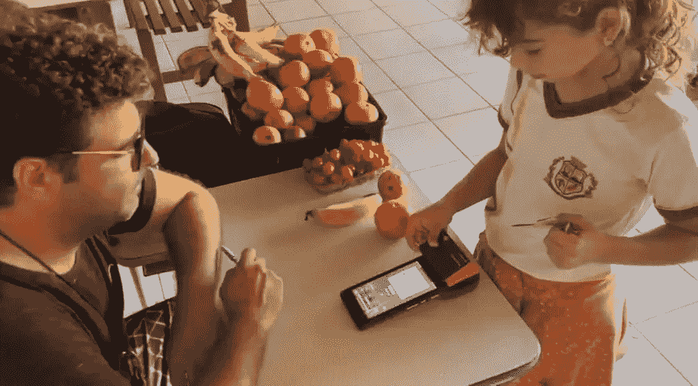

# 巴西社区教孩子们在学校使用比特币

> 原文：<https://medium.com/coinmonks/brazil-community-teaches-children-to-use-bitcoin-at-school-fd7e3613301a?source=collection_archive---------27----------------------->

巴西的比特币城堡，被称为[比特币海滩](https://www.bitcoinbeach.com/)(葡萄牙语为 Praia 比特币)，正在教小学生在课间使用加密货币购买他们日常消费的物品。

因此，在 Jericoacoara 社区的一所学校，孩子们正在用借记卡和基于比特币闪电网络的销售点购买水果。

> *Jericoacoara(也被称为 Jijoca 或拼写为 Gijoca)是巴西塞阿拉的一个小渔村，位于福塔莱萨以西约 300 公里处。(* [*来源*](https://en.wikivoyage.org/wiki/Jijoca_de_Jericoacoara) *)*

*“我们比 Visa 或 MasterCard 更快，孩子们喜欢它，”*Citadel 团队在其 Twitter 账户上表示。

在分享的视频中，可以看到几名学童为他们购买的每种水果支付 10 sats(比特币的最低标准)。

按照社区的规定，使用 Breez Technology 的 Lightning 移动销售点和 CoinCorner 公司的比特币支付 Bolt 卡来完成体验。

该地区的一些商家正在整合类似的支付系统，巴西比特币海滩城堡(Bitcoin Beach Citadel)的创始人费尔南多·莫托莱斯(Fernando Motolese)在另一份出版物中展示了这一点。他认为，通过易于使用的方法，他们自去年以来一直在推动的比特币循环经济将会增长。

# 比特币的循环经济势头更猛

该项目的计划是完全放弃使用由政府控制的法定货币，以创建一个基于“真实和平的货币”的地方经济，这是他们对比特币的分类。

> "*循环经济的提案必须利用遗留系统，利用其工具和法律来提供真正的自由和减少奴役。通过使用比特币，并决定和平的钱，你会收到时间回来。多年来，你会降低你的奴役水平，成为一个独立自主的个体。既然你不再是问题的一部分，你将能够通过修复金钱来修复世界。”—比特币海滩城堡*

然而，在使用二维码用比特币支付时，仍有几个弊端需要解决。主要困难在于参与这一过程的不同平台记录的 BTC 价格存在差异。

出于这个原因，用户“可以支付不正确的金额或巨大的差额，有时是 5%或 10%，”在 Twitter 上说。

有鉴于此，该小组继续寻找技术替代方案，以帮助他们创建最好的基于比特币的社区银行。因此，他们指出*“采纳需要时间和几次商店访问，但它正在发生！”。*

11 月初，该社区为儿童组织了一个研讨会，学习如何使用 LNBits 网关使用比特币支付卡进行支付。

当时，Motolese 向社区的年轻成员强调了学习如何使用比特币作为未来储蓄方式的重要性。

*原载于 2022 年 11 月 9 日*[*【https://bitnewsbot.com】*](https://bitnewsbot.com/brazil-community-teaches-children-to-use-bitcoin-at-school/)*。*

> 交易新手？尝试[加密交易机器人](/coinmonks/crypto-trading-bot-c2ffce8acb2a)或[复制交易](/coinmonks/top-10-crypto-copy-trading-platforms-for-beginners-d0c37c7d698c)