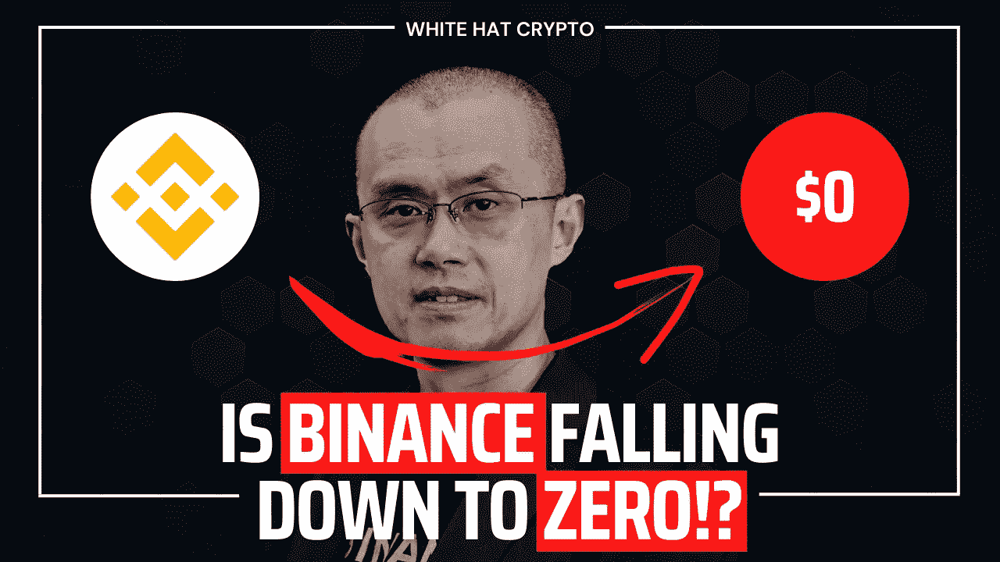

# 🚨插播:币安跌到零了吗！？

> 原文：<https://medium.com/coinmonks/breaking-is-binance-falling-down-to-zero-db20f7581278?source=collection_archive---------1----------------------->

不断变化的动态和 FUD 已经引起了许多关于币安稳定的关注！

Breaking: Is Binance falling down to zero!?

就在一个月前，赵昌鹏似乎还是加密货币无可争议的统治者。11 月初，革命性的交易所发生了灾难性的崩溃，而的首席执行官赵通过出售的本地加密货币射出了致命的一枪，引发了一场流动性危机，导致及其创始人兼首席执行官**山姆·班克曼-弗里德**。

几天来，币安似乎可能会买下 FTX。在随后的几周里，FTX 混乱的崩溃威胁着已经不堪重负的加密部门。

检察官和监管者声称 FTX 不仅仅是一家倒闭的公司，而是一个大骗局，班克曼-弗里德于周一(T5)在巴哈马被拘留。

FTX 危机也在加密幸存者中播下了相当多的怀疑种子，他们正等着看下一个倒下的是哪家大公司，以及其中是否有一家是币安。

就交易量而言，币安是全球最大的加密货币交易所。然而，该公司存在监管问题，并面临洗钱和违反制裁的潜在刑事指控。

> 从顶级交易者那里复制交易机器人。免费[试用](https://coincodecap.com/go/pionex-coinmonks)。

本周，客户从该公司的平台上提取了数十亿美元的资产，币安暂时阻止了一项关键资产的提取。其他加密货币公司安排了危机会议，讨论如果币安局势恶化，他们将如何应对。

那么，**币安陷入混乱**有多深？内部人士称，这里没有 FTX 那么糟糕，但仍不理想。

许多其他知名加密企业的高管，包括币安的主要竞争对手，告诉《财富》杂志，他们**不认为币安处于崩溃的边缘**，区块链的数据支持这一观点，显示该公司有足够的比特币和流动资产储备。尽管一些不经意的旁观者将币安和 FTX 相提并论，但许多业内人士却不这么认为。

赵本周表示，该公司和加密货币总体上正在经历一段艰难时期。他在一份给员工的备忘录中表示，加密行业正在经历一个“**历史性时刻**”，未来几个月将会“**坎坷**”，但币安“**将会度过任何一个加密寒冬。**

然而，该平台及其首席执行官正受到严格审查，在接下来的几个月里，将决定币安是否会长期存在。

虽然本周新闻周期的焦点是在华盛顿特区举行的班克曼-弗里德和密码相关的听证会，但一场关于币安的新戏剧正在幕后慢慢上演。

这一切都是从分析公司南森发布的数据开始的，数据显示客户在七天内从币安取走了 36 亿美元的资产，其中包括在一天之内从 T2 取走了 20 亿美元！

撤资很可能是由周一发表的一篇报道引发的，该报道称司法部内部的团体正在努力寻求对币安及其首席执行官**提出违反制裁和洗钱的刑事指控。**

因为南森的数据涵盖了以太币和稳定币的提款，但不包括比特币，资金外流的真实规模可能比报道的要多！

一位币安竞争对手的高管告诉《财富》杂志，他要求匿名，因为他不被允许公开发言，他的公司内部估计显示，总流出量可能高达 60 亿至 80 亿美元，其中包括比特币和其他货币，如 Tron 套现。

有报道称，该业务无法处理与美元挂钩的最受欢迎的稳定货币之一 USDC 的支出，这引发了人们对币安的担忧。据竞争对手公司的高管称，这是有必要计划出涉及币安的最坏情况的部分原因。

这种最糟糕的情况可能会敲响警钟:据推测，币安可能会利用 **BNB** ，一种原产于币安区块链的硬币，作为贷款抵押。币安拒绝了这种方法，但如果这是准确的，它可能会像 FTX 的 **FTT** 硬币所做的那样暴露公司。如果市场开始担心币安的生存能力，BNB 的价值可能会崩溃，使币安无法偿还债务，并迫使其抛售其持有的有争议的稳定币。这反过来可能会导致储备结构一直不明朗的**系绳**无法维持 1 美元的汇率，从而在整个加密市场引发一场大范围的野火。

你对这种情况怎么看？

我希望这篇博客对你有所帮助。在投资和了解加密货币领域时要谨慎。如果您喜欢这些内容，请考虑关注我！

(我现在也在接受 [Patreon 提示](https://patreon.com/whitehatcrypto?utm_medium=social&utm_source=twitter&utm_campaign=creatorshare_creator)！所以不要犹豫，鼓励我吧！)

这篇文章中提供的内容不是赞助的，据我所知是正确的。这篇文章不是金融建议，我们不对针对这篇文章采取的任何行动负责！

请随时查看我们的社交平台，了解每日加密更新，或通过以下渠道联系我们:

[YouTube](https://www.youtube.com/channel/UCjfinzatswbVaRd89zn5kJQ/featured)

[推特](https://twitter.com/whitehatcrypto)

[Instagram](https://instagram.com/white.hatcrypto?igshid=YmMyMTA2M2Y=)

[Gmail](http://cryptowhitehat@gmail.com/)

信息来源:[财富](https://fortune.com/crypto/2022/12/16/how-stable-is-binance-really/)、[杰夫·约翰·罗伯茨](https://fortune.com/author/jeff-john-roberts/)、[硬币电报](https://cointelegraph.com/)等等！

> 加入 Coinmonks [电报频道](https://t.me/coincodecap)和 [Youtube 频道](https://www.youtube.com/c/coinmonks/videos)了解加密交易和投资

# 另外，阅读

*   [如何开始通过加密贷款赚取被动收入](https://coincodecap.com/passive-income-crypto-lending)
*   [BigONE 交易所评论](/coinmonks/bigone-exchange-review-64705d85a1d4) | [电网交易 Bot](https://coincodecap.com/grid-trading)
*   [氹欞侊贸易评论](https://coincodecap.com/anny-trade-review) | [CoinSpot 评论](https://coincodecap.com/coinspot-review)
*   [新加坡十大最佳加密交易所](https://coincodecap.com/crypto-exchange-in-singapore) | [购买 AXS](https://coincodecap.com/buy-axs-token)