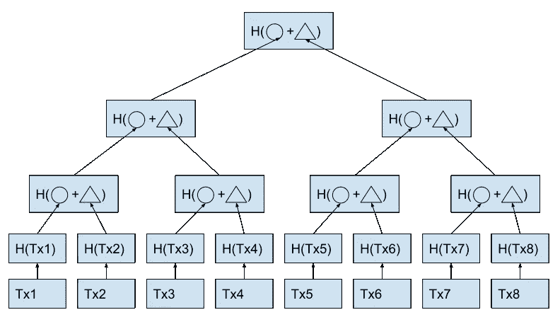
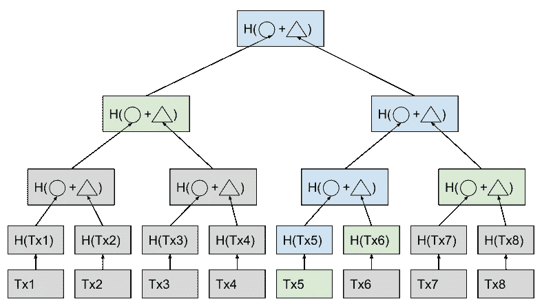
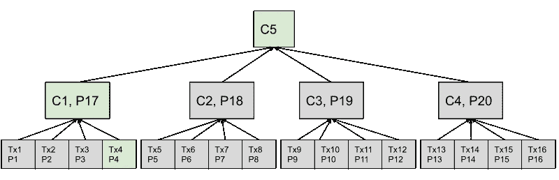

# 用蔓生树打破树木单一栽培

> 原文：<https://medium.com/coinmonks/breaking-tree-monocultures-with-verkle-trees-f64f9e610d6b?source=collection_archive---------25----------------------->

我们被树包围着。不是普通的树，而是梅克尔树。这些森林无处不在，几乎全是区块链网络生产的。但是我们从生物课上知道，单一栽培对生态不好。因此，出于完全不相关的原因，[聚合物实验室](https://www.polymerlabs.org/)正朝着种植一种新型的树——Verkle 树前进。你可以在[我们之前的帖子](/@upResearch/the-essence-of-polymer-75992b4d62b4)中阅读更多关于聚合物实验室及其 IBC 基础设施的信息。

在这篇文章中，我们将解释什么是 Merkle 树如此有趣，以及 Merkle 树给游戏带来了什么。

**证明交易**

如果我们想要检查特定块中事务的正确性(完整性),一种简单的方法将引导我们向每个事务添加一组校验和(散列)(理想情况下，每个事务都加密签名)。当我们想要快速验证一个特定的交易时，这看起来是合理的，我们可以立即这样做。但是由于存储要求，它同时是低效的。这意味着，对于每个事务，它需要存储额外的签名校验和，如果我们考虑到这种块需要在网络上传播，这是一个额外的成本。想象一下，一个由 100 万个事务组成的块增加了 100 万个签名校验和，每个签名校验和甚至可能比事务本身还要大(以字节为单位)。这里你可以看到天真的方法的低效。

**拯救默克树**

Merkle Tree example.

因此，Merkle 树(或哈希树)是一种能够更有效地解决上述问题的结构。通过在一组事务的顶部应用 Merkle 树，我们可以将签名校验和的数量减少到只有一个。这意味着即使我们有一百万个事务，我们也只需要存储一个校验和来验证所有这些事务的正确性。

这是一种高效的存储解决方案。但这也是有代价的，计算的代价。在简单的方法中，我们可以通过查看附加的校验和来立即验证单个事务的正确性。使用 Merkle 树需要更多的工作，我们需要在所有事务的顶部计算 Merkle 树，并比较根校验和，如果它与块中的校验和匹配，那么我们知道该特定事务(以及所有其他事务)是正确的。

**Merkle 校样**

Merkle Tree Proof example, where greens are given and blues are calculated.

现在让我们考虑如何向某人证明我们的事务包含在块中。我们可以简单地将他指向块，显示我们的事务，并要求构建一个 Merkle 树，并将它的根与块中包含的校验和进行比较。听起来好像有一些工作和数据要发送。

幸运的是，由于 Merkle 树的构造方式，这种包含证明可以更有效地完成。代替前面提到的天真的方法，我们可以只在树上呈现一条路径来成功地说服验证者我们的事务确实包含在那个块中。所谓路径，我们指的只是一个事务和通往根树途中的所有相邻散列，如上图所示。这种优化本质上是对数的，这意味着我们可以展示 O(log_2(n))大小的证明，而不是在中构建 Merkle 树，其中 n 是叶子的数量(在我们的示例中是事务)。

**皱树**

Verkle Tree example, where Cn is a Vector Commitment Pn is a proof.

Verkle 树将 Merkle 树的证明大小提高了 O 倍(log_2(k))。换句话说，他们可以用更少的数据说服验证者包含我们的事务。他们正在实现这一目标，这要归功于两个技巧。

首先，Merkle 树是一棵二叉树，这意味着从树根开始，向下到树叶，树中的每个节点只有 2 个子节点。而 Verkle 树是 k 叉树，一种像 Merkle 树那样分支 k 次而不是 2 次的树。

第二，Verkle 树不像 Merkle 树那样使用散列函数，而是使用向量承诺。在本文中，我们不打算详细讨论向量承诺，但我们将只提到向量承诺包括一个证明，即我们的叶子的所有邻居也是正确的。因此，证明只能局限于从叶子(我们的事务)到根的严格路径。下面的例子。

Verkle Tree Proof example, path is marked as green.

没有免费的晚餐，这意味着这种改进是有代价的，这种代价是通过将构建复杂度乘以 Verkle 树的分支因子来支付的。也就是说，不是在 O(n)时间内构建 Merkle 树，而是在 O(kn)时间内构建 Verkle 树，其中 k 是每个节点具有的分支数量。

拥有更短的证明的好处是最重要的，Verkle 树有许多有趣的应用，比如在事务包含证明或零知识构造中。毫无疑问，我们将会看到更多的树种植在我们周围，感谢像[聚合物实验室](https://www.polymerlabs.org/)这样的项目。

直到下一个！

> 交易新手？试试[密码交易机器人](/coinmonks/crypto-trading-bot-c2ffce8acb2a)或[复制交易](/coinmonks/top-10-crypto-copy-trading-platforms-for-beginners-d0c37c7d698c)