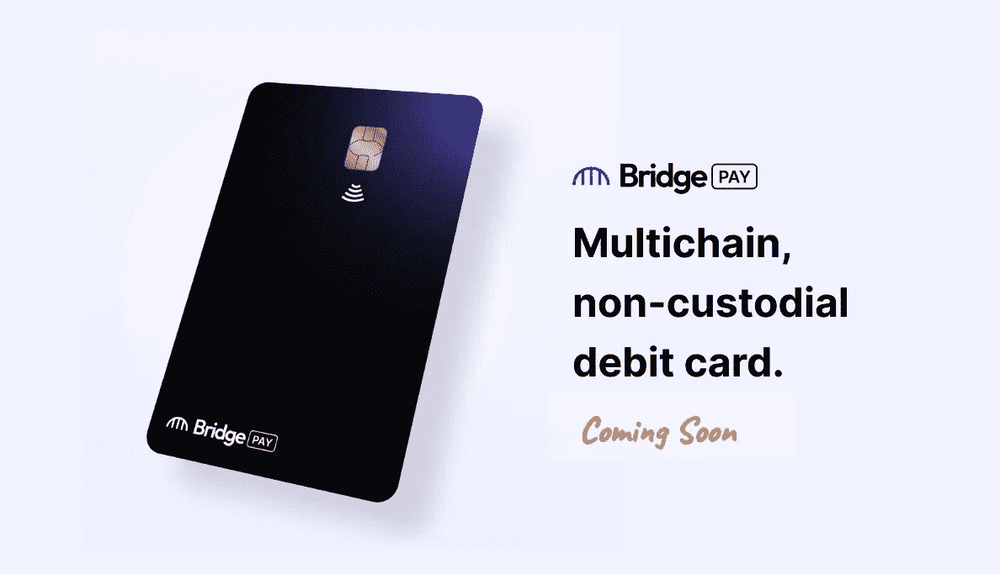
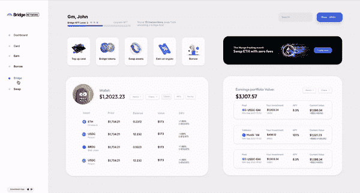

# bridge Pay——面向所有人的非托管多链借记卡！

> 原文：<https://medium.com/coinmonks/bridge-pay-a-non-custodial-multichain-debit-card-for-everyone-d5372f8fbde3?source=collection_archive---------28----------------------->

## Bridge Network 邀请社区加入即将推出的 BridgePay 支付系统的等候名单。

今天就加入等候名单吧！

这是几个月来建造的！我们终于准备好与你们分享我们所做的一切了！

在 Bridge，我们一直在关注加密支付领域。全球用户仍面临巨大障碍，用户资金集中也是一个主要问题。这就是我们介入的地方，引入过桥工资！

[Bridge Pay](http://bridgenetwork.com/pay) 为 web3 用户创造了一种全新、简单的方式，让他们在 100%非托管和多链的真实世界中使用他们的密码。

通过 bridge network 平台上的简单钱包连接，用户可以访问虚拟或物理卡，在几秒钟内就可以直接从自己的投资组合中充值！

通过我们现有平台的多链可访问性，用户可以轻松地将各种不同的区块链资产纳入传统的 web2 支付系统！

例如，用户可能在 BSC 上拥有 BUSD，或在以太坊上拥有 USDC，Bridge Pay 提供了在几秒钟内将这些货币转换成真正的法定货币的机会。这真的像听起来那么简单。

在整个充值过程中，没有集中的钱包来控制您的资产。该应用程序是真正的非托管，用户在任何时候都可以 100%控制他们的资金，无论是在卡里还是在他们的 web3 钱包里。

卡顶在行动中！

**我怎样才能得到一张卡？**

官方候补名单现已上线！

除此之外，我们将很快为有限数量的用户提供机会，让他们从等待名单中参与我们的封闭测试！$BRDG 持有者将有机会以**先到先得**的方式加入独家封闭测试版。

立即注册，抢占您的位置，获得全面发布！[www.bridgenetwork.com/pay](http://www.bridgenetwork.com/pay)

*过桥米线有望于 2023 年在 Q2 上线。*

**Bridge 如何支付 tie 回令牌桥？**

从卡中产生的收入将能够用于进一步激励桥接网络验证者！这将增强并进一步维护现有令牌桥网络的不可信特性！

***联系我们保持更新***

**网址:**[【https://www.bridgenetwork.com/】T21](https://www.bridgenetwork.com/)

**电报:**[https://t.me/BridgeNetwork0x](https://t.me/BridgeNetwork0x)

**推特:**[**https://twitter.com/bridgenetwork0x**](https://twitter.com/bridgenetwork0x)

**不和:**[**https://discord.com/invite/PGHnWapB8u**](https://discord.com/invite/PGHnWapB8u)

**Reddit:**[【https://www.reddit.com/r/bridgenetwork0x/】T21](https://www.reddit.com/r/bridgenetwork0x/)

> 交易新手？尝试[加密交易机器人](/coinmonks/crypto-trading-bot-c2ffce8acb2a)或[复制交易](/coinmonks/top-10-crypto-copy-trading-platforms-for-beginners-d0c37c7d698c)