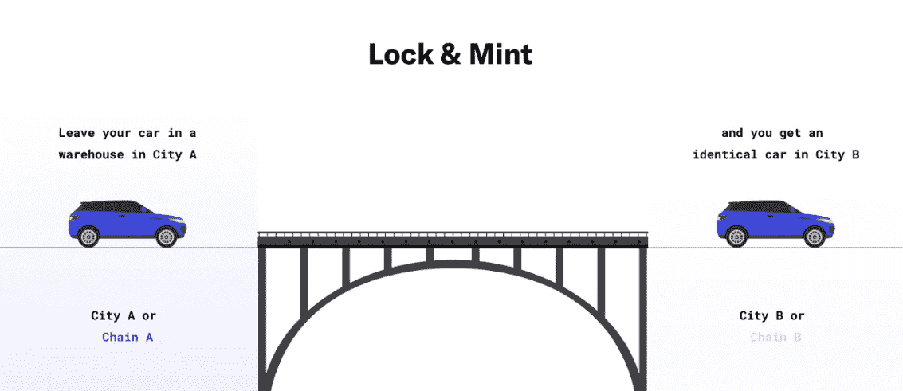
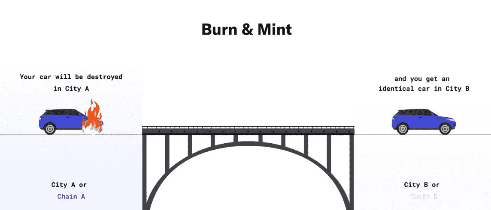
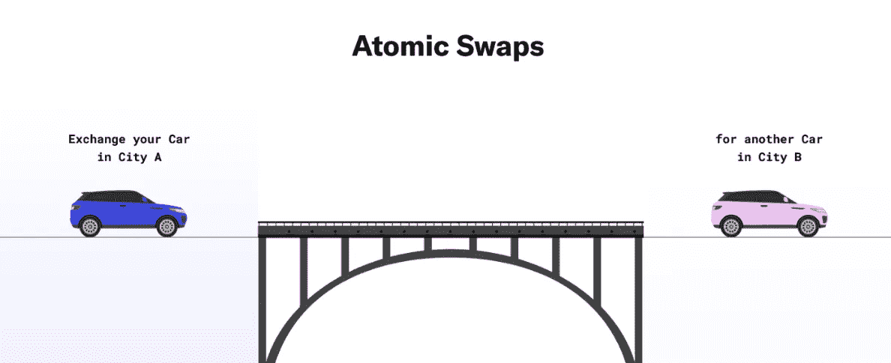

# 桥梁类型、工作原理和风险

> 原文：<https://medium.com/coinmonks/bridge-types-how-they-work-and-risk-abb9928fb72f?source=collection_archive---------14----------------------->

大家好，在这篇文章中，我们将介绍现有的主要类型的桥以及它们是如何工作的，所以让我们开始吧！

> 桥是如何工作的？

虽然有许多类型的桥梁设计，但有三种方法可以促进链之间的资产转移:

*➖* **锁定和创建:**锁定源链上的资产，创建目的链上的资产。示例:多边形 PoS 桥、雪崩(AB)桥。

*➖* **Burns 和 Mint:** 在源链中 burn 资产，在目的链中 Mint 资产。示例:跳协议、跨。

*➖* **原子互换:**将源链中的资产与另一方交换目的链中的资产。例如:Connext。

> **桥梁类型**

桥梁通常分为以下几类:

*➖* 通常，这种桥使用 block and mint 机制。例子:本地桥，如多边形的 PoS 桥，币安以太坊桥。

*➖* **多链桥**:这些桥设计用于跨多个区块链转移资产。他们是建立在这样一种方式，他们可以实施任何类型的 L1 或 L2 区块链。例子:连接，突触，星际之门。

*➖*

*➖* **包装资产桥**:这些桥是专门设计的，能够将非本地资产转移到不同的区块链。他们通过在目标链上创建包装资产来实现这一点，这些资产代表了源链上的原始资产。例如:wBTC、wETH。

> **桥梁风险**

Bridges 是 DeFi 中最大的三个黑客，目前仍处于早期开发阶段。使用任何桥梁都有以下风险:

*➖*

*➖* 这使生态系统面临系统性风险，正如我们已经看到的被利用的包装形式的令牌。

*➖* 用户需要信任这些外部行为者，这使他们暴露于各种风险之下，如暗中破坏、审查和其他恶意活动。

> 交易新手？试试[密码交易机器人](/coinmonks/crypto-trading-bot-c2ffce8acb2a)或[复制交易](/coinmonks/top-10-crypto-copy-trading-platforms-for-beginners-d0c37c7d698c)