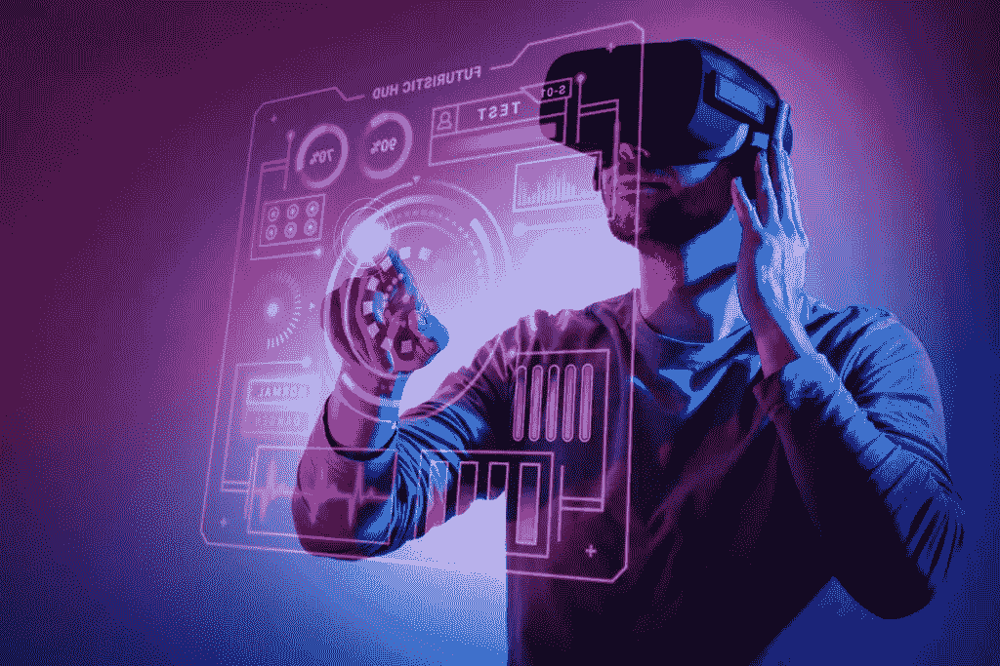
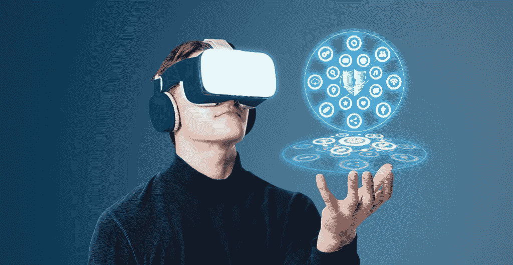

# 元宇宙发展服务:照亮你的 Web3 业务前景的必备工具！

> 原文：<https://medium.com/coinmonks/brighten-your-web3-business-prospects-using-the-best-metaverse-development-services-around-7fe68dac0931?source=collection_archive---------37----------------------->

**Metaverse Development Services**

现在是 2022 年，在这近 15 年的时间里，密码世界已经见证了一切。从繁荣到崩溃，从赞赏到怀疑，从善意到恶意行为，虚拟世界亲眼目睹了这一切。尽管加密市场的价值和声誉不断变化，但新的应用程序不时出现，成为全球的头条新闻。虽然 [**元宇宙开发**](https://bit.ly/3PNZNOg) 可能已经存在了一段时间，但引入区块链元素却是最近才发生的事情，这为未来几代人过上虚拟生活铺平了道路。

# 元宇宙，也就是虚拟世界

虚拟世界是一个虚拟世界，人们可以通过数字化身相互交流，无论他们的物理位置如何。虽然使用 Web3 技术的 metaverses，如区块链、虚拟现实(VR)、增强现实(AR)和人工智能(AI)是最近的事情，但第二人生(2003 年推出)、堡垒之夜、Roblox 和《我的世界》等游戏是数字世界的早期迹象。如今，元宇宙空间公司已经开始涉足游戏之外的领域，沙盒平台**、分散土地和波尔卡城**等平台在不断发展的 Web3 领域取得了长足进步。未来是光明的，因为数十亿美元被投入到现实世界急需的各种应用程序的 metaverses 的研发中。

Metaverse- Virtual Realm

# 2022 年元宇宙发展热点领域

*   **NFT 市场**——metavens 中的 NFT 市场可以用来托管创作者、初创公司和品牌的商店。这些平台专注于为最终用户提供身临其境的体验，这将重新定义他们对 Web3 和购买数字资产的看法。
*   **Launchpads** — [**元宇宙 launchpads**](https://bit.ly/3zOQ7NX) 的工作与他们的 launchpad 同行类似，都是为了支持有抱负的元宇宙创造者和初创公司通过代币销售来筹集资金。这些平台提供关于项目的所有必要信息，这些信息是可信的，因为它们将在社区和智能合同的勤奋审查后被列出。
*   **数字事件** —随着全球流行病停止人类活动，参加事件可能会变得困难，这可以通过使用元宇宙开发解决。虚拟举办活动的空间可以让每个参与者受益，利用 NFTs 可以增强参与者的整体体验。
*   **数字工作** —出于与上述相同的原因，metaverses 可用于通过类似办公室的虚拟环境拉近远程工作人员的距离，人们可以在虚拟环境中工作、会面和讨论演示文稿。这种文化将导致远程工作的公司的发展，也使他们能够雇佣全球人才而不受国界限制。
*   **支付解决方案** —随着 metaverses 的发展，消费加密货币和平台原生令牌的需求增加。这就要求数字世界的支付解决方案能够在任何给定时间高效地处理成千上万的交易。
*   [**医疗保健解决方案**](https://bit.ly/3vuYLOY) —与上述观点类似，医疗保健行业可以从元宇宙发展中受益，以改善培训、模型分析、数据收集、跟踪、研究和用户体验等方面。远程医疗可以发展到与现实世界的医疗标准相匹配，而不会给进行医疗旅行的患者带来巨大的支出。
*   **双胞胎和模拟**——也许，人类面临的最大挑战之一可以通过 metaverses 解决，meta verses 一直在研究物理上不可逾越的领域。虽然 2D 模拟揭示了许多问题急需的信息，但 metaverses 可能是通过虚拟测试获得更准确结果的关键。
*   **游戏平台** —尽管游戏是第一个采用 metaverses 的领域，但随着新类型的整合，它将继续发展，更多基于 VR 和 AR 的游戏可以进入元宇宙竞技场。 [**元宇宙游戏开发**](https://bit.ly/3bj1O63) 以玩赚(P2E)和移动赚(M2E)为基础，2022 年出现大规模增长，导致元宇宙市值增加。
*   **社交网络**—metavens 上的社交网络平台可以与这些虚拟世界的原始定义相匹配，因为用户可以参加活动，并查看来自创作者和其他用户的反馈，所有这些都将通过使用 VR 和 AR 而身临其境，并提供赚钱的机会。
*   **电子学习空间**——meta vers 提供深度体验的特性非常适合年轻人教授他们可能无法很好理解的概念。元宇宙学习空间将被视为从传统的物理屏幕教室的进步，给学生提供学习和理解的机会。
*   [**房地产**](https://bit.ly/3cVA6MS)**——目前，元宇宙发展专注于将虚拟世界中的地块令牌化并出售给人们。这些可以被企业购买，这些企业可以在他们的地块上建立他们的 Web3 企业并进行交易。人们也可以购买元宇宙的房地产作为投机性的数字资产，然后出售获利。**

# **最后一笔**

**随着 metaverses 在过去几年中发生了很大的变化，人们不应该忘记市场、发射台和游戏等平台在塑造虚拟领域中的作用。尽管这些平台在初级水平上执行不同的任务，但它们在很大程度上帮助了 Web3 的发展。如果你想经营这样一个虚拟平台，给人身临其境的真实体验，最好去找一家在元宇宙发展的公司。这类公司通常拥有必要的专业知识和所需技术，以及以客户为中心的理念，这有助于为您的 Web3 企业推出一个世界一流的元宇宙应用程序。**

> **交易新手？尝试[加密交易机器人](/coinmonks/crypto-trading-bot-c2ffce8acb2a)或[复制交易](/coinmonks/top-10-crypto-copy-trading-platforms-for-beginners-d0c37c7d698c)**