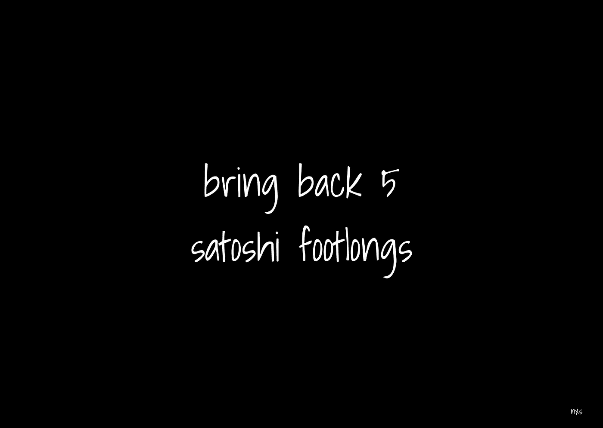

# 带回 5 个 satoshi 英尺长

> 原文：<https://medium.com/coinmonks/bring-back-5-satoshi-footlongs-114ce5c51249?source=collection_archive---------42----------------------->

> 美好的旧时光

bring back 5 satoshi footlongs — nxs

我的邻居，初为人父母，目前在我下面打架。我记得初为人父母的压力，以及随之而来的生活中的财务压力。不让这些压力把你的家庭一分为二是很难的。

不是很多人出生于金钱，我很感激我的生活，从接近贫困开始，到接近贫困，到成为中产阶级，然后为自己选择贫困，这样我就可以“从底层开始”。我没有回到中产阶级的选择，因为这不是我的钱，这是我家人的钱。我有自己的名字。

我在蓝领阶层工作，基本上是领薪水。还不错。我真的很喜欢我现在的穿着。不是满足，而是快乐，感激我的旅程。我掌握了大量的技能，从多语言编码到焊接。我在很多行业工作过，我甚至做过几年的日内交易者。

金钱驱动我们的社会，这不是一件坏事。我们被一种媒介所驱动，这种媒介允许我们进行资源交易，从而使我们的生活变得更加轻松。你能想象如果我们不得不建造自己的家园、自己发电、发明自己的机器、电脑或几乎所有的技术部件和设备来达到我们今天的处境，生活会有多困难吗？我感谢在我们之前的发明家，感谢他们发明了货币。金钱使世界运转..更快。

我相信世界上有超过一万亿美元的流通财富。这将包括所有物理的、数字的、运行中的有限资源、公司估值、衍生产品、股票等。更有可能的是，我们(在全球范围内)不会把所有事情都记录到“t”上。

我住在一个小镇上，这里有一位亿万富翁，他为我们的能源网和建筑服务做了大量的工作。其他人基本上都很贫困，处于中产阶级和社会顶层的少数局外人，不管他们是农民还是医生。是的，最后两个在同一个组，赚的钱一样多。

当我在工作的时候，我经常会有相当多的时间自动进入状态，听播客、音乐，或者在我的耳机坏了的情况下，我不得不在我工作的商店/工厂里使用耳塞来保持噪音最小。不管怎样，我要出去了。我开始思考和反思。我开始想象世界的未来和我在未来的位置。

我不是受教育程度最高的人(理论上)，但我在许多领域都有着令人难以置信的广博知识，并且拥有我所珍视的丰富的现实世界经验。我知道我还在发展我的世界观，但是我已经有了一个很好的想法。

我记得我还是个高中生的时候，非常兴奋地带着 10 美元去学校(那时我是大二/大三学生),然后去当地的地铁站买一个 5 美元长的。啊…时代是美好的。5 美元太贵了。20 美元加满了你超过一半的油箱。5 美元可以让你在乳品皇后或哈迪餐厅饱餐一顿。现在它甚至不能给你买一个完整的汉堡或半个地铁站。别让我开始加油。

你可以明白我的意思，因为如果你处于和我相似的情况，你可能会感受到过去 10 年的影响。事情已经失去控制，我们(在底部)感受最大。现在我不想抱怨太多，因为，好吧，有第一世界的问题是一种特权。但尽管如此，我仍然有发言权。

回到万亿次。大量资金在世界各地的资产多样化和/或交易/价值媒介的许多缝隙中流动。

想象一下。整个世界，不断走向数字化，都集体同意将我们所有的资产时间链接到比特币网络上。不仅一切都有记录，而且一切都可以分析。一切都可以私有化给每个主权个人。我们将创建一个真正的责任体系，以能源燃烧(采矿/电力保障)为后盾。有些人可能会争辩说，这将带来一个世界警察国家，你做的一切(财务)都受到监控。我将在下一段中谈到这一点。

如果你住在美国，并且有一部手机，哈哈，那东西在你附近的每一秒钟你都会被跟踪。你开车经过当地的十字路口，十字路口的摄像头会监控你的车牌，并检测你的速度是否合适。你开着你的车，它有几十个甚至几百个传感器，一旦你发生事故，这些传感器就会对你说三道四，所有人要做的就是把插头插入你的 ob2 插孔，他们就可以看到你的车存储在电脑上的一切，对吗？现在回到比特币，因为我可以不停地说我们已经生活在一个社交媒体驱动的世界，如果它反对(当权者的)世界观，你的自由就不是那么自由了。

如果我们可以将几乎所有形式的货币和身份信息放入比特币的时间链，并为其他东西增加一层安全和几层安全，我们就可以真正赋予每个人成为世界主权公民的权利。你的财富永远不会被夺走。如果你违反了法律，你可能会被监禁，但你的钱仍然是安全的。在当今世界，没有人能像我们一样轻轻一按开关就关掉你的银行账户。这是值得思考的权利，移动一切，我们可以，到比特币。当然，这是一个宏伟的想法，有许多遗漏的细节和许多模糊之处，但尽管如此，这是一个强有力的想法。

网络的市值或链上的财富总量会是什么样子？嗯，随着新产业的形成，太空旅行/生活，以及小行星采矿变得更加普遍，世界将继续增加自己的财富。目前，我估计全世界可能有 1 到 3 万亿美元的财富。

为了便于讨论，我们假设世界上有 2.1 万亿美元的资本。假设所有的财富都被记录下来，可以在比特币时间链上移动。单个比特币除以 1 亿得到最小的分数单位，称为一个 satoshi。一只 satoshi 长这样= 0.00000001

如果全世界的财富都在比特币的时间链上，那么一只 satoshi 今天大约值 1 美元。那该多酷啊。如果你拥有 1 个比特币，如果我们继续兑换成美元，你将拥有 1 亿美元。这不是一个“如果”我们将世界财富转移到比特币时间链上的问题，而是“何时”的问题。这是最小的摩擦。甚至闪电也会沿着阻力最小的路径前进。一旦我们的猴脑意识到一个错误或模式，我们也会这样做。

好吧，那么现在全世界的财富都是比特币。你有希望成为 satoshi 千万富翁或亿万富翁，因为你走在了潮流的前面。现在你可以去拿你的 5 只脚了，回到过去的好时光。

在未来的一篇文章中，我计划不仅讨论美元如何贬值到其本身的极低水平，还讨论这如何影响我们目前经营的服务、产品和食品的质量。

附言:如果你认为我的语法很糟糕，你应该看看我亲自谈论一个特定的想法——我到处都是

把血氧饱和度叠加。

**n̷x̷s̷**