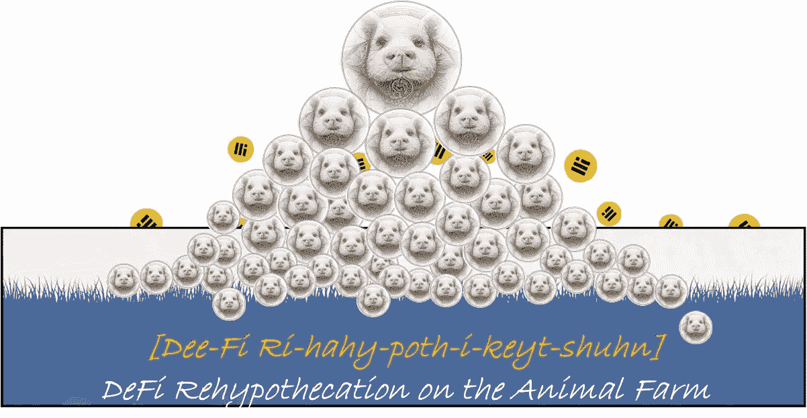
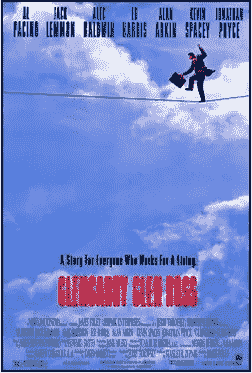
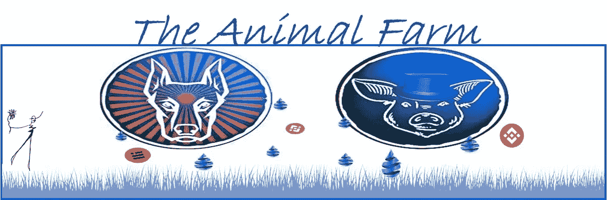
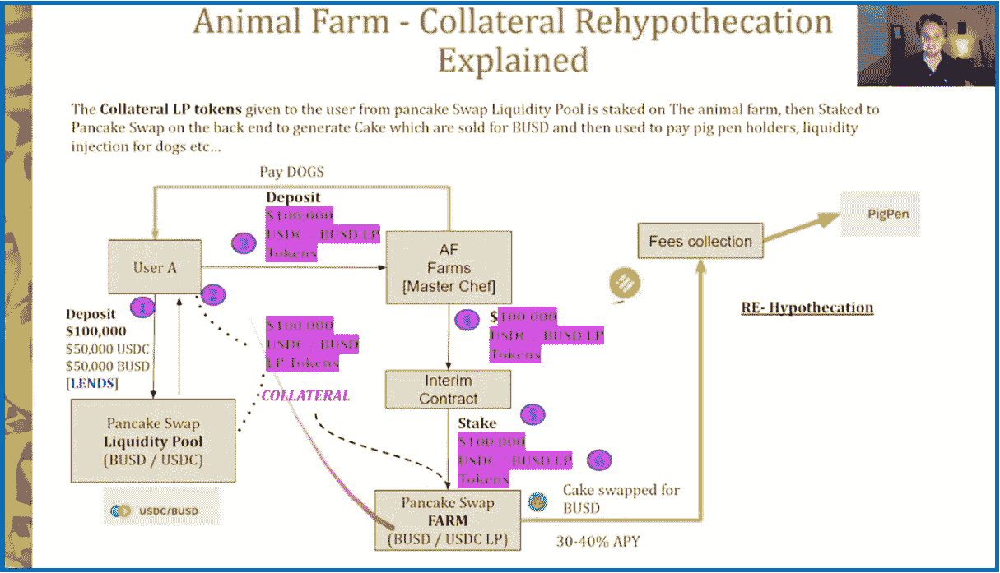
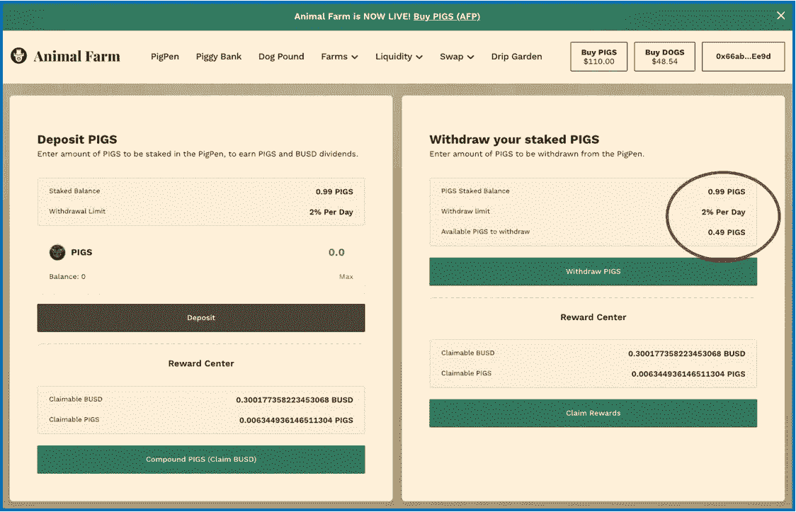
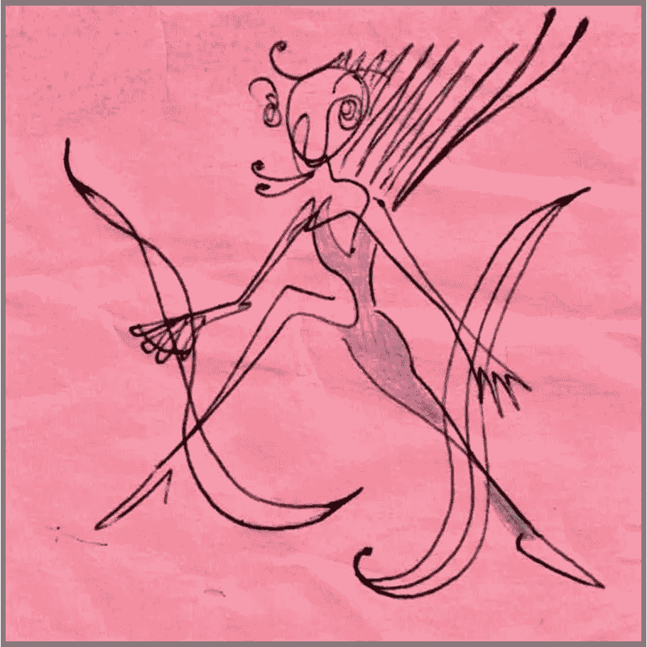

# 把熏肉带回家:动物农场利润丰厚的 DeFi ReHy，解释

> 原文：<https://medium.com/coinmonks/bringing-home-the-bacon-animal-farms-lucrative-defi-rehy-explained-a152d3e78aed?source=collection_archive---------3----------------------->

***是(我的)利息，赚(我的)更多利息……***

很久以前，我为一家只收佣金的房地产公司工作，比办公室惊悚片《T4》中描绘的稍微不那么残酷。然而，根据电影，我的老板*从未*告诉我们**除了前 2 名之外的所有人将在周五**被解雇。

当我在公司的顶级代理商中时，这是偶尔的，我可以赚到 10，000-20，000 美元/月的支票。奇怪的是，当交易完成后&我们的佣金支票到了，业主通常会搁置 10-12 天。它们会在周四/周五送到他的办公室&他不是在下一周，而是在下一周的周一下午 5 点分发。它们会安全地放在他的办公室里——不在他办公桌后面的玻璃柜里——但会永远留在我们的脑海里。这让我们抓狂。

一天，我问他为什么不早点把钱给我们。

## 他说:

*这有助于公司将支票“浮动”几天。大量的[***]工人的[***]佣金支票——在任何时候都远远超过 25 万美元——在那一周左右的时间里一直留在高收益账户上，赚取公司股息。这种兴趣增强了公司的底线。如果绝对有必要，公司可以从那些“流动资金”中借款，只要它最终得到偿还。*

> “你会得到你所有的钱，”他说。“只是不是马上。”

在他看来，没有人受伤，所以没什么大不了的——对他来说，这是一起没有受害者的犯罪).

在我心里，我认为那是我的钱，他拿着我的钱赚钱。知道自己的钱在赚钱，却没有受益，留下了不好的味道…

> 我想，在不知道的情况下，我被重新抵押了——或者说，我的钱被抵押了……

Growing up, my idea of a dream job was not making someone else lots of money…

人生的许多教训之一:我意识到借出我的钱的惊人效用，然后分享这笔钱的任何收益/回报的%。

## 什么是 DeFi ReHy(pothecation)？

***简而言之定义:当投资者“承诺对一项资产的权利，作为抵押品的一种形式，以换取资金”时，就发生了质押。***[Investopedia](https://www.investopedia.com/terms/r/rehypothecation.asp)。

换句话说，我允许金融机构/银行借入我储蓄账户中的资金。名义上，我的存款还在我的账户里；然而，**机构再利用/借出它来赚更多的钱**。作为回报，银行向我提供他们利润的一个百分比(非常小)。

> 那是在旧时代，只有法定银行…闪回到现代&加密货币独特的分散金融…

来自 [Coinmarketcap](https://coinmarketcap.com/alexandria/glossary/rehypothecation-2) ，因为 DeFi: ReHy“被投资公司用来增加他们的利润……它有助于为整个市场的个人(秘密)市场参与者&创造[流动性](https://coinmarketcap.com/alexandria/glossary/liquidity)，增加企业获得资本的机会&提供社会福利。”

> 流动性是极其宝贵的——当用一个代币换另一个代币时，它是必不可少的；它让密码世界运转起来…

## 你好 PancakeSwap！

> [PancakeSwap](https://pancakeswap.finance/) 于 2020 年 9 月推出，提供自动做市商(AMM)，允许用户交易&掉期分散金融(DeFi)代币。它现在是币安区块链网络 BNB 链上最大的分散式应用程序(d app ),拥有超过 40 万用户。[Binance.com](https://www.binance.com/en/news/top/7125797)

## PS 杠杆

因此，PancakeSwap 现在也是世界上最大的加密流动性池提供商之一。将 PancakeSwap 的泳池和农场加入其中是 DeFi gamechanger。

## 回到**动物庄园**

这个对话是从哪里开始的:新推出的《动物庄园》以他们独特的“抵押品再抵押贷款模式”为特色，该模式**利用了 Pancakeswap** 的惊人杠杆作用。请继续阅读…

Lovely day on the Farm…Pigs & Dogs relaxing together in the sun 😃.

# 养家糊口🐷

## ***工作原理:***

> 我投资了猪圈，这为我的投资提供了 2%的日回报率，50 天的锁定期。

动物农场将我的投资——以及其他 AF 投资者基金的大型众包池——捆绑在一起，并以 BUSD/USDC(例如)的形式，将这些钱借给 PancakeSwap 使用。然后，PancakeSwap 将这些流动性用于所有的互换交易。

**如何？** PancakeSwap 从这些基金中铸造了一个流动性池(LP)令牌，由动物庄园&持有作为抵押品。LP 令牌代表动物农场在该池中的流动性份额。

与此同时，每当有人在 PancakeSwap 上进行 USDC/BUSD 交易时，PancakeSwap 就会收取一部分交易费&这笔利润将与动物庄园分享。在农场内部，这些利润随后被发送给养猪场的利益相关者。我是这些利益相关者之一；任何读到这篇文章的人都可以。

**动物庄园 DeFi 抵押品 ReHy，四个简短的句子**:

> 动物农场贷款给 PancakeSwap。PancakeSwap 提供 LP 代币作为抵押品。当人们交换 USDC 和 BUSD 时，PancakeSwap 收取费用并与动物农场/猪圈分享利润。微笑并重复。

> **看似复杂的东西…** 我大量借用的一个无价资源是一个关于动物农场 DeFi ReHy 的视频，是由被动收入的家伙制作的。我看了 3 遍，完全掌握了概念&每次都被启发。其中一个信息图表在&下方链接，来自截图。Thx [T 猪](/@jonathanpechmajou)！

This video describing AF collateral rehypothecation was huge for me — it’s one of the necessary 1st stops, as we do our own research…

另一个极好的资源:<<[动物农场维基页面(请阅读我！)](https://dripcommunity.wiki/en/af/pigpen/)

## 在[猪圈](https://defi.animalfarm.app/piggy-bank/0x66ab1C0978Df3AC4c9cfa0b9e8bd6EcE4B57Ee9d)里打滚……

在 DeFi 世界的这一部分，快乐地生活在动物农场里，DeFi ReHy 每天都在猪圈里用木桩钉猪。

我投资这个猪圈到现在只有 30 天，投资了 140 美元，这在当时是一个完整的猪圈。今天我有 1.49 头猪，比开始时多了 0.49 头。

> 我涨了半只猪！今天每头猪 110 美元，我上个月赚了 55 美元，仅仅是通过让动物农场收回我的初始投资。太好了。

(如果我一开始投资 1000 美元，现在我会有 1390 美元……)

## 第二猪圈收入流:

如下所示，我也从 PancakeSwap 获得了%的 BUSD。我可宣称的 BUSD 现在很小，但是昨天在 AF 官方发布之前还是~零。

除了收到猪令牌，从 PancakeSwap 收到的 BUSD 红利是一个受欢迎的奖金，并可能成为一个非常有利可图的水龙头坐在下面，向前发展…

It begins with just one PIGS token & increases exponentially from there. My goal is to look back only when I’ve produced 50 PIGS tokens, as seen in the top image…

动物农场的猪圈正成为我最喜欢的为自己创造安全、被动收入的方式之一。请跟随我投资&深入了解世界上最有趣的 DeFi 投资项目之一。

我在这里写了更多关于[动物庄园](https://defi.animalfarm.app/piggy-bank/0x66ab1C0978Df3AC4c9cfa0b9e8bd6EcE4B57Ee9d)的内容:

 [## 潜入猪圈:动物农场的 DeFi Staking 功能

### 一头猪能赚到什么？

medium.com](/@jebalukas/diving-into-the-pigpen-animal-farms-defi-staking-feature-8b85dd6fc563) 

***请注意:*** *当我成功地从 DeFi 协议中赚钱时——不一定是我的全部投资回报，只是现在——我会写下我的经历。如果你喜欢信息&决定投资它，那是我的目标&我很激动。投资有助于其可持续性。*

*通过推荐链接投资该项目将为我提供一点补偿，&是让我知道这些对话是有益的一种极好的方式。如果你决定使用我下面的推荐链接，我会很荣幸。*

如果你决定投资…

## 你不会是我的伙伴吗？

为了开始复利和盈利， [**动物庄园**](https://defi.animalfarm.app/piggy-bank/0x66ab1C0978Df3AC4c9cfa0b9e8bd6EcE4B57Ee9d)**&**[**浮利欧社区**](https://app.furio.io?ref=0x66ab1C0978Df3AC4c9cfa0b9e8bd6EcE4B57Ee9d) **【下图】两者**都要求新投资者与现任**好友**投资者一起进入。有一个小的介绍费；*如果没有输入好友地址，则转介给开发者*。

我很荣幸成为你的伙伴。我的好友地址:

[https://defi . animal farm . app/piggy-bank/0x 66 ab 1c 0978 df 3 AC 4c 9 CFA 0 b 9 e 8 BD 6 ECE 4b 57 ee 9d](https://defi.animalfarm.app/piggy-bank/0x66ab1C0978Df3AC4c9cfa0b9e8bd6EcE4B57Ee9d)

单独地址:[0x 66 ab 1c 0978 df 3 AC 4c 9 CFA 0 b 9 e 8 BD 6 ECE 4b 57 ee 9d](https://defi.animalfarm.app/garden/0x66ab1C0978Df3AC4c9cfa0b9e8bd6EcE4B57Ee9d)

这将带你到动物农场平台上的[猪圈](https://defi.animalfarm.app/piggy-bank/0x66ab1C0978Df3AC4c9cfa0b9e8bd6EcE4B57Ee9d)开始。从那里，容易点击到**猪圈**，BUSD **互换**等。探索&享受！

感谢你走到这一步。我希望你能在这篇关于我们生活的疯狂密码世界的评论文章中找到一些有价值的东西。我不是理财顾问，所以请不要考虑这个理财建议；我只是喜欢研究密码…

**Shameless Plug…**

## [富里奥投资](https://app.furio.io/?ref=0x024ee915c2BF9d12F98b750119051A752e18CAa0)

下面是 Furio，一个年轻的协议&一个非常值得与极其知名的每日投资回报爷爷滴滴社区竞争的对手。

 [## 浮利欧令人满意的“洛根的运行”功能

### 即使在一个完美的世界里，你也不能永远停留…

medium.com](/coinmonks/furios-satisfying-logan-s-run-feature-ca0a4baea1b1) 

Furio 白皮书 —阅读我！>

*投资进入*[*Furio*](https://app.furio.io?ref=0xDd00AD7742a7e3244cA26053707F39Eec9d68900)*&前 28 天日收益 1.75%，为启动期。然后每日调整至****2.5%****。可持续税收有进有出的费用；团队建设推荐有助于增加社区支持；复利显然是核心；通货紧缩的象征性政策保护了后期投资者；有一个可变的%奖励系统，惩罚反倾销机制进一步保护合同。咻！*

我有 4 个带 Furio 的钱包。我的目标是每天复合&只收集到 2023 年夏天的某个时候。

> 一个人越深入研究这个项目，拥有多个钱包就会变得越明显…

***你不会是我的哥们吧？***

## Furio 好友地址:

[0x 024 ee 915 C2 BF 9d 12 f 98 b 750119051 a 752 e 18 CAA 0](https://app.furio.io/?ref=0x024ee915c2BF9d12F98b750119051A752e18CAa0)

Furio Investments

又是 Thx。我的朋友在任何东西上画画，从收据和信封，到任何有表面的东西。下面是一个例子…

Stick-it note…

> 交易新手？尝试[加密交易机器人](/coinmonks/crypto-trading-bot-c2ffce8acb2a)或[复制交易](/coinmonks/top-10-crypto-copy-trading-platforms-for-beginners-d0c37c7d698c)