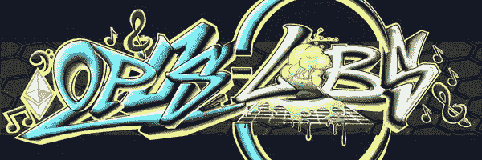
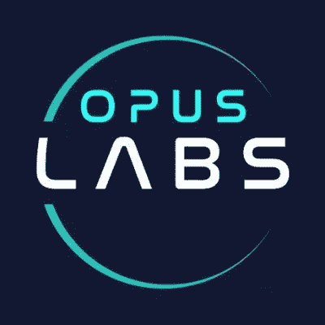

# 将 web2 带到 web3Opus 实验室

> 原文：<https://medium.com/coinmonks/bringing-web2-to-web3-opus-labs-d898a43658a6?source=collection_archive---------40----------------------->

什么是 Opus-labs？

作为一个 web2 品牌，Opus-Labs 将如何帮助我？

个人将从 Opus-Labs 获得什么？

为什么一个品牌或个人应该信任 Opus-Labs 并与之合作？

结论

# 什么是 Opus-Labs？

Opus-Labs 是 web2 公司进入 web3 的入门平台。该组织是由成功的 web2 企业家创建的，他们已经过渡到 web3，并愿意帮助其他 web2 公司做同样的事情。

目标很简单；

"*未来是分散的*"

公司越早加入未来的生态系统，就越有利于他们获得未来的利益。实验室对愿意转向 web3 的公司和 web3 中的个人有很多好处。让我们找出如何受益…

# 作为一个 web2 品牌，Opus-Labs 将如何帮助我？

Opus-Labs 将通过使用 web3 策略和技术帮助您的品牌在 web3 中建立其存在。例如，你的品牌在 web2 中已经有了追随者，但人们正在转向 web3，而你的品牌目前还不在那里。为了进入 web3，你的品牌必须做其他品牌转移到 web3 时正在做的事情。其中包括:

# 创建一个 web3 社区

你的粉丝可以聚在一起讨论你的品牌和粉丝特有的事情

# 创建一个 web3 产品

此产品作为属于您的 web3 社区的证明。它可以是令牌或 NFT(不可伪造的令牌)。这个产品会吸引人们来到你的社区；没有实用程序，它是不完整的。

# 为您的令牌或 NFT 创建一个实用程序

你的 NFT 或代币不足以让你的社区里的人成为一个 web3 品牌。通过持有你的硬币或 NFT，你的持有者会得到什么？这是让你的社区团结一致的原因。该实用程序可能包括但不限于:

*   版税(一些钱)
*   访问产品发布活动
*   治理权力
*   用你的 NFT 申请一个实物产品
*   未来另一个 NFT 系列的通行证

Opus-Labs 将通过上述选项将您的品牌从 web2 带入 web3。

# 个人将从 Opus-Labs 获得什么？

虽然实验室正在考虑加入品牌，但 web3 不仅仅是品牌，web3 是我们所有人。那么，作为个人，你会从 Opus-Labs 获得什么呢？这个 web3 东西有等级，从 Opus，你会得到以下:

# 大师系列

Opus-Labs 的 NFT 产品为您的组织提供了多种选择，包括:

*   访问进入实验室的品牌:你将是第一批与平台上的品牌互动的人之一，获得早期访问权，并获得一些奖金和其他奖励。
*   你可以接触到项目的创始人:你的 NFT 和团队成员身份将让你接触到实验室背后的大脑。我们谈论的是超过 200 年的各种商业领域的经验(创业、金融、艺术、公共关系、法律和其他)。没有其他项目能让你直接接触到它的创始人。然而，它就在这里。

# 工作机会

当品牌通过 Opus-Labs 从 web2 进入 web3 时，他们将需要与 web2 不同类型的员工。Opus-Labs 社区中的个人将获得申请工作的第一手机会，如主持人、协作经理、开发人员、财务和业务分析师、产品经理等。Opus-Labs 是区块链上一个自我维持的生态系统。想到它将与所有可用的区块链一起工作是令人兴奋的。这就是为什么它是一个实验室。

# 为什么一个品牌或个人应该信任 Opus-Labs 或与之合作？

现在 web3 项目给人一种感觉…

"*我在哪里见过这个*"

不幸的是，一些项目已经将复制其他项目作为他们的优先事项，并带着他们通过炒作和 FUD 获得的社区的钱逃跑了。

Opus-Labs 是独一无二的，你将从实验室中受益。以下是您应该信任 Opus-Lab 的原因:

*   效用和路线图:项目有一个可持续的效用和一个与效用同步的路线图。这是罕见的，但是，团队已经成功地合并了一个项目中最重要的两个因素，并将其注入到这个项目中。你可以错过。
*   组织:实验室高度组织化，像一个传统的公司一样运作，尽管这个公司是一个网站 3。他们有工作组合的员工。你可以从个人资料描述中得知该联系谁，团队会非常积极地回应询问。
*   doxx 团队:对于一个新人，你可能会疑惑 doxx 是什么意思；对专业人士来说，这是在公园散步。Doxxing 是项目背后团队身份的公开声明。这是在社区中建立信任的非常重要的一步；当团队有一张脸和一个公众形象。这也是为了向投资者保证，这个团队不会在一夜之间消失。Opus-Labs 团队被搞糊涂了。

Founder/ CEO Bryan Ottens

[布莱恩·奥滕斯](https://twitter.com/BryanOttens)——创始人兼首席执行官

COO — Joe Veteri

[乔·维特里](https://twitter.com/JosephVeteri)——首席运营官

Investor Relation — Vlad Ouritski

[弗拉德·奥里茨基](https://twitter.com/vlad_ouritski) —投资者关系

Art director — Andrew Foord

安德鲁·福德——艺术总监

CTO-Daniel Bright

[丹尼尔·布莱特](https://twitter.com/LazurusEffect) —首席技术官

CFO — Jim Van Grouw

吉姆·范·格鲁 —首席财务官

Legal — Olivia Michalski-ottens

奥利维亚·米哈尔斯基-奥滕斯 —合法

# 结论

Opus-Labs 是品牌将他们的公司装载到 web3 的地方。你应该比他们先到，这样你就可以带他们四处看看，当然，也可以互相受益。要加入 Opus-Labs，请访问:

[网站](https://opus-labs.io/)

[推特](https://twitter.com/OpusLabsHQ)

[不和](https://discord.gg/opus-labs)

> 交易新手？尝试[加密交易机器人](/coinmonks/crypto-trading-bot-c2ffce8acb2a)或[复制交易](/coinmonks/top-10-crypto-copy-trading-platforms-for-beginners-d0c37c7d698c)