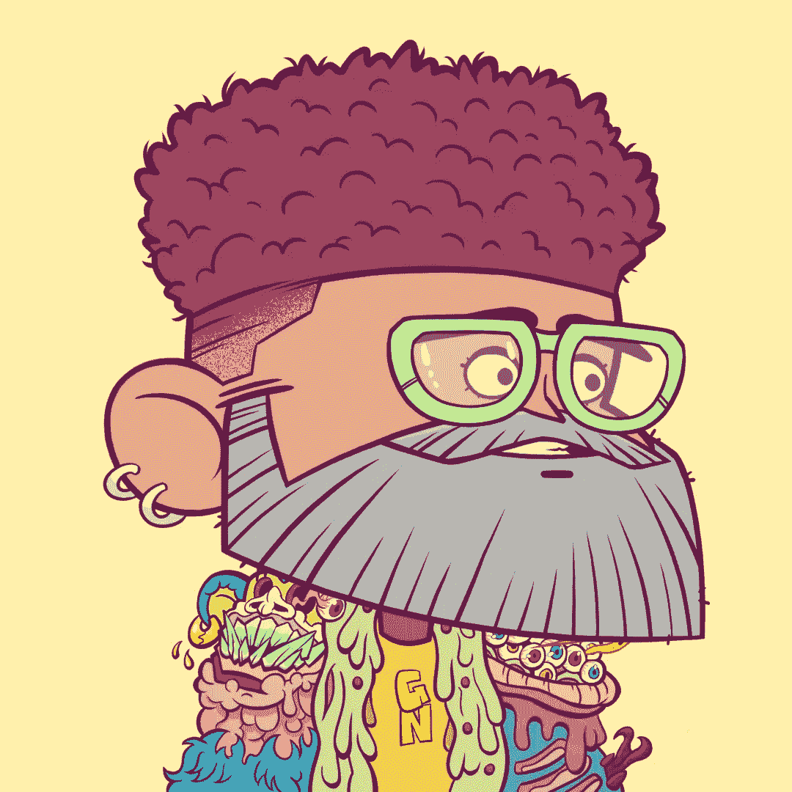
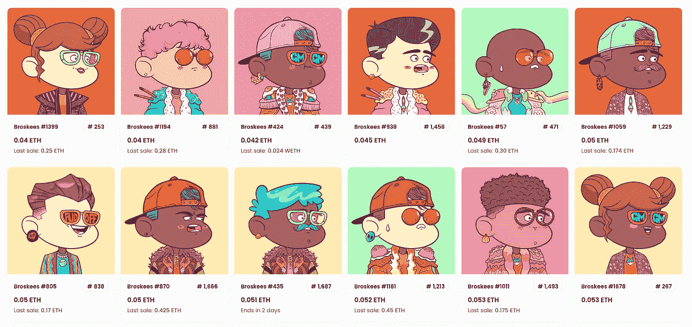

# 巴基斯坦价值百万美元的 NFT 收藏

> 原文：<https://medium.com/coinmonks/broskees-the-million-dollar-nft-collection-from-pakistan-79cbdee7cc47?source=collection_archive---------17----------------------->

[https://opensea.io/assets/ethereum/0x0c9153d9abb5e0489c89b38837f248816f151f42/1233](https://opensea.io/assets/ethereum/0x0c9153d9abb5e0489c89b38837f248816f151f42/1233)

在了解区块链和 NFTs 时，我看到了 Ramish Safa 关于这个收藏 Broskees 的视频。首先想到的是，他为什么要这么做？第二个是让我们探索他在做什么，这让我加入了他们的不和，并体验这个社区是如何成长和发展的，并能够出售他们所有的 1691 Broskees NFT。

Broskees 是 Ramish Safa 的创意，根据他们的博客，

*“布罗斯基收藏由 1691 件精心制作的 NFT 组成。每一个 NFT 都代表着自己独特而鲜明的个性，正如 Ramish Safa 对世界和个人生活经历的诠释所揭示的那样。这些不仅仅是 PFP NFTs。这些 NFT 代表了一种信仰体系，如果你愿意，也可以说是一种哲学；致力于教育、慷慨、同情和社区合作。这是我们的使命，也是我们对社区的承诺。”*

[https://opensea.io/collection/broskeesnfts](https://opensea.io/collection/broskeesnfts)

***官方链接***

[**网站**](http://broskees.io)

[**Opensea**](https://opensea.io/collection/broskeesnfts)

[**推特**](https://mobile.twitter.com/broskeesnfts)

他们以每个 0.169 Eth 的价格开始了 1691 个 NFT 的预销售，公开销售是 0.2 Eth。以太坊在推出之日的价格约为 2620 美元。经过所有的计算，他们能够从他们的收藏品中获利 100 万美元。

但问题是他们是怎么做到的。因此，我把这篇博文分成了几个部分，让你了解这个社区用来从他们的非功能性交易中孵化一百万美元的不同方面。

# **社区团队**

我在之前的博客中也提到过，社区是任何 NFT 收藏的重要组成部分，Broskees 开始这样做了。他们聚集了一个由版主、web 3.0 营销人员和开发人员组成的团队，以使这个系列获得成功。这个团队来自不同的地区，专注于他们的领域来执行创始人给出的所有计划。他们负责创建验证流程、生成对话、自动化任务、将体验游戏化、维护机器人、编写智能合同和实时会议，陈述他们的进展。他们在 Discord 上创建了自己的社区，随后又创建了一个 Twitter 账户来补充这两种媒介。

# **路线图**

吸引任何人购买你的收藏是路线图。Broskees 提到建立 Broskees 学院和孵化器及加速器，以帮助 NFT 持有者了解 NFT 世界，并帮助获得财务独立。他们通过在以前公司的表现来支持他们的承诺，并通过帮助社区学习关于空间的不同术语，标记有关于空间的技巧和提示。

你可以在这篇[文章](https://broskeesnft.medium.com/broskees-a-beginning-20422c660cb5)中找到关于它的完整文章。

# **白名单**

白名单允许 NFT 项目在公开铸造或销售之前，为他们的社区提供铸造 NFT 销售的机会。Broskees 以此为诱饵，通过在他们的社交媒体帖子和不和谐的对话中注入获得白名单的机会来保持他们的社区参与。他们还设定了关闭白名单的最后期限，然后将这些位置公开出售。他们聪明地利用了这一点，考虑到他们只有 1691 个 NFT 和总共 3000 个成员，每个成员在任何时候都在参与对话。

# **赠品**

Broskees 团队一直在宣布他们不和谐的赠品，以保持观众的参与，让他们为社区做出贡献。这个想法是给那些参与度最高或者对话贡献增长百分比最高的人。赠送白名单点，merch 和白名单点为其他 NFT 收藏。

# **游戏化体验**

他们从一开始就在他们的社区中建立了游戏化。从第一个对一些帖子或排行榜或预建机器人提供的游戏比赛做出反应，以加速转换。通过图片猜电影的游戏、蹒跚学步的比赛和随机的卡拉 ok 之夜是在社区中建立游戏化的少数事情。

# **推特炮轰**

Broskees 使用 twitter 作为他们的第二媒体来推广他们的收藏，并为 Broskees 建立了宣传。团队会将对话从不和谐转移到他们的 Twitter 上，社区会跟进。无论他们在推特上发布什么，都会自动出现在时间轴上，从而增加了关注者的数量。此外，他们使用标记 3 个朋友和转发的基本帖子，使他们成为白名单的竞争者。

此外，他们还与不同的 NFT 收藏馆合作交叉发布帖子，以吸引他们的追随者。

# **协作**

协作一直被视为 Broskees 团队的关键。从一开始，他们就与在这个领域成长并对社区有着相当理解的艺术家合作。因此，这些艺术家能够把他们的追随者带到社区。此外，还发布了公开征集粉丝艺术的帖子，让他们通过微影响力艺术家的作品吸引更多眼球。此外，Broskees 与几个 NFT 收藏合作，并与他们一起制作扇子艺术。通过这种合作，他们能够帮助社区获得合作伙伴 NFT 收藏的白名单，从中赚取一些钱，反之亦然。

# **FOMO 帖和先睹为快帖**

害怕错过被营销人员聪明地用来增加销售，老板们也这样做了。他们宣布了他们的发布日期，并将其整合到他们的推文中，以确保他们能够填充所有的白名单，以确保在发布日期之前获得收益。与此同时，他们开始分享藏品的预览，以提高会员对 NFT 藏品本身的兴趣。最后，对于 FOMO 邮报来说，他们设置了钱包地址收集的截止日期，以使他们的团队更安全地提前锁定收入。

# **监管、报告和自动化**

Broskees 团队特别注重简化流程，并从一开始就通过机器人实现自动化。从验证过程开始，到允许白名单成员进入某个通道，都是自动化的。游戏机器人被预先安排好，并被编程为自动奖励获胜者。该团队非常小心地通知人们社区中的任何违规行为，并积极消除任何违反社区规则的行为。

## Ramish 谈论该系列

这些是使他们能够销售他们的产品系列并成功上市的一些要点。你可以遵循同样的方法，并在你的收藏中使用它们，让它成功。

> 交易新手？试试[密码交易机器人](/coinmonks/crypto-trading-bot-c2ffce8acb2a)或[复制交易](/coinmonks/top-10-crypto-copy-trading-platforms-for-beginners-d0c37c7d698c)