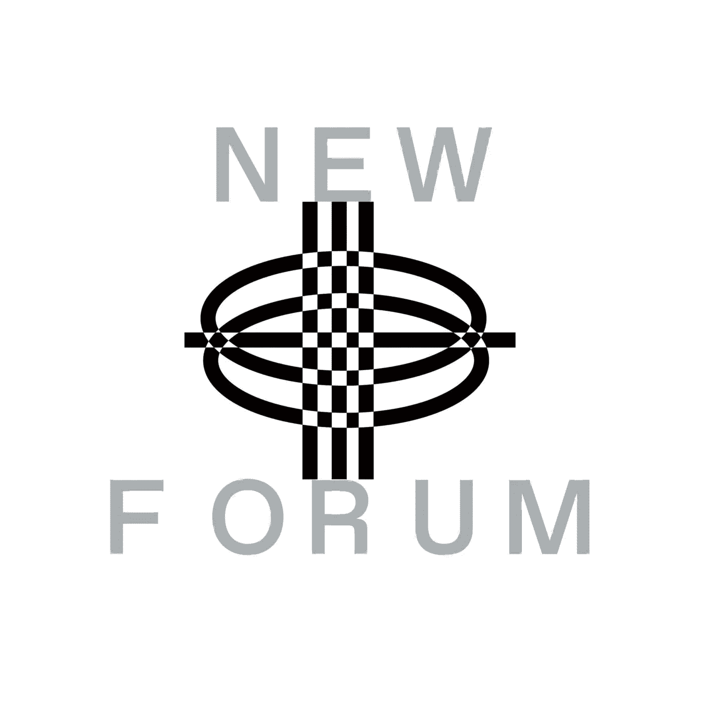

# Loot Bolt 的联合创始人拜斯·约翰逊讨论了 Web3 游戏的方方面面

> 原文：<https://medium.com/coinmonks/bryce-johnson-co-founder-of-lootbolt-discusses-all-things-gaming-47753e0522f4?source=collection_archive---------13----------------------->

Bryce Johnson ( Brycent) | Web3 Gamer & Content Creator on [Twitch](http://twitch.tv/brycent)

拜斯·约翰逊，在 Twitter 上被称为 Brycent，在 NEWFORUM 的一期节目中加入了我们，讨论 Web3 游戏的所有事情。

Brycent 是最老牌的 Web3 游戏倡导者、内容创作者和流媒体服务商之一。他还是 Loot Bolt 的创始人，Loot Bolt 是一款帮助 Web3 社区将 discord 上的互动游戏化的应用程序。

我们喜欢听他讲述自己的旅程，以及在 Web3 领域做一名创造者的感受。Brycent 还分享了他对游戏的过去、现在和未来的看法。

我们喜欢听我们才华横溢的嘉宾如何在 Web3 中找到自己的来龙去脉。

# 那么，Brycent 是如何进入 Web3 领域的呢？是什么让他参与进来的？

他的旅程开始于大约一年半前。他通过 Koroush AK 在他的市场思考播客上主持的播客发现了 Web3 gaming，谈论虚拟土地和投资。

> “那时候 Axie Infinity 流行或者刚刚开始流行。我通过市场冥想播客发现了这一点，并意识到没有人在游戏中制作内容。我的意思是在更广泛的 Web3 游戏生态系统上以一种娱乐的方式创造内容。当我开始玩这个游戏时，我对这些赚钱的金融方面的游戏一无所知。我认为这更像是一个没有人讨论的游戏类别……”——bry cent

Brycent 预见到了 Web3 游戏的潜力。他开始制作爆炸式增长的内容，这让他得以创办自己的公司 Loot Squad，这是 Loot Bolt 的控股公司——去年从许多不同的投资者那里筹集了大约 500 万美元。

Brycent 的旅程始于他消费一些内容，并意识到这是一个服务非常不足的空间。他决定更深入地研究并发现，好吧，他可以发展一个公司或品牌以及所有那些很酷的东西，作为一名全职的内容创作者在 web3 领域工作。

他补充说，他感谢这一切是如何开始的，尽管这是出乎意料的。Brycent 分享说他是一名软件工程师。他有技术背景，但对 Crypto、Web3 或 NFTs 一无所知。

> “我第一次听说 NFT 是 NBA 最佳射手。我买了一个，觉得这是有史以来最愚蠢的狗屎。我想，好吧，我不会用这个做任何事情。买了之后马上转了一圈。我仍然保留着那些顶级照片；有几个。但是，是的，它并没有为我做到这一点。”— Brycent

# Web2 和 Web3 游戏的主要区别是什么？两者之间有竞争吗？

他分享说，Web2 的主要区别在于所有权方面，游戏“只是”需要好。

> “我也不认为它必须被拥有——在链条上表现出来，才能成为玩家或游戏玩家的真正力量。我们到了一个点，在游戏如何互动的问题上，有很多 Web3 矫枉过正的地方。但最终，整个老生常谈的术语是，游戏必须是人们想玩的东西，不管是 Web2 还是 web 3……”——bry cent

根据 Brycent 的说法，主要问题是我们如何在 Web3 游戏上教育人们，而不是将其视为游戏的新世界。他补充说，这是一个完整的概念，告诉人们这些市场的存在方式让他们能够赚钱，但也让他们能够创造体验。

> “游戏的不同之处在于，Web2 游戏体验是这些不同生态系统的价值来源。堡垒之夜很受欢迎，但这是游戏中多次合作的副产品。带来了龙珠 Z 和帕特里克·马霍斯，现在是多力多滋。所有这些将体验与我们在现实生活中享受的事物联系起来的疯狂的协作，都超出了游戏或我们对游戏和 Web3 的传统观点——哦，好吧，你可以从玩这些游戏中赚钱。你可以在常规工作中做到这一点。但是没有人谈论散户投资者是如何被欺骗的……”——bry cent

他还分享了他对 Web3 游戏或项目是否不总是承认 Web2 游戏的成功的看法，反之亦然。

Brycent 分享了他对 Web3 游戏教育的深入看法。这是一个具有挑战性的话题，因为大多数游戏玩家对密码并不特别感兴趣，其他人来这里只是为了抢钱，还有一些人是因为他们对游戏好奇。

# Brycent 帮助我们的社区了解了他是如何在社区中解决教育问题的。

> “这是一个两面性的结合，大多数真正的游戏玩家还没有进入 Web3 游戏。目前在 Web3 游戏中的大多数人只是投资者或投机者。他们是试图从游戏中赚钱的人，这没什么。在早期阶段，你会有这样的经历，但就像，如果这些人是新人拥有的第一种经历，这将为这个领域创造一个糟糕的先例……”—bry cent

Brycent 讨论了游戏玩家接受教育的方式是让他们玩他们喜欢的游戏。他认为，作为玩他们喜欢的游戏的副产品，游戏玩家会自然地调查或陷入更深的秘密兔子洞。

在他的完整采访中，他深入探讨了这个话题！

# 在这一集的 NEWFORUM 中，我们还和 Brycent 讨论了什么？

在 Twitter 上，一些声音正在讨论 Web3 游戏的不同愿景，例如，Limitbreak 的首席执行官 Gabriel Leydon 说

> “我的目标是取消免费游戏，代之以更好的基于 Web3 的 F2O(免费拥有)模式。”

我们请 Brycent 分享他对“游戏赚钱”和“自由拥有”的总体看法，以及他对“自由拥有”模式的看法。

我们不应该说 Web3 游戏，并把它作为游戏在某种程度上的自然演变，作为这些 Web3 功能的进步和实现吗？Brycent 对此如何看待？观看他的完整采访，了解全部情况。

Brycent 还讨论了他如何预见未来几年所有公司的到来和兴趣，特别是接近整个元宇宙方面。

Web3 游戏社区不耐烦了吗？传统游戏玩家已经准备好为一款好游戏等待几年。我们如何将创作者的空间游戏化？在本期 NEWFORUM 中，听听 Brycent 对这一点以及所有 Web3 游戏的看法。

Brycent 还分享了一些他感兴趣的文章的推荐，并带到了他的游戏社区和我们的社区。

享受🔥

[加入社区](https://twitter.com/newforum_nco)了解 [@brycent_](https://twitter.com/brycent_) 并在 web3 社区中发现其他创始人和远见者！

✨follow·布莱斯特！推特: [@brycent_](https://twitter.com/brycent_) 网站:[brycent.com](https://pillar.io/brycent/)Twitch:[brycent](https://www.twitch.tv/brycent)

# new forum # web 3 # web 3 gaming # community # creator # creator economy # crypto #元宇宙

爱 x 新论坛

# Twitter @newforum_nco

不和谐[@加入](https://discord.gg/2K8tvVh8tM)

# 新论坛

[NEWFORUM](https://newforum.notion.site/newforum/Welcome-to-NEWFORUM-48f9661398ec4ec6a1af37fcc96dc926) 由 [Newcoin Foundation](https://newcoin.org/) 提供支持，专注于促进去中心化社交应用的扩展，也被称为 Social 3.0，形成一个生态系统和一个由远见者、创造者和投资者组成的社区。它为思想者提供了一个安全的交流、传播和分享思想的空间，以确保一个新网络的自觉和道德发展，嵌入关怀、自由和创造力的价值观。✨每周新集！在 [Twitter](https://twitter.com/newforum_nco) 、 [Newlife](https://newlife.io/) 、 [Youtube](https://www.youtube.com/channel/UCWvHyau1nIJBffmaaj6FmbQ) 和 [LinkedIn](https://www.linkedin.com/showcase/newforum/) 上关注我们，了解 web3 的更多信息，认识生态系统！加入生态系统[不和](https://discord.gg/DHepA4WTkN)！

> 交易新手？尝试[加密交易机器人](/coinmonks/crypto-trading-bot-c2ffce8acb2a)或[复制交易](/coinmonks/top-10-crypto-copy-trading-platforms-for-beginners-d0c37c7d698c)