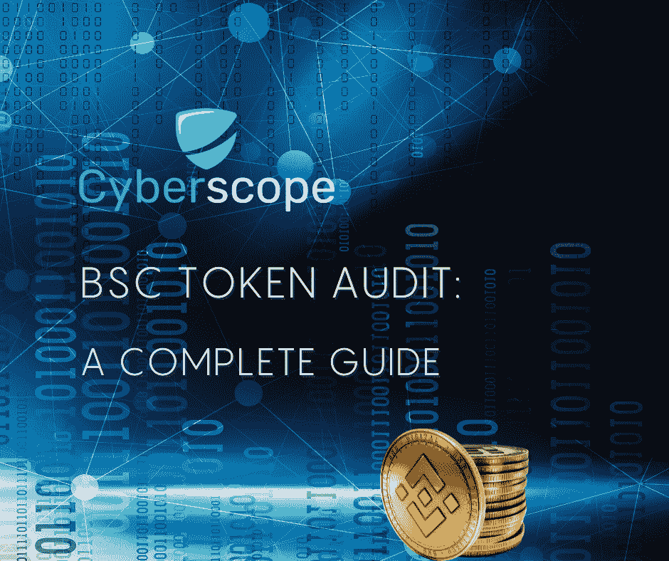
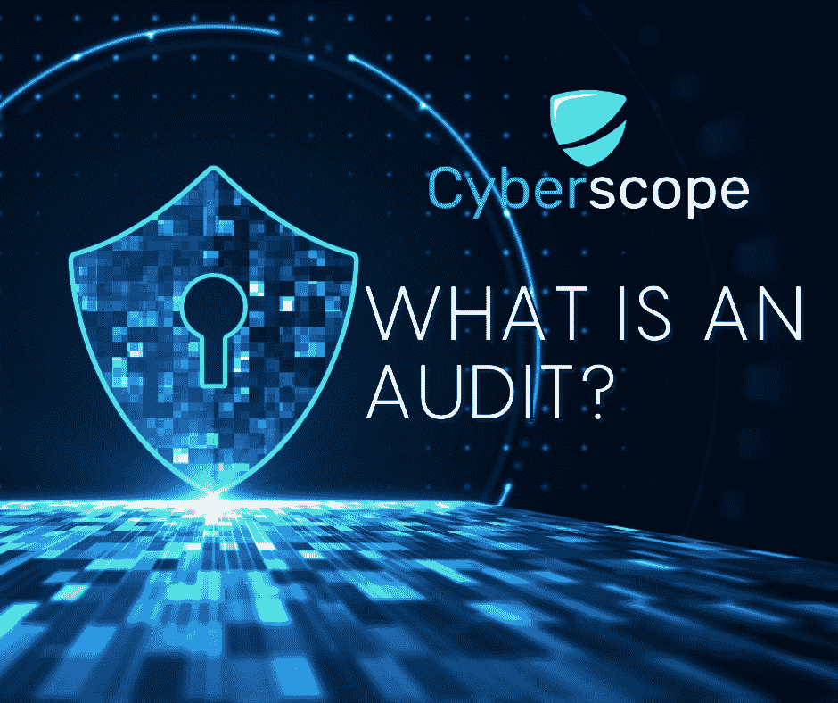

# BSC 令牌审计:完整指南

> 原文：<https://medium.com/coinmonks/bsc-token-audit-a-complete-guide-94649ab7f546?source=collection_archive---------39----------------------->

# 介绍

代币合同是当今区块链合同中较为常见的一种。每个人都想创造自己的加密货币，并成为下一个加密社区会为之疯狂的流行令牌。为你的代币制定一份智能合约只是等式的一半，因为你还需要确保你和投资者可以安全地使用该合约。

在本文中，我们将讨论最流行的一种令牌——基于 BSC 的令牌，以及获得 BSC 令牌审计来检查项目的安全性和功能性是多么重要。

# 什么是 BSC 令牌

BSC 代表币安智能链。这是由币安创建的链，也使用其本地令牌，BNB。BSC 令牌是在币安链上创建的令牌，因为该链目前是新项目中最优选的一个。

币安智能链基于以太坊，因此通过与 EVM 兼容，它让开发人员有机会创建或迁移 DApps、工具和其他组件，而不会遇到任何障碍。

BSC 上的平均交易费用为 5 Gwei，而以太坊上为 40 Gwei。这意味着在 BSC 上运行 dApp 要便宜 8 倍。

在写作时，币安智能链是世界上最快的区块链。BSC 以其闪电般的交易速度而闻名，每 3 秒钟就完成一次交易。另一方面，以太坊创建一个方块需要 13 秒。

作为最受欢迎的交易所之一，BSC 的可信度贯穿其所有平台。最重要的是，交易所审查网络上的每一个验证者，这确保了链上开发既安全又可靠。

> 交易新手？在[最佳密码交易所](/coinmonks/crypto-exchange-dd2f9d6f3769)上尝试[密码交易机器人](/coinmonks/crypto-trading-bot-c2ffce8acb2a)或[复制交易](/coinmonks/top-10-crypto-copy-trading-platforms-for-beginners-d0c37c7d698c)

通过利用 BSC 及其本地令牌的优势，项目享受到了该链的交易速度、低费用和受欢迎程度。对于新项目来说，这是一个很好的起点，因为它为他们自己的令牌提供了一个强大的基础。

# 什么是审计

智能合同(也称为区块链合同)是自动执行的合同，将买卖双方之间的协议条款写入代码行。代码在区块链网络上存储、分发和复制。

[智能合约审计](/coinmonks/smart-contract-audits-a-complete-guide-39781ef2c972)是对智能合约源代码的全面审查，检查漏洞、优化问题以及任何可能破坏合约预期功能的缺陷。最后，您会得到一份详细的报告，其中包含所有的发现以及审计代码的工程师推荐的修复方法。

审计报告是智能合同创建过程的一个重要方面。开发人员将使用它来检查他们代码中的漏洞，外部参与者可能会利用这些漏洞。审计报告还向合同的投资者和用户保证，合同的行为符合预期，这使他们能够安全地与合同进行交互。

# 为什么审计 BSC 令牌很重要

与任何智能合约一样，BSC 令牌也存在漏洞。如果没有正确编程，它们可能被利用，并且可能遭受操作问题，这些问题可能会对项目造成毁灭性的影响。尤其是那些旨在接管行业、成为未来创业者参照点的新项目。

通过获得 BSC 令牌审计，您可以获得关于智能合约完整性的信息，并找出是否有任何应该解决的问题。该报告还包括对每个发现的可能修复的建议。这包括安全性、性能或业务逻辑发现。

最近几个月，发生了多起网络安全攻击，导致巨额资金损失。根据最近的报道，仅在 2022 年，就有超过 30 亿美元被盗。如果合同制定得当并经过彻底的审计程序，这些问题本来是可以避免的。也有合同严重失灵的情况，虽然没有造成直接的资金损失，但使投资者放弃项目以保护他们的资产。在这种情况下，项目的完整性(和信任)会受到打击，从而降低了长期成功的可能性。

# 审核 BSC 令牌的过程

审核 BSC 令牌有不同的方法，最常见的是手动和自动审核。

大多数审计提供者选择自动审计方法来处理这项服务。BSC 令牌智能合约的源代码由 AI 工具进行分析，对照最常见和已知的问题进行检查。它全面地介绍了安全漏洞和性能问题。这种方法的一个缺点是，作为一个自动化的过程，它无法检查可能是代码一部分的隐藏良好的威胁。这可能是由于恶意的合同开发者或糟糕的编程。它也无法发现潜在的业务逻辑问题。

尽管在自动化工具的帮助下获得 BSC 令牌审计会产生更快的结果，但人工智能只能识别这么多东西。随着合同变得越来越复杂，并且包括与其他合同或钱包地址的交互，自动检查的价值会降低。

另一方面，手动审核虽然更耗时，但被认为是更好的方法。智能合同的每一行都经过仔细检查，以考虑安全漏洞、性能问题以及业务逻辑中的错误。更复杂的人工审计还包括其他测试，比如单元测试。单元测试是为了检查契约在不同场景和边缘情况下的行为。这可以证明是非常宝贵的，尤其是对于大型项目。

密码领域领先的网络安全公司采用自动和手动方法。这是为了确保所有事情都得到检查，并最终交付最高质量的审计。

# 为什么选择赛博视

Cyberscope 是加密领域领先的审计公司之一。该公司拥有 1000 多家客户，其品牌名称在业内广受认可和追捧。

他们是所有主要启动平台的合作伙伴，BSC 令牌所有者可以使用这些平台启动他们的项目并获得相关徽章。此外，他们最近的合作伙伴关系，如 [Polygon Village 计划和 radarg](https://www.cyberscope.io/blog/topics/cyberscope)，证明了 Cyberscope 是智能合同审计的网络安全专家。他们自己的自动化合同分析工具 Cyberscan 正在用于 [GeckoTerminal](https://cyberscope.medium.com/cyberscope-partners-with-geckoterminal-c98bced34375) 平台，作为一种手段，帮助潜在投资者能够识别他们正在研究的项目的智能合同中的问题。

# 结论

对于任何项目来说，BSC 令牌审计都是最重要的一步。通过审计你的代币的合同，你保护你的项目，并为投资者提供他们所寻求的安全。考虑 launchpad 徽章也很重要。

Launchpads 推出了各种徽章，让投资者可以直接识别已经完成各种里程碑的项目。最常见的是审计和 KYC 徽章。投资者正在寻找有这些徽章的项目，因为它们增加了项目的安全性和可信度。这些可以通过从每个 launchpad 平台的经验证的提供商处获得每个相关服务来获得。因此，如果您计划使用启动板进行 BSC 令牌的预售，您可以通过认证提供商获得 BSC 令牌审计和相关徽章。

希望本文能让您更好地理解什么是 BSC 令牌，以及为什么投资审计如此重要。如有任何关于审核智能合同的问题，您可以通过 [contact@cyberscope.io](mailto:contact@cyberscope.io) 联系我们。

*…*

*原载于*[*www . cyber scope . io*](https://www.cyberscope.io/)