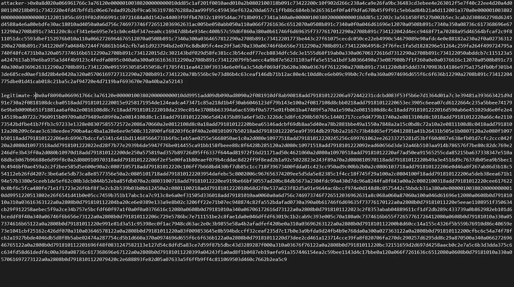

# 严厉的社区批评是针对币安智能链

> 原文：<https://medium.com/coinmonks/bsc-token-hubs-cross-chain-bridge-was-vulnerable-which-led-to-more-bnb-being-generated-3b44c22f7ba6?source=collection_archive---------28----------------------->

## 最近的 BNB 链漏洞和币安采取的应对措施可能限制了危害，但机构群体再次面临同样的分散难题。

Paradigm 的安全主管 Sam Sun 声称，黑客成功地诱骗币安大桥转移了 100 万 BNB 代币。在利用有效后，黑客使用相同的技术发送了 100 万个额外的 BNB 令牌，但这次是发送到一个受控的地址。

2022 年，已经发生了三起针对跨链桥的袭击。分别有 6.5 亿美元和 1 亿美元在早先袭击浪人桥和地平线桥时被盗。

## 攻击分析

据 Paradigm Research 的 Sam Sun 称，攻击者说服币安桥将 100 万 BNB 传输到一个受控地址。

他们经历了两次这个过程。Sun 发现攻击者在将他们的交易与有效取款进行比较时，总是使用相同的高度 110217401。研究人员指出，合法的取款使用更大的高度，如 270822321。

他还指出，攻击者为该特定区块“伪造了一个证明”，即 110217401，因为它明显比合法取款的证明短。

[https://twitter.com/samczsun/status/1578170804818219010](https://twitter.com/samczsun/status/1578170804818219010)

为了伪造一个证明，我们需要两个操作都成功，我们还需要最后一个操作(multistore)返回一个固定值(指定块的散列:110217401)

攻击者的目标是 BSC 链，这是币安桥为 BSC 提供流动性价值的地方。

币安跨链网桥使用 IAVL 树来认证提交给它的消息。

IAVL 树使用币安独有的预编译合同进行验证。用户必须定义一组“操作”来验证 IAVL 树。根据孙的说法，大桥通常会预见到其中的两种情况:一种是“iavl:v”操作，另一种是“multistore”活动。

黑客利用跨链桥消息验证机制的基础库代码 IAVL 树中的一个漏洞，伪造了一个恶意的取款消息。

研究人员断言，尽管攻击者仅仅转发了两条消息，但危害可能要严重得多。

*跨链攻击就是用来描述这种黑客行为的术语。*

通常，IAVL 树会立即拒绝黑客生成的通信。但是这一次，攻击者在 IAVL 验证过程中发现了一个缺陷，这使得他可以欺骗 IAVL 树接受随机消息。通过精心制作和伪造信息，黑客成功地将 2M·BNB 从跨链桥上移除。

为了确认 MerkleProof 的有效性，黑客调用了 BSC 跨链桥契约中的 handlePackage 方法，然后调用预编译的契约。

预编译执行的功能有点类似于操作系统中的 syscall。

被称为 IAVL 树的自平衡二叉查找树是由乔治·阿德尔森-维尔斯基和叶夫根尼·兰迪斯创造的，正如它的名字所示。

***Harbor 的目标是促进安全 Web3.0 的发展。我们定期分享内部技术，并专注于区块链安全生态系统的整体安全以及操作系统、浏览器和移动设备的安全，请继续关注。***

## 最后的话

幸运的是，由于社区的遏制和缓解努力，黑客的真实范围被认为要小得多。

但是这些跨链应用受到了社区的严厉批评。甚至连以太坊的联合创始人维塔利克·布特林(Vitalik Buterin)也质疑“桥的基本安全限制”，并补充说他“对跨链应用持悲观态度”。

> 交易新手？试试[密码交易机器人](/coinmonks/crypto-trading-bot-c2ffce8acb2a)或[复制交易](/coinmonks/top-10-crypto-copy-trading-platforms-for-beginners-d0c37c7d698c)