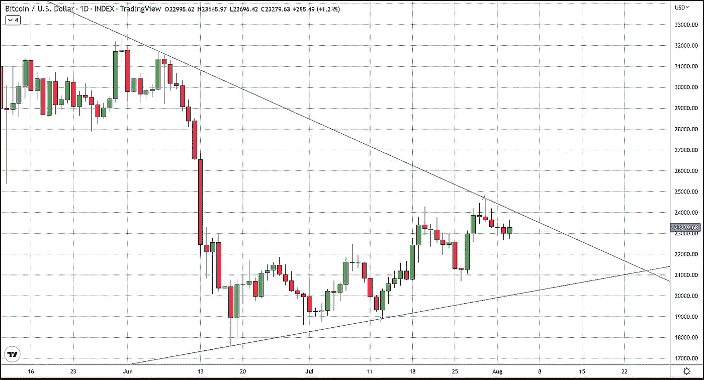
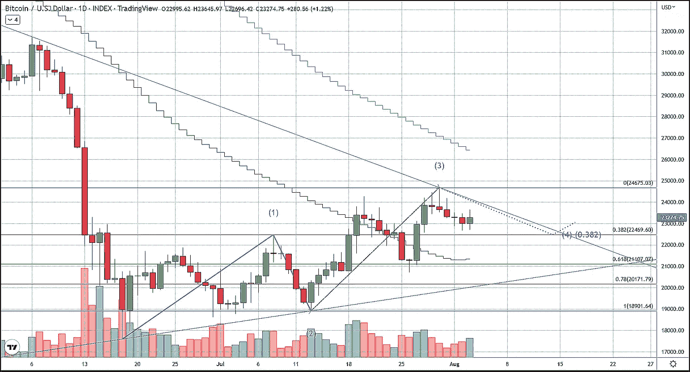
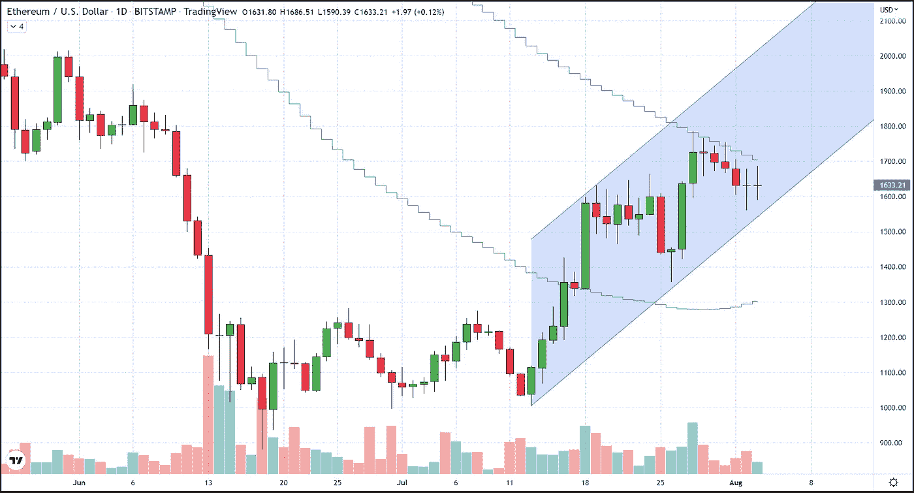
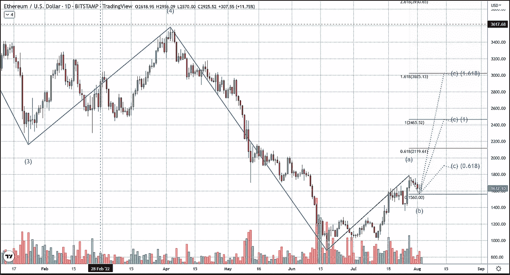

# BTC 和 ETH 海流波计数和范围

> 原文：<https://medium.com/coinmonks/btc-and-eth-current-wave-count-and-ranges-9259bba8b822?source=collection_archive---------59----------------------->

以太坊(Ethereum)和比特币(Bitcoin)本周首次公布每日涨幅，同时它们的交易价格都接近当前区间的顶部。

比特币的范围由连接 6 月 18 日和 7 月 13 日达到的低点并及时向前延伸的压缩三角形定义，相同的方法用于使用 6 月 6 日和 7 月 30 日高点的阻力趋势线。

正如你在上面的图表中所看到的，自 7 月 30 日以来，比特币一直在接近趋势线的上方。下降的上部趋势线和上升的底部趋势线为 BTC 创造了一个压缩三角形，三角形或楔形图形的底部与 20，000 美元上方的 78%回撤重合。然而，在该价格上方有几个支撑位，包括 50 天 SMA 在 21，300 美元左右，以及 38% Fibonacci 回撤在 22，500 美元左右。根据每日时间框架的艾略特波浪计数是一个牛市计数，其中最有可能的情况涉及 38%回撤的反弹，这将完成第四波。如果这真的成为现实，接下来的第五波冲击肯定会把 BTC 炸出楔子，推向更高的价格。

至于以太坊，它目前位于 7 月 13 日从 1000 美元附近的低点开始的平行趋势通道的底部。以太在这个通道内确实有阻力，这个通道几乎精确地标出了过去 7 天的高点，我所说的阻力是 100 日均线。

以太坊波计数在每天的时间框架是非常乐观的，这符合基本面的前景，以及我个人的意见。以太坊仍处于熊市，但它正处于调整阶段，换句话说，它正处于熊市周期结束时的牛市阶段。我们在 7 月 28 日完成了上涨的一波行情，当时价格达到了自 6 月初以来的最高点。现在我们正处于下跌的 B 浪中，可能低至 13，500 美元，但不一定会低到那种程度。如果 B 波以今天的更高价格结束(这完全有可能在下个月发生“合并”)，波数预测最后的 C 波将以太坊最低带到 2100 美元，最高到 3000 美元，这是 a 波的 1.618%斐波纳契扩展。

以太坊仍然像过去几周一样更有前景，预计这将继续下去。由于以太网的 B 波还没有结束，我们建议跟踪我们并接受我们的交易建议的交易者在 7 月 18 日做多以太网，应该保持保护性止损，以避免止损出局，错过以太网的大规模反弹。

任何对我们致力于比特币交易的免费服务感兴趣的人，只需点击这个[链接](https://www.thegoldforecast.com/bitcoin)。

> 交易新手？试试[加密交易机器人](/coinmonks/crypto-trading-bot-c2ffce8acb2a)或者[复制交易](/coinmonks/top-10-crypto-copy-trading-platforms-for-beginners-d0c37c7d698c)