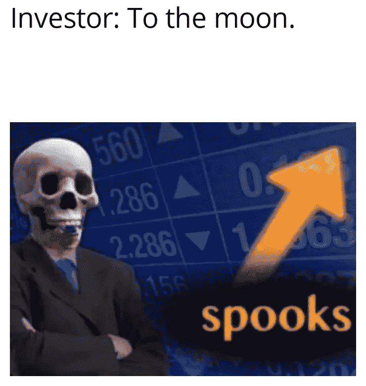

# BTC 和 ETH UP:牛市的开始？

> 原文：<https://medium.com/coinmonks/btc-and-eth-up-the-beginning-of-a-bull-season-87278dab77d3?source=collection_archive---------46----------------------->

我们要去月球吗？

本周早些时候，加密市场出现了一些改善，本周迄今为止有一个很好的上升趋势。市场能保持这种上升趋势多久？

我们能从中学到什么来为牛市提前做准备？首先，虽然技术分析中的运动可能是一些模式，但值得注意的是，一些事件和消息也大大促进了市场的“绿色”。

全球最大的资产管理公司；管理着 10 万亿美元资产的贝莱德与世界上最著名的加密交易所之一比特币基地合作，为阿拉丁提供机构投资者；贝莱德的投资组合管理软件，通过比特币基地 Prime，获得加密交易，托管，大宗经纪和报告的熟练程度。该交易目前仅限于比特币(BTC)。然而，随着时间的推移，该协议可能会扩展到其他值得注意的加密货币和项目。

这种合作关系为市场带来了更多的流动性。它为比特币领域增加了更多的采用和可靠性，比特币是其他加密货币的先驱。

此外，弗吉尼亚州费尔法克斯县的一家养老基金正在考虑投资加密技术，他们已经获得了投资加密产量农业和贷款的批准。这一举措带来了更多的市场流动性，并为密码交易员提供了更多的资金。这让机构投资者、资产管理公司和其他人有更多理由关注比特币和加密生态系统。这一举措可能最终使加密生态系统成为许多国家的金融标准。

此外，最近美国通胀降温的消息以及公布的消费者价格指数(CPI)较前一个月的 9.1%有所下降；2022 年 7 月，到本月的 8.5%，给投资者带来了一些宽慰，平息了恐惧指数。关于市场对这一消息的反应，股票市场飙升，密码市场也紧随其后。加密市场的市值从 2022 年 7 月的 1 万亿美元上升到 2022 年 8 月撰写本文时的 1.16 万亿美元。

最后，以太坊合并成功，该合并见证了他们从工作证明(POW)到利益证明(PoS)的转变，该合并是 Goerli 测试合并，与 PoW 共识能耗相比，将使区块链更加节能。随着最近最终测试合并的消息，加密市场反应积极，以太币(ETH)，一种以太坊区块链的本地硬币引领了上升趋势。

然而，这种情况能持续多久，这一消息会对市场造成多长时间的冲击？

像任何其他金融市场一样，加密市场受到技术分析和基本面消息的影响。尽管如此，基本面消息和事件往往会对市场做出更快的反应，因此这条消息可能会继续产生影响，直到市场或生态系统中似乎出现另一条消息或事件。就像 Solana 的黑客攻击造成了 500 万美元的损失一样，币安平台和 WazirX 交易所之间的争端。CPI 上升到 9.1%的最初消息，导致过去一周和过去一个月的加密市场和股票市场大幅下跌。

尽管如此，以太坊的 goerli 测试合并的消息，积极的市场反应和夏季秘密反弹的可能性。我们是否已经接近熊市隧道尽头的曙光？

我们是否可以说，牛市行情才刚刚开始？或者这种反弹和价格上涨只是一种消退？

有鉴于此，采用区块链是公司经营彻底转型的最佳行动。现在互联网上似乎有几篇文章捆绑在一起，要么是为了点击，要么是为了浏览。

这干扰了学习者学习和使用信息的意图，或者阻止了组织充分培训他们的团队和员工。这就是为什么需要一个全面的指南来理解和使用 web3 和区块链技术。

此外，理解区块链并向每个公司成员灌输信息以促进业务运营的理想方式是建立一个专门提供教育和专业知识的学院。

区块链议会介入帮助解决这个问题。通过区块链理事会，您可以访问关于区块链、加密货币、defi 和 nft 的课程。他们还为有兴趣了解区块链技术发展的初学者和致力于 web 3 的开发者提供培训。

他们还为企业主提供区块链技术和相关主题的优秀教育，这将有助于他们深入了解区块链如何运作，以及如何在他们可能经营的任何业务中使用它。区块链理事会提供的考试和证书是我喜欢的其他功能。他们保证并提供证据证明企业中的团队已经完成了教育阶段并理解了他们注册的课程。

你可以参观[学院](https://www.blockchain-council.org/)，形成自己的观点，[申请](https://www.blockchain-council.org/)。

 [## Web3 和区块链、加密、NFTs 和元宇宙认证和培训

### 区块链委员会是一个权威的学科专家和爱好者团体，他们宣传区块链的研究和…

www.blockchain-council.org](https://www.blockchain-council.org/) 

请确保您在媒体和 Twitter 上分享和关注我。

[https://twitter.com/PrinceSamuel_A](https://twitter.com/PrinceSamuel_A)

您想深入了解什么是区块链和加密货币的更多细节吗？

 [## 什么是区块链技术？

### 区块链科技:区块链技术 101 你需要知道的一切

medium.com](/@princesamuelaadeyemo/what-is-blockchain-technology-560db5c3d8cf)  [## 什么是加密货币？

### 它是如何工作的？

medium.com](/coinmonks/what-is-cryptocurrency-5255ff3625a5)  [## 为什么区块链技术对您和您的企业很重要(如果您有)。

### 区块链技术对个人和企业是否至关重要？

medium.com](/codex/why-blockchain-technology-is-important-for-you-and-your-business-if-you-have-one-770ea1b4643f)  [## 什么是比特币:适合初学者的比特币

### 揭秘比特币白皮书

medium.com](/coinmonks/what-is-bitcoin-bitcoin-for-beginners-620c0986b467) 

在我的个人资料中还有更多。关注我并订阅我的电子邮件，以便在我发表文章时收到通知。注意安全！

> 交易新手？试试[密码交易机器人](/coinmonks/crypto-trading-bot-c2ffce8acb2a)或者[复制交易](/coinmonks/top-10-crypto-copy-trading-platforms-for-beginners-d0c37c7d698c)