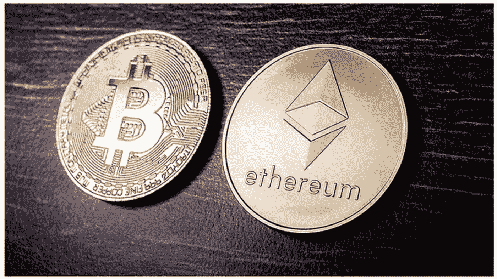
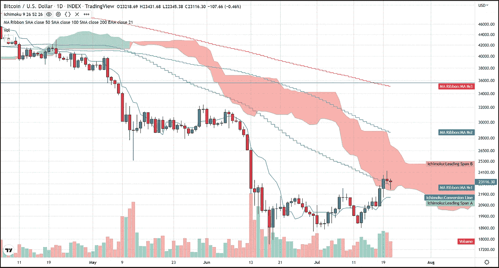
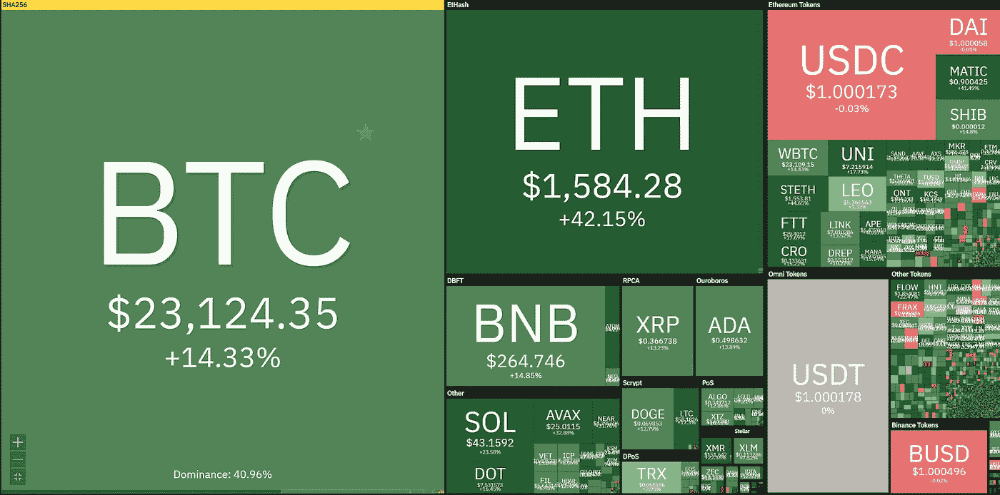
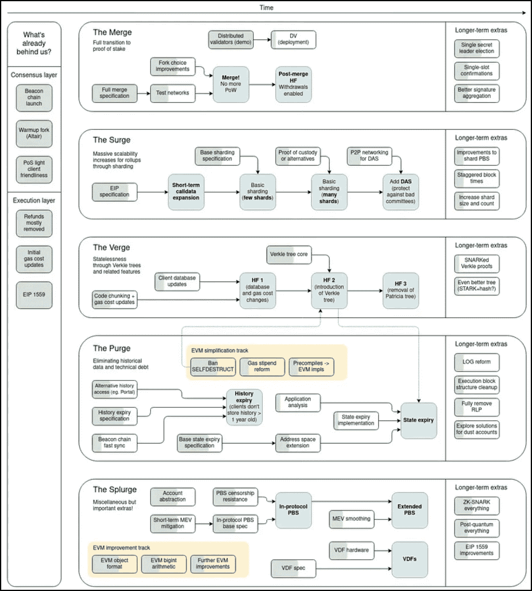
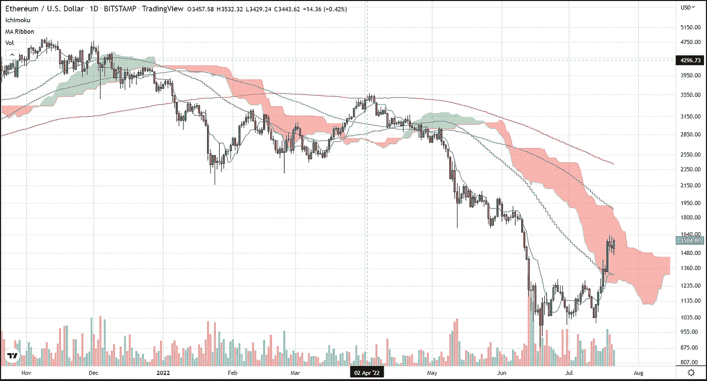

# BTC 举行 200 周 SMA，而 ETH 再次成为焦点

> 原文：<https://medium.com/coinmonks/btc-holds-200-week-sma-while-eth-steals-spotlight-again-e4cc9a126387?source=collection_archive---------50----------------------->

截至美国东部时间 4:30，比特币目前的交易价格持平，约为 23，160 美元，仍高于关键的 200 周均线。当前价格在交易时段早些时候跌破该指标后，也高于 50 天 SMA。股价下跌可能是由于特斯拉第二季度的持股量显示，该公司已从资产负债表中清算了 75%的 BTC。尽管如此，BTC 仍坚持其刚刚形成的看涨情绪和技术前景。BTC 也进入了“云”或者确切地说是市云，它可以象征着从看跌到看涨的转变或支点。

以太坊再次引领了高端市场的热潮。以太坊当天上涨了 5.7%，本周上涨了 42%，而比特币同期上涨了 14%。

以太坊的创始人 Vitalik Buterin 洞察了以太坊的未来路线图，并继续列出了超越合并到股权证明的基准目标。Buterin 周四在巴黎举行的 EthCC 会议上对拥挤的主会议室发表了讲话，讲述了以太坊如何进行大量重大改进，最终从长远来看，这些改进将使系统受益。布特林表示，合并后，以太坊将完成大约“55%”的股权证明更新，也被称为 EIP-3675。

他给出了以太坊开发者的四个目标的更多细节，他在今年早些时候概述了这四个目标，分别称为合并、边缘、激增和清除。一旦这些里程碑完成，以太坊将有可能每秒完成 100，000 次交易。(相比之下，每秒 10-15 次。).

他接着描绘了一幅画面，以太坊不再需要如此多的不断升级，而是能够避免大修，达到一个稳定的地方并“安定下来”，“这类似于图灵完整性……如果你有一台足够强大的计算机，你几乎可以在它上面建立任何东西。”

这种稳定性可能会导致排名第二的加密货币的价格稳定，因为它试图抢占第一名。

> 交易新手？试试[加密交易机器人](/coinmonks/crypto-trading-bot-c2ffce8acb2a)或者[复制交易](/coinmonks/top-10-crypto-copy-trading-platforms-for-beginners-d0c37c7d698c)