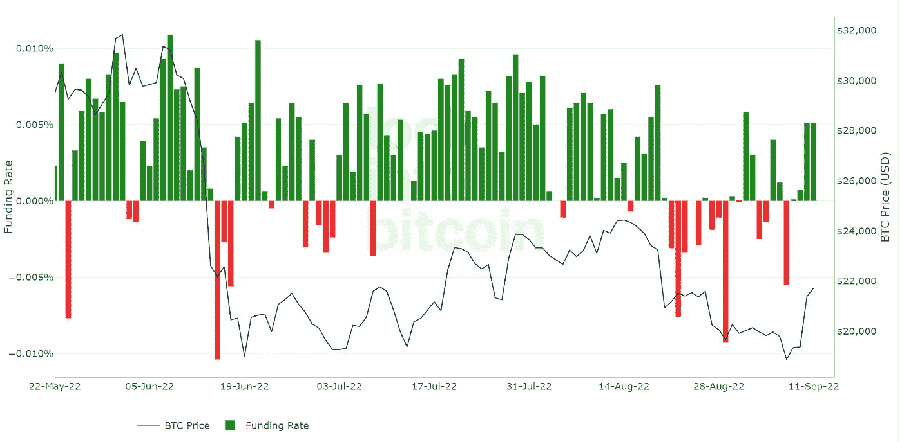
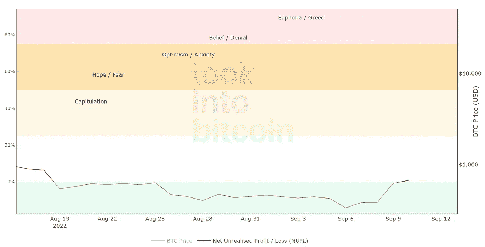
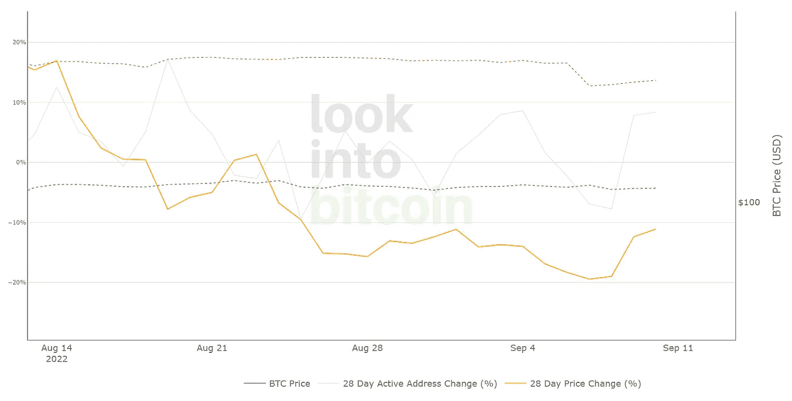
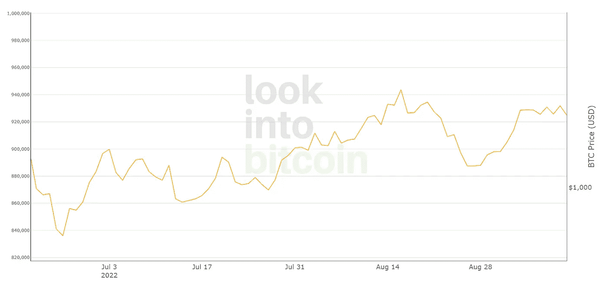
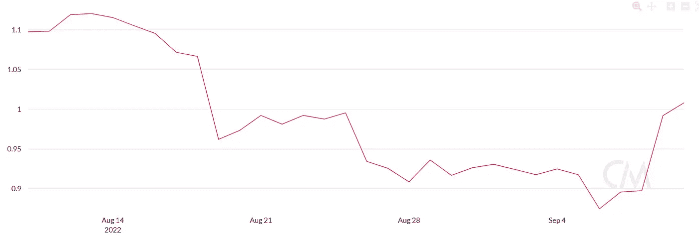
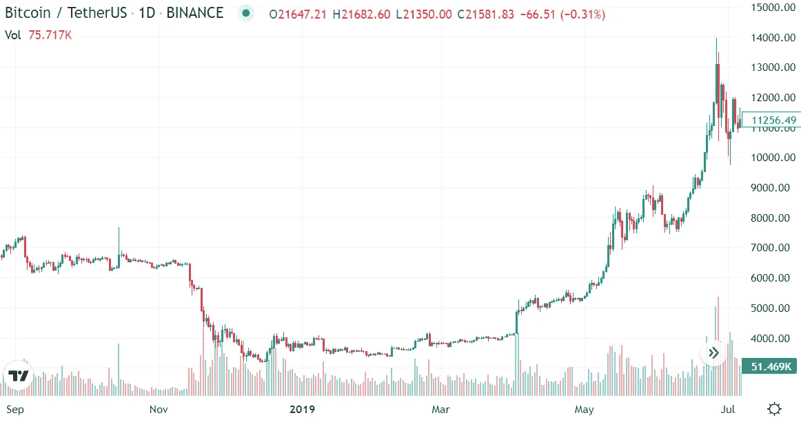

# BTC 指标更新— CW 36

> 原文：<https://medium.com/coinmonks/btc-indicators-update-cw-36-34f0c6820fc8?source=collection_archive---------2----------------------->

Bitcoin Funding Rate since May 2022.

上周五，比特币价格涨到了 2.1 万美元。通过查看 BTC 指标，我们可以了解到当前形势的哪些信息？在这次更新中，我分析了其中的几个来看看我们的现状。

## 1.未实现利润/亏损净额(NUPL)

随着最近 BTC 价格的飙升，NUPL 现在已经离开了熊市，这意味着市场不再超卖。情绪又有希望了。

Net Unrealized Profit/Loss (NUPL) for the last weeks.

在 Twitter 上关注我，获取更多关于加密和投资的免费内容。

Click me.

## 2.活动地址情绪指示器(AASI)

AASI 仍然看跌(橙色线在绿色虚线下方)，这意味着地址活动落后于最近的价格发展。然而，它正在慢慢攀升。

Active Address Sentiment Indicator (AASI) for last weeks.

## 3.比特币活跃地址

最近活跃的 BTC 地址的激增已经趋于平稳。从更大的时间范围来看，地址活动自 6 月底以来一直在上升，这是一个好迹象。

Bitcoin Active Addresses for last weeks.

## 4.市场价值与实现价值比率

MVRV 推至 1 上方，表明市场不再超卖。

Market Value to Realized Value Ratio (MVRV) for last 4 weeks.

## 5.比特币融资利率

在经历了过去几周的反复后，比特币融资利率现在再次转为正值。这意味着交易者正在建立更多的比特币多头头寸。

Bitcoin Funding Rate since May 2022.

## 6.比特币钱包数量的变化

> 1 BTC:我们自 2022 年 1 月以来看到的强劲增长仍在继续，但最近有所减弱。散户仍在利用低价积累 BTC。

> 10 BTC:自 2 月中旬以来，我们已经看到了持续的增长，现在仍在继续。

> 100 BTC:过去几周没有明显变化——横盘整理。

> 1.000 BTC:4 月份开始大幅下跌，8 月份企稳，此后持平。

## 最终评估

我们能从中学到什么？多个指标显示，我们已经摆脱了熊市最糟糕的时期。然而，有一些原因使我们应该继续非常谨慎。

*   即使几个 BTC 指标现在看起来更好，我们仍然非常接近熊市。
*   最近的积极发展是一个好迹象，但最大的问题是它是否会持续下去。当这一趋势在未来一周消失时，我们很容易回落。
*   此外，我们从来不会直接从熊市进入牛市。通常，底部之后是几个月的横盘。这里有一张图表说明了我的意思。

Multiple months of sideways action in the course of the 2018/2019 bear market.

> 交易新手？试试[加密交易机器人](/coinmonks/crypto-trading-bot-c2ffce8acb2a)或者[复制交易](/coinmonks/top-10-crypto-copy-trading-platforms-for-beginners-d0c37c7d698c)