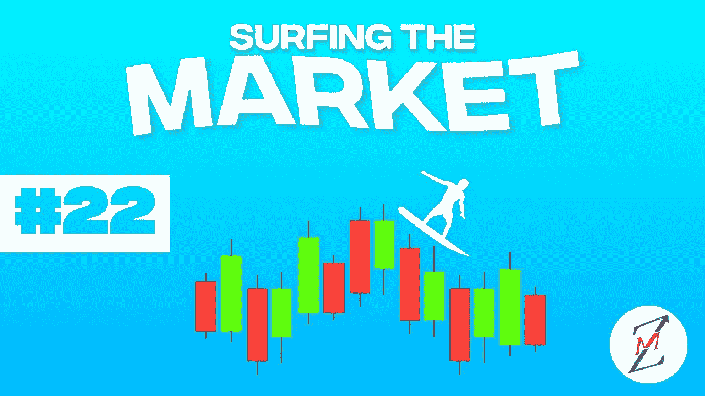
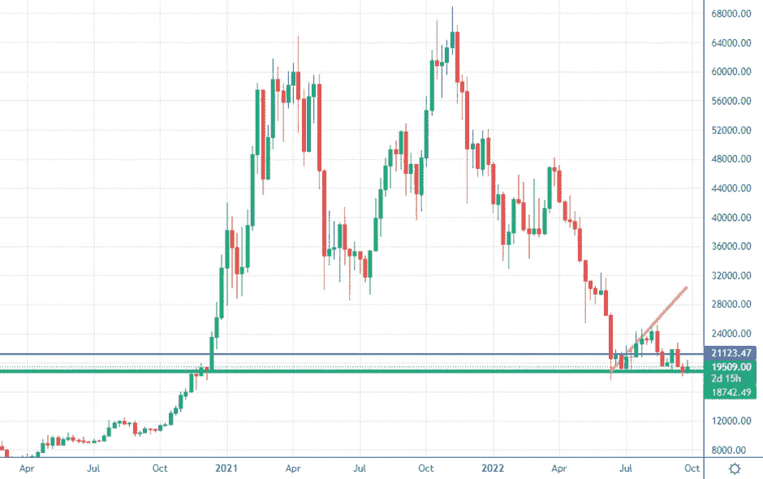
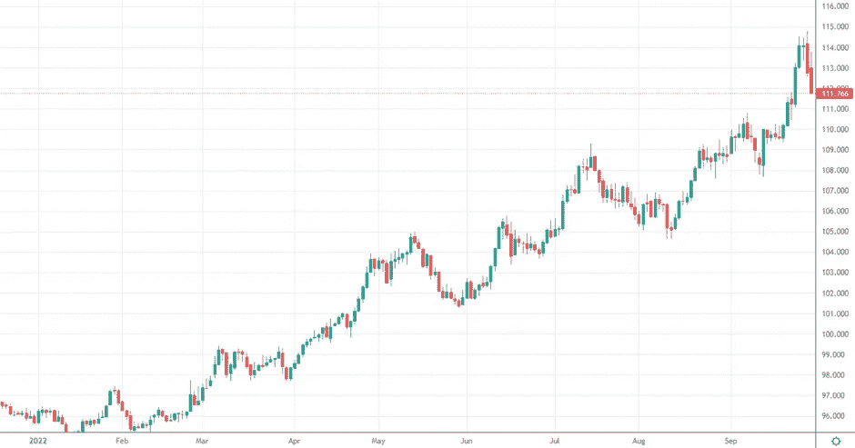
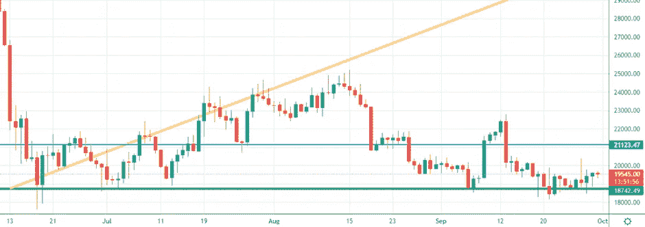
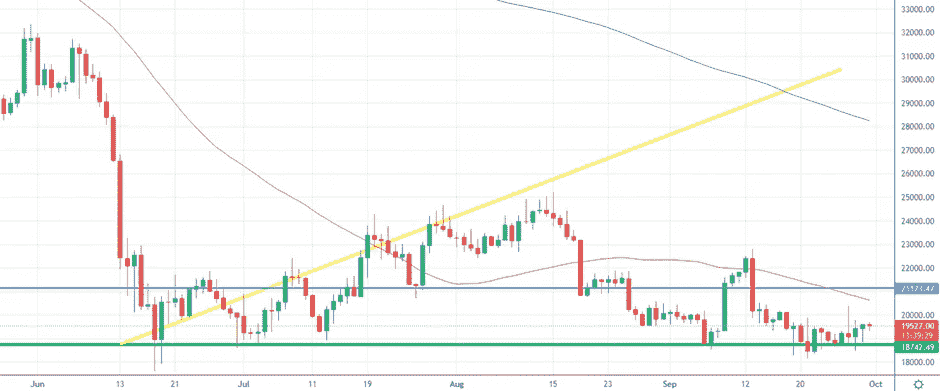
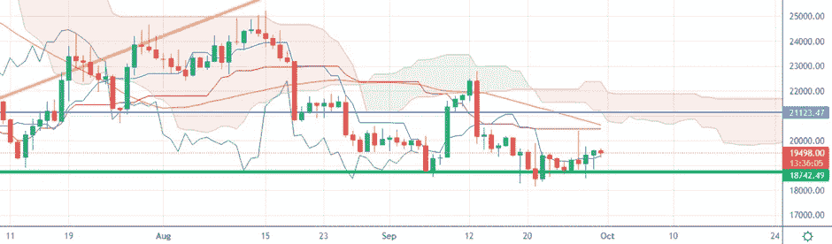

# BTC 真的在努力“推底”

> 原文：<https://medium.com/coinmonks/btc-is-really-trying-to-push-the-bottom-4a731ba8f30f?source=collection_archive---------38----------------------->

我们将进入什么样的市场阶段一直是我们上次约会的开场白问题。我们要听牛市还是熊市？我们会看到牛市还是熊市？

欢迎来到市场冲浪，我们已经到了第 22 天，我希望通过这些简单的技术分析，我们已经在某些方面帮助了你，甚至只是评估不同的市场观点。

让我们从我们通常的**每周视角**开始

WEEKLY CHART — Source: Tradingview

价格从绿线再次反弹，绿线是比特币上周浮动的价格水平。如前所述，在我个人看来，如果出现重大的*坏消息，如巨大的电力危机，移动网络危机或俄罗斯的天然气限制，比特币的价格只能下降到 15000 美元。*

Screenshot on a D-TimeFrame of the Dollar Currency Index

美元强势指数再次显示，有些疲软，回到以前的支撑位，给其他货币和以美元为对应货币的主要指数带来一些新鲜空气(如比特币)。

> **你知道为什么我的交易目标是获得高于 0.003 BTC 的 BTC 吗？请在评论中给出你的答案。**

# 从日常角度来看，我期望什么？

DAILY CHART — Source: Tradingview

比特币的价格持续触及绿色水平，在过去的日子里，它获得了一些空间。我的预期仍然是，我们应该在这个周末保持温暖，但我会等待华尔街的开放和周一的重新开放。

> **目前来看，我还是保守看涨。**

DAILY CHART — Source: Tradingview

50MA 就像一块磁铁，它现在位于 20.621 美元，这意味着在这个区域(就像我们在 27 日看到的那样)可能会有某种价格阻力，即使我仍然看着蓝色水平再次受到攻击，开始触发多头。

Ichimoku Cloud 仍然远离当前的价格水平，但我们可能会像前几周一样，在未来两周内看到差距缩小，这意味着将 SMA50 和 Ichimoku Cloud 相加，我们可能会有助于更强的运动。

DAILY CHART — Source: Tradingview

# **特别观察什么？**

我们仍然处于一个不稳定的范围，所以我会等待进一步的立场，我肯定会等待我上面提到的两个时刻的反应！但如果信号保持稳定，我将(再次)略微乐观。我现在做的是最多持有几个小时的短期头寸。

我正在等待蓝色级别的突破，以看到更多的向上运动。

让我知道你对这个新的每周约会的想法，以及你希望更多地考虑(或甚至解释)哪些指标。

请继续关注，当我的内容出来时，请务必关注。

## 促销建议

***还有一件事*** :如果你真的不关心技术分析，或者你不喜欢花时间在市场上，一定要看看 [Zignaly](https://zignaly.com/app/signup/?invite=mikezillo) 平台，这是一个管理着巨大交易量的币安官方经纪合作伙伴。他们提供很好的利润分享交易服务，你可以模仿其他专业交易者，与他们分享利润！一定要给个眼神！

如果您有兴趣提前了解我们合作伙伴的指标发布情况，请在此留下评论，以便我们了解您是否有兴趣！

> 我写的任何内容都不能代表任何形式的财务建议。所以，在采取任何行动之前，先做好自己的研究。

> 交易新手？尝试[加密交易机器人](/coinmonks/crypto-trading-bot-c2ffce8acb2a)或[复制交易](/coinmonks/top-10-crypto-copy-trading-platforms-for-beginners-d0c37c7d698c)