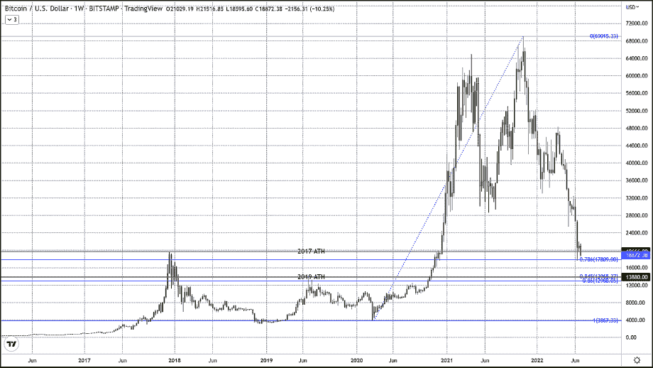

# BTC 价格底部可能在 2019 年高点

> 原文：<https://medium.com/coinmonks/btc-price-bottom-likely-at-2019-highs-490a2a7736fc?source=collection_archive---------30----------------------->

比特币已经恢复了下跌趋势，截至下午 4 点 45 分，美国东部时间交易价格下跌近 1300 美元，跌幅为 6.38%，至 18880 美元。它突破了 2017-2018 年高点 19，660 美元的支撑，似乎注定要交易到 2019 年高点 13，880 美元。

> 交易新手？试试[加密交易机器人](/coinmonks/crypto-trading-bot-c2ffce8acb2a)或者[复制交易](/coinmonks/top-10-crypto-copy-trading-platforms-for-beginners-d0c37c7d698c)

在当前的加密冬天，2019 年略低于 14，000 美元的峰值价格是比特币非常有说服力的价格目标。在我们的上一篇文章中，我们谈到了比特币的前四个周期中，每个周期的回撤都小于前一个周期，

*“过去四个周期的最后一个方面，特别是在中点减半后一年左右发生的三个周期，因为我们当前的周期似乎可以用来暗示 BTC 在哪里找到底部，如果它确实低头的话，这三个周期的回撤比前一个周期少一点。例如，在第一个周期，比特币回撤了 95%，在第三个周期，比特币回撤了 92%，在第四个周期，它回撤了 86%。如果这确实是一个持续的模式，我们将看到不到 86%的回撤，大约在 13，000 美元。因此，我认为 14000 美元是一个可能的底部，这是 2021 年 11 月前的最高月度收盘价格"*

因为现在可以肯定的是，20k 美元附近的旧 ATH 不会像它试图成为的那样是一个强支撑位，而阻碍 14k 美元的唯一支撑位是 17800 美元的 78%回撤位。正如上面的报价所解释的，如果更高的回撤形态预示着底部继续，我们将不得不在 86%的回撤位 12，988 美元上方形成一个底部。如果 BTC 重新回到 2019 年的高点并在那里找到支撑，这将是 84.5%的回撤，这符合小于上一个周期的回撤。所有这些都表明，2019 年约 14k 的顶部是比特币最有可能找到底部的价格点。

*原载于*[*https://thegoldforecast.com*](https://thegoldforecast.com/crypto/2022/btc-price-bottom-likely-2019-highs)*。*