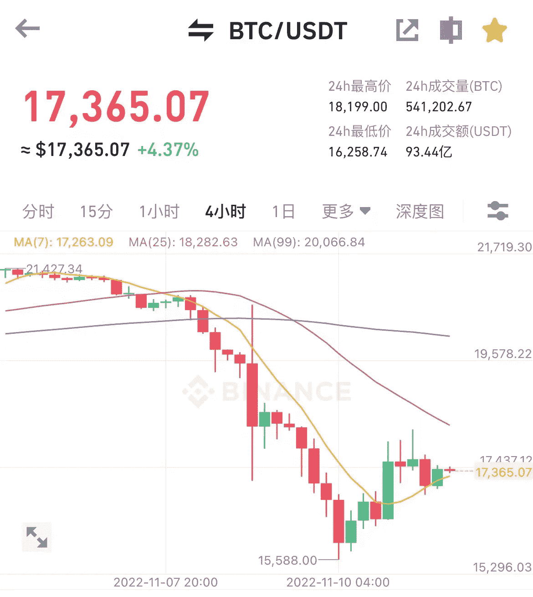
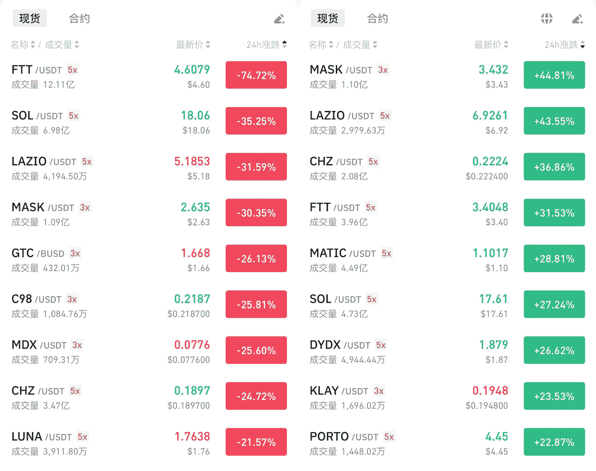
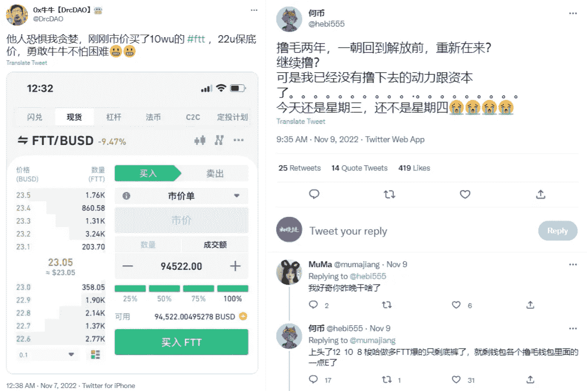
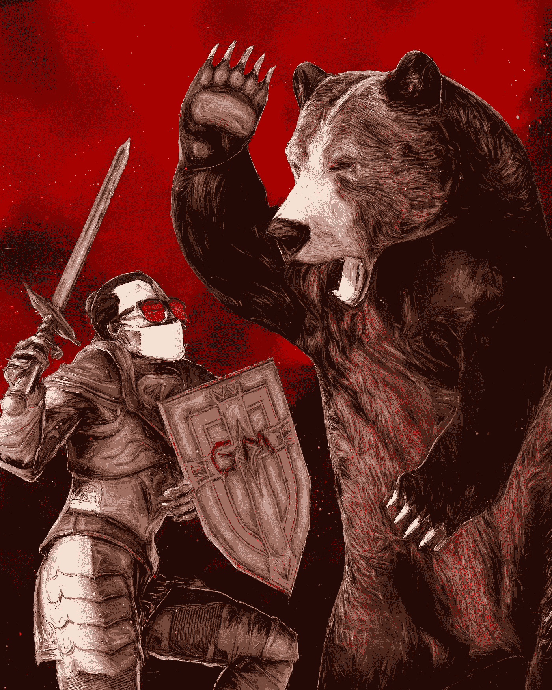

# BTC 沉浮随心，密码市场无喜？

> 原文：<https://medium.com/coinmonks/btc-rises-and-falls-at-wil-no-joy-in-the-crypto-market-8b1d2a51b2d7?source=collection_archive---------28----------------------->

这一周，BTC 的价格波动极大，一天上下十几个点，其他项目的涨跌就更不用说了，有的项目跌幅超过 90%。

在 FTX 事件之前，比特币的价格是 21480 美元，几天前还一路上涨。社区的 FOMO 情绪逐渐形成，许多观点看涨到 24k 美元。

没想到，在 CZ 和 SFB 隔空喊了几声后，BTC 突然被拉了下来，连续 4 天大跌，最低跌至 15588 美元。
跌势被压倒的时候，很多观点又在喊做空，跌破 15k，12k，市场极度恐慌。

就在更多人在等待更低价格的 BTC 时，大盘再次止跌，4 小时线继续上涨，一度涨到 18199，涨幅超过 14 个点，牛市回来了一段时间。

在来回的震荡中，跟得上的人在嘀嘀咕咕，跟不上的人在懊恼不已。

BTC 4-hour price K line

每次 crypto 市场大起大落的时候，社区的声音都极其混乱，因为他们不知道哪个声音是对的，往往误判的声音最大。

因为错误的预测更符合现在玩家的心理预期，而且市场往往不会按照大多数人的剧本发展。

一些专注于短期策略的人完全屏蔽了社区的情绪，因为大多数人没有判断力，只是在起哄。想要在市场上有所收获，就要逐步培养自己的操作技能。

The crypto market is up and down

涨跌起伏很大，对合同球员来说是双杀。即使他们开仓方向正确，如果不及时止盈平仓，很快就会变成亏损。

随着 FTT 消息不断，跌宕起伏在瞬间，利好拉高 10 个点，利空拉低 20 个点，来回摩擦。

FTX 自 2019 年上线以来表现不俗，其平台免费转 ETH 在早期迅速积累了大量用户。FTT 价格在去年 2021 年 9 月达到 85.74 的高点，之后跟随整个市场的波动，一度稳定在 25 左右。

11 月 8 日 FTT 开始下跌后，一些玩家认为 FTT 仍将回升，并选择做多 FTT。没想到，消息越多，价格越低，不管是合约还是现货，都会被埋没。

一位玩家说，他以 22 的 FTT 价买了 100k usdt，现在亏了 80k usdt 多。还有一个球员 12 岁和 10 岁都是长 FTT，现在只剩下屁股了。

这可能只是他们的玩笑，但确实有大量的玩家，无论他们是做多还是做空 FTT，他们都在赔钱，因为爆仓和暴跌都是在短时间内发生的。

Long FTT players lose 80k usdt

有人说币圈不幸福，这几天楚小莲明显感受到了。

虽然我不玩合约，但是现货波动也很大。爆炸的时候，我后悔之前没有加仓；暴跌的时候，后悔高点没卖出。

关注 crypto 世界这么久，每次出现极端行情时间段，早上第一件事就是打开 APP 查看最新行情。

这种状态很不好，市场波动不受个人情绪影响；但是个人状态被市场波动冲昏了头脑。投资是为了更好的生活，但人生沉浮，得不偿失。

The market is always a game between bulls and bears

有老玩家说，最大的境界就是不看 k 线，做长线，这显然容易得多。如果不是高频操作，10 个点的涨跌影响不算太大，但是心态崩了，本末倒置。

以上，鼓励自己。

希望在未来对加密世界的探索中，能够轻而易举，从容应对，既能抓住时代机遇，又能充实钱包。

以上只是我个人观点，没有投资建议。我是初晓·钱恩，我正在关注元宇宙和 web3。​​​​

> 交易新手？试试[加密交易机器人](/coinmonks/crypto-trading-bot-c2ffce8acb2a)或者[复制交易](/coinmonks/top-10-crypto-copy-trading-platforms-for-beginners-d0c37c7d698c)