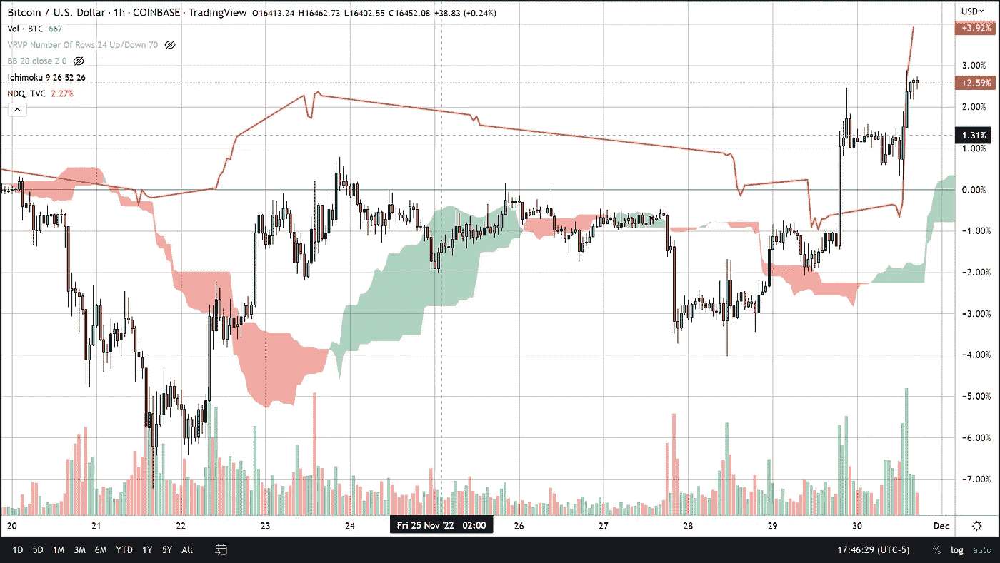
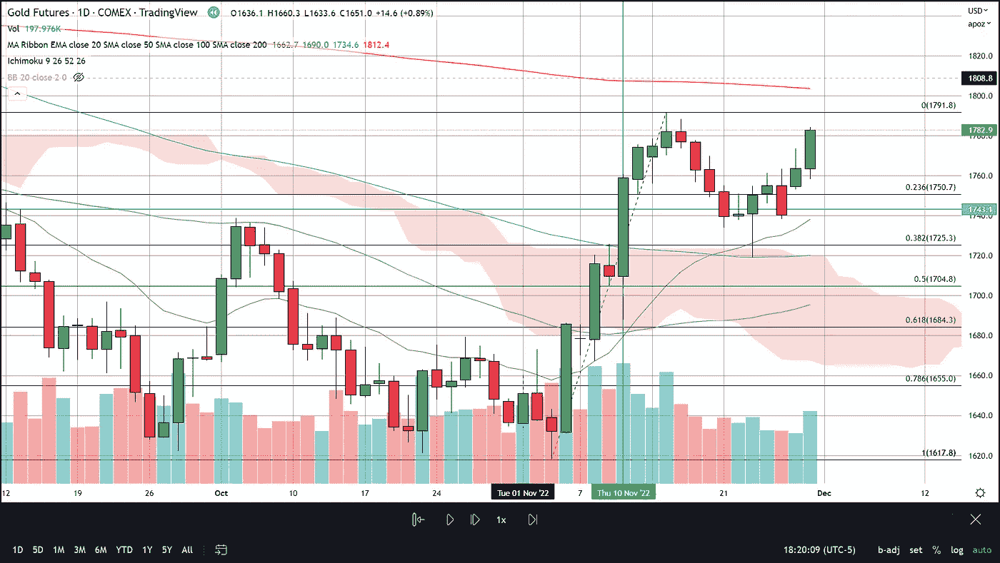
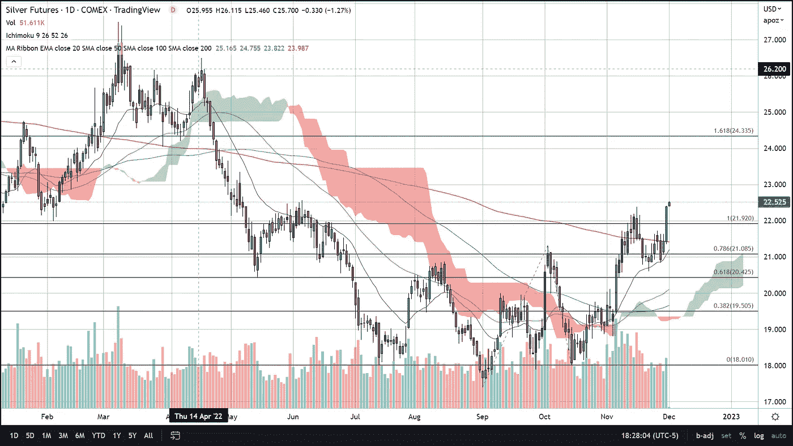
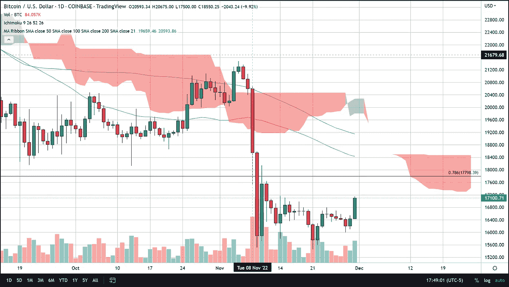

# BTC 股市与纳斯达克和更广泛的市场同步上涨

> 原文：<https://medium.com/coinmonks/btc-rises-lockstep-with-the-nasdaq-and-broader-markets-74f56074baec?source=collection_archive---------22----------------------->

11 月 30 日星期三，美联储主席杰罗姆·鲍威尔在布鲁金斯学会的一场准备好的发言和提问会上发表了一条广受欢迎的消息，令市场一片哗然。这将是他在两周内央行下一次会议前的最后一次预定露面。他的讲话概述了美联储预计将从 6 月份以来普遍存在的快速加息 3 . 25 个百分点“放缓”。

这使得比特币与更广泛的加密和金融市场一起飙升，因为交易员最终获得了近乎明确的确认，即大幅货币紧缩将继续，但速度比我们过去 8 个月所习惯的速度要慢。截至美国东部时间下午 6 点 16 分，BTC 股价上涨 4.34%，合 711 美元。纳斯达克指数反映了比特币收盘时的涨幅，上涨近 5% (4.82%)或 554.90 点，收于 12060 点。贵金属今天也表现很好，黄金和白银期货都增加了黄金期货 1.79%和白银期货 5.25%的周涨幅，本周还剩 2 个交易日。

即使今天比特币上涨了近 5%，交易量也出现了不错的飙升，但如果比特币继续从最近的低点 16，000 美元左右的价格上涨，它仍面临着与几个潜在阻力区的上行之战。

现在，海外比特币交易仍处于看涨状态，接近目前交易区间的顶部 16，000 美元至 17，500 美元。区间的顶部代表了 BTC 多头必须克服的第一个挑战。在 17，798 美元之上是 78%的长期回撤线，形成了 11 月 9 日突破的三重底部。再往北是 50 天均线，大约在 18，340 美元，所有这些水平似乎都落在一见云结构内，这是红色的，因为价格低于云。

所有这些技术研究表明，比特币尚未脱离险境。然而，它们似乎表明，在我们说话的时候，比特币很有可能正在触底，而且无论何时比特币摆脱了阻力，价格都很有可能平稳地飞向 2 万美元的标准巡航高度。

> 交易新手？试试[加密交易机器人](/coinmonks/crypto-trading-bot-c2ffce8acb2a)或者[复制交易](/coinmonks/top-10-crypto-copy-trading-platforms-for-beginners-d0c37c7d698c)