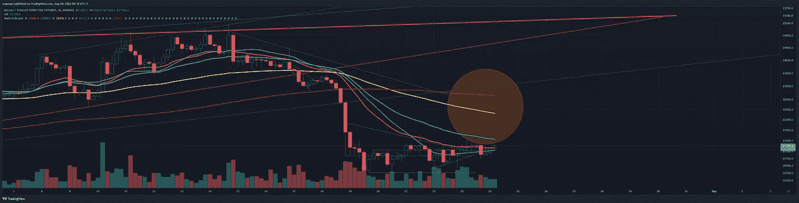
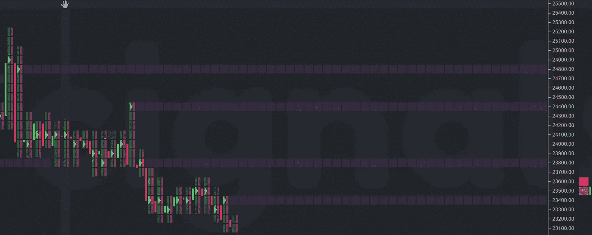
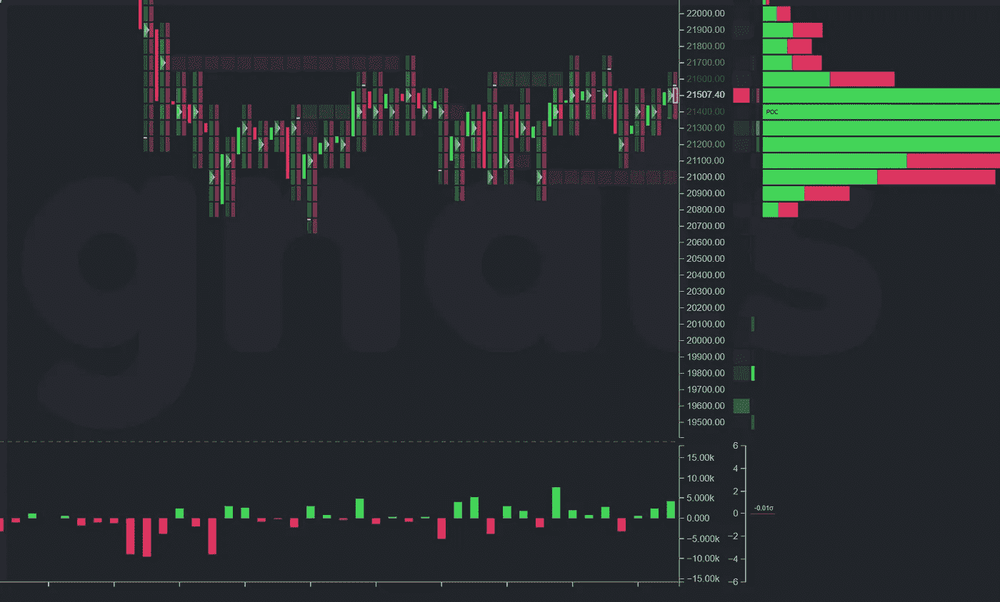

# BTC 短期上涨即将到来

> 原文：<https://medium.com/coinmonks/btc-short-term-rise-coming-b06505218007?source=collection_archive---------33----------------------->

比特币/密码货币市场分析 8/24

所以，今天的市场是疯狂和愚蠢的。但我不想承认，它即将上涨。这将确认未来的熊市，并与期货到期时间一致。所以…无论如何。宏观上，我们仍然极度看跌，但我们可能会重新测试支点的底部，然后下跌。大约是 22 到 23 千磅。附近 21 公里以下有需求，24.8 公里以上有大量需求。

this sort of demand gap is what we’re about to fill [https://www.tradingview.com/x/yqPRsd4b/](https://www.tradingview.com/x/yqPRsd4b/)

以上:

all the above untested

和以下:

we’re barely above the POC, but it is what it is

[融资数据显示，随着零售多头的离去，OI 正在上升。](https://www.binance.com/en/futures/funding-history/4)零售赢得一次胜利。

> 交易新手？试试[密码交易机器人](/coinmonks/crypto-trading-bot-c2ffce8acb2a)或者[拷贝交易](/coinmonks/top-10-crypto-copy-trading-platforms-for-beginners-d0c37c7d698c)