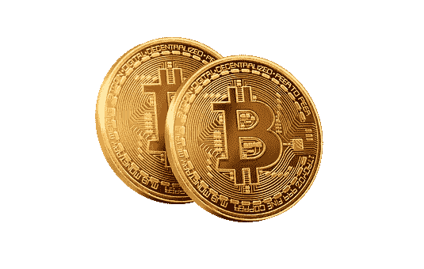

# BTC 到加纳 CEDIS: EBITPOINT VS DART AFRICA

> 原文：<https://medium.com/coinmonks/btc-to-ghana-cedis-ebitpoint-vs-dart-africa-2415b8eb659f?source=collection_archive---------53----------------------->

第一种加密货币比特币诞生于 2009 年。自诞生以来，比特币一直是市值排名第一的加密货币。这部分是由于它的低费用和快速交易，以及它的广泛接受。虽然还有其他加密货币，但比特币仍然是投资者和交易者最受欢迎的选择。

交易比特币和加密货币的乐趣通常在于，当你需要时，能够轻松地将你的硬币转换成你的当地货币。世界各地的各种加密交换平台开始在它们的平台上整合尽可能多的菲亚特，以帮助适应来自全球各个角落的用户。

如果交易平台不支持您的本地货币，将您的比特币转换为您的本地货币可能会有点压力。有各种平台支持大量的本地货币，让我们考虑一下加纳塞地。作为一名加纳交易员，为了将你的比特币兑换成加纳塞地，你必须在支持塞地的平台上交易。加纳加密领域最大的两家公司是 Ebitpoint 和 Dart Africa。你可以很容易地在这些平台上交易你的比特币，并以加纳塞地获得你的资金。然而，在这些平台上交易不仅仅是确保你的当地货币得到支持，还有一些因素需要考虑，以做出最佳选择。先说说他们的特色吧。

> 交易新手？试试[加密交易机器人](/coinmonks/crypto-trading-bot-c2ffce8acb2a)或者[复制交易](/coinmonks/top-10-crypto-copy-trading-platforms-for-beginners-d0c37c7d698c)

Ebitpoint 是一个在加纳购买、出售和存储比特币和其他数字资产的在线平台。它提供了一个基本的加密投资组合管理服务。这个平台完全支持加纳 cedis。各种流行的加密资产，如比特币、以太坊、莱特币、比特币现金等，都可以在 Ebitpoint 上进行交易。这个平台是安全的，并提供了一个很好的利率。该交易所的一个主要缺点是交易时间，从在线评论来看，用户似乎对在 Ebitpoint 上完成交易所需的时间不太满意。这迫使用户进一步寻找更好的替代品。关于税息点，你需要一个有效的政府颁发的身份证来验证，如果你没有的话，这可能会很紧张。

另一方面，Dart Africa 是一个安全可靠的平台，出售你的比特币和其他硬币。该平台支持加纳 cedis，用户在完成交易后三分钟内即可免费获得现金。这是 Dart Africa 相对于 Ebitpoint(交易时间)的一个主要优势。此外，与 Ebitpoint 和加纳的其他加密交换平台相比，Dart Africa 提供的费率也有明显差异。Dart Africa 提供最优惠的价格。这是使 Dart Africa 成为大多数人销售其加密资产的首选平台的另一个特征。Dart Africa 支持 7 种加密货币；比特币、以太坊、莱特币、、、、戴。您需要的只是一个有效的电话号码和电子邮件地址；与 Ebitpoint 相比，在 Dart Africa 上验证要容易得多。

概括地说:

*   两个平台都差不多。然而，一个主要的区别是，Ebitpoint 提供购买、出售和存储服务，而你只能在 Dart Africa 上出售加密货币。
*   与 Ebitpoint 相比，Dart Africa 提供了最好的费率和交易速度。这是基于对两个平台的大量评论。Dart Africa 还有一个很棒的移动应用程序，可以快速轻松地进行交易。
*   他们都支持加纳塞迪斯。