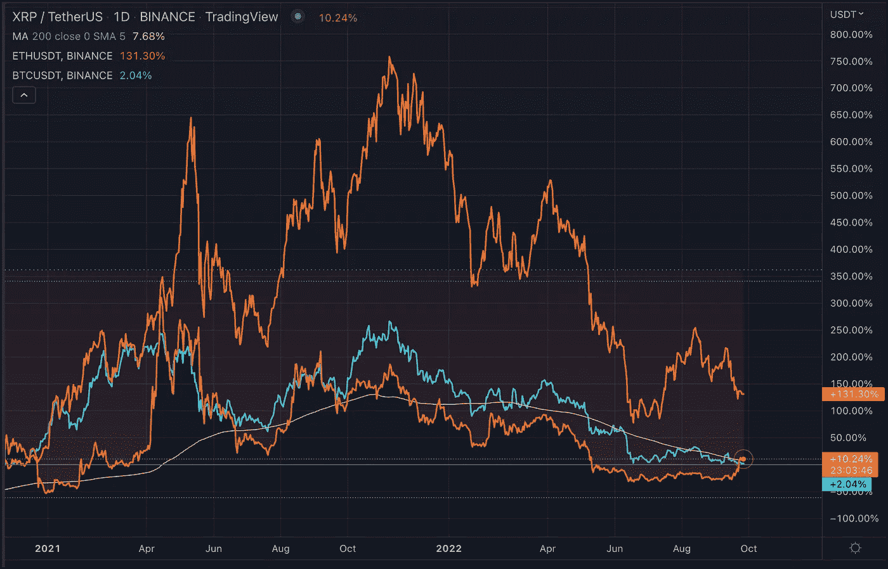

# BTC XRP 联邦理工学院

> 原文：<https://medium.com/coinmonks/btc-xrp-eth-d2830a79af13?source=collection_archive---------43----------------------->

为什么 XRP 的价格会跟随 BTC 的价格？

Ripple 是 crypto 中最吸引人的故事之一。监管机构已经追捕他们近两年了，最新的传言让联邦政府认输了。官方说法是，看起来双方都要求此案不进行审判。让法院在 13 亿美元的诉讼中进行简易判决。

我不知道该如何看待这件事，也不能给出任何接近有见识的评估，但我有一种感觉，在这么长时间之后，在大多数加密社区与$XRP 保持距离之后，对 Ripple/XRP 有利的事情对加密社区也是有利的。这场斗争是关于“它是一种安全/它不是一种安全”以及谁对 XRP 和一般加密拥有管辖权。

当这一切开始的时候，XRP 几乎是加密领域的第二号人物。在比特币之后但在以太坊之前。有趣的是，在近 2 年的合法踢踏舞中，XRP 一直与 BTC 并驾齐驱，而联邦理工学院却一直远离他们。我不会从中得出任何结论，但有点令人吃惊的是，所有加密技术的始祖比特币，除了与过去两年受到监管机构巨大压力的代币保持同步之外，几乎没有做什么。我不知道这种压力是否正在上升，如果上升会发生什么，但这一切都有点发人深省。

> 交易新手？试试[密码交易机器人](/coinmonks/crypto-trading-bot-c2ffce8acb2a)或者[复制交易](/coinmonks/top-10-crypto-copy-trading-platforms-for-beginners-d0c37c7d698c)