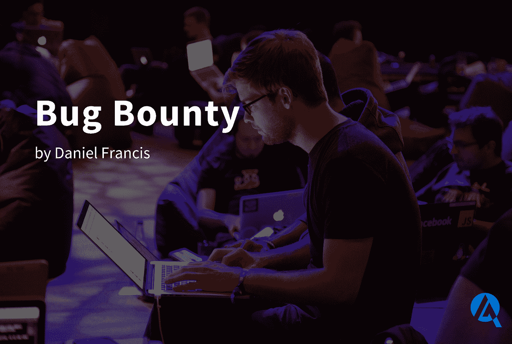

# 虫子赏金

> 原文：<https://medium.com/coinmonks/bug-bounty-a1a3b3e74b87?source=collection_archive---------9----------------------->

2021 年，黑客窃取了 140 亿美元的加密货币，比 2020 年的 70 亿美元翻了一番。2022 年也不会不同。DeFi 平台似乎和一个 Jenga 游戏一样有基础。把右边的木块拉出来，一切都可能崩塌。代码中的错误非常普遍。智能合约使这变得复杂，因为它们可以保存有价值的加密资产，并且是不可变的。"每个加密项目都是伪装的 bug 赏金项目."邓肯·汤森，Immunefi 的首席技术官。如果被利用，一个错误就可能造成数百万的损失。审计智能合同和漏洞奖励计划有助于降低这些风险。

**什么是虫子赏金？**

为黑客检测和报告软件漏洞提供报酬的众包项目。赏金猎人是有道德的程序员，“白帽”黑客，他们通过在恶意黑客做“黑帽”之前发现漏洞来提高平台的安全性。自从网景公司第一次为在他们的导航器中发现安全漏洞提供奖励以来，漏洞奖金就一直存在。Bug bounty 程序允许黑客报告代码中的漏洞，而不用担心刑事起诉。它给了黑帽黑客一个合法的途径来赚取干净的钱，并可以激励他们变成白帽。

bug 奖金的必要性越来越大，因为并非所有开发人员都有检测 bug 和漏洞的技能。不是每个项目都能雇佣一个有经验的安全专家。因此，有道德的黑客会因为发现任何加强项目的漏洞而获得奖金。

**Bug 赏金设置**

项目应该定义奖金计划的范围以消除混淆。项目必须阐明黑客攻击的证据，以及他们希望如何接收信息。组织应该公开奖金，以及根据缺陷的严重程度分配给缺陷的金额。

**为什么越来越多的 DeFi 公司开始实施臭虫奖励计划？**

**成本**

奖励需要相称。一个控制着 3 亿美元的智能合约，不可能为发现一个关键漏洞提供 1 万美元。付钱给一个赏金猎人来告诉你一个漏洞可能比付钱从黑客那里拿回你的资金成本更低。

并非所有案件都以富有成效的谈判告终，但黑客们在 2022 年 7 月 2 日通过 Crema Finance 上的闪付贷款偷走了 8，782，446 美元。最终，该团队与黑客进行了谈判，他们返还了被盗资金，但扣除了 170 万美元的赏金。这不是一个标准，但是项目应该考虑 10%的风险资金作为奖金的合适起点。任何低层和黑色的帽子可能不觉得有必要去合法。

**营销**

MakerDAO 等项目已宣布奖金 1000 万美元，Olympus DAO 330 万美元；奖金这一重要信号表明，这些项目重视安全，并希望防止金钱损失。在宣布之后，他们也对自己的协议产生了浓厚的兴趣。这是一个重要的声明，因为智能合同每周都会被黑客攻击数百万次。社区围绕特定的目标形成，一个可观的奖励计划可以将合适的人聚集在一起，推动项目的成功，使其成为焦点。

**安全**

Bug bounty 程序表明一个项目更加合法，因为它重视安全性，并且他们理解安全性是一个持续的过程。忽视这一点会将用户、合作伙伴和协议置于危险之中。

**正在进行测试**

Bug bounty 项目培养了一个持续测试的环境。社区可以测试添加到代码库中的新开发，不断地增强程序。

**覆盖范围**

大量的黑客检查代码增加了发现漏洞的机会。认真对待 bug 报告至关重要。在错误被恶意行为者瞄准之前付款并修复。忽视赏金猎人合理的安全顾虑可能会导致可怕的后果。

**下行**

**已经发现的**

有经验的专业人员会花时间去发现一个已经测试过的协议中的漏洞，而浪费他们的时间和精力却没有发现新的漏洞。

**修复 bug 的时间**

在修复已知问题的过程中，可能会发生黑客攻击。当检测到漏洞时，项目必须有一个行动计划，以避免不及时采取行动的负面结果。

**结论**

Bug bounty 计划只是安全领域的一小部分。项目必须优先考虑内部控制并测试他们的代码。之后，他们可以考虑用审计市场 AuditOne.io 来审计他们的智能联系人。最后，整理一个 bug 赏金程序。黑客会试图从每一个有潜力产生数百万的项目中获利。应该有足够的基础设施来解决出现的任何问题。在加强平台安全性的同时，最好让黑客站在你这边，而不是在受到攻击后进行谈判。

**保持连接:**

[**网站**](https://t.co/gbDV0I4bZk) **|** [**推特**](https://twitter.com/auditone_team)**|**[**LinkedIn**](https://www.linkedin.com/company/auditonegmbh/)

> 交易新手？尝试[加密交易机器人](/coinmonks/crypto-trading-bot-c2ffce8acb2a)或[复制交易](/coinmonks/top-10-crypto-copy-trading-platforms-for-beginners-d0c37c7d698c)