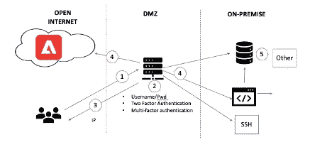
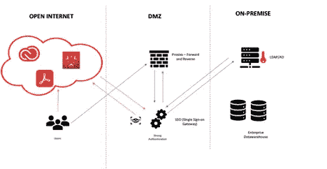

# 借助 Adobe 体验云构建零信任企业

> 原文：<https://medium.com/coinmonks/build-zero-trust-enterprise-with-adobe-experience-cloud-6eba6e365e4d?source=collection_archive---------11----------------------->

企业正在将客户数据纳入多云环境。大量的客户数据在整个多云环境中被管理和访问，这就要求必须遵守安全标准。在过去的几年里，对大型企业的网络攻击迫使组织后退一步，重新审视安全设置。例如，丹麦航运和运输巨头 AP 穆勒-马士基公司(AP ml ler-Maersk)处理着全球七分之一的集装箱，是最近一次重大勒索病毒爆发中受打击最严重的公司之一。跨多个站点和选定业务部门的许多 IT 系统被关闭，这也影响了电子邮件系统

实施零信任架构以充分利用 Adobe 体验平台

**零信任架构是保护客户数据最安全的方式**

由于云平台的激增，零信任架构的需求已经出现。因为客户的需求是不可预测的，而且是临时的，所以隔离部署不是一个选项。

特别是在客户生态系统中，MarTech 的实施被分割开来，几乎与其他应用架构相连接，而不是更广泛的应用架构的一部分。

你们中有多少人仍在使用 VPN 实施 MarTech？

你们中有多少人在独立的 SaaS 云中拥有 MarTech 系统，而这些系统只是相互连接？

你们中有多少人仍在使用代理模式，严重依赖第三方来推动营销活动？

你们中有多少人仍然专注于营销自动化部署？

你们中有多少人仍在使用多个 SDK 实施众多 MarTech 平台？

如果你属于任何一类，那是因为你还没有实现零信任架构。

您能充分利用 MarTech 堆栈吗？

您是否仍在改进 MarTech 平台，使其成为客户生态系统中的可行选择？

您的组织中有集成灾难吗？

您是否需要与许多提供商合作来推出一项营销计划？

您是否没有将他人之前尝试和测试过的东西付诸实践？

上述问题的答案是零信任架构的基础。无论问题是同类最佳、全面的 MarTech 套件还是体验云平台，都必须是零信任合规的。

**为什么企业需要零信任架构？**

企业正在经历一场变革，一些企业正在向云迁移，另一些企业仍然使用基于 SaaS 的本地应用，还有一些企业同时拥有基于云和本地应用，还有一些企业正在向多个云迁移。这增加了复杂性，同时突出了所有位置之间平滑和安全的数据通道化的重要性。使系统符合各种法规和数据标准是顺利访问数据的障碍。

这是一张简化的图片，展示了公司网站可能整合的内容。

默认情况下，数据处于飞行模式。

为了满足实时客户交互的需求，组织需要最安全的体系结构形式，这种形式本质上不是传统的，并且解决了以前设计的缺点。

零信任架构(ZTA)是一种基于零信任原则的网络安全架构，旨在防止数据泄露并最大限度地减少内部横向移动。简单地说，当您实现零信任架构时:

零信任方法将所有流量视为恶意流量，即使它已经在企业内部。也就是说，如果不先进行身份验证，您就不能从一个系统进入另一个系统，并且您必须始终返回到原始系统进行身份验证。例如，工作负载被阻止通信，直到一组质量(如指纹或身份)验证它们。基于身份的验证策略提供了更高的安全性，无论工作负载在哪里进行通信，无论是在公共云中、混合环境中、容器中还是在本地网络架构中。

**利用 Adobe 体验云构建零信任企业**

Adobe Experience Cloud 是客户数据和客户体验的保管者。Adobe Experience Cloud 是 Adobe 的 SaaS 产品，可与内部应用程序以及其他 SaaS 和云平台交互。因此，Adobe 平台兼容并共享最安全的架构是不可避免的。

过去，客户一直通过 VPN(虚拟专用网络)使用 Adobe Experience Cloud。最常见的是用户在 DMZ 区域设置 VPN I

***传统建筑使用 VPN***

在我们放大到零信任架构及其差异之前，让我们浏览一下传统架构。

传统架构被划分为多个隔离区，应用程序托管在内部以及开放的互联网上。用户通常通过托管在 DMZ 区域的 VPN(虚拟专用网络)访问应用程序

-用户请求访问内部托管的任何应用程序以及云

-在 VPN 上验证用户对应用程序的访问

o 最简单的认证是使用用户名和密码，就像 API 访问应用程序一样

o 双重认证，如动态口令或应用程序访问链接

o 如今，应用程序通常使用多因素身份验证，除了用户之外，其应用程序设备也要经过身份验证

一旦用户验证或认证成功，IP 就与用户共享。

-用户被分配了 IP，这意味着实际上是在专用网络上

-分配 IP 后，用户可以访问本地以及 SaaS 云应用

**传统架构的缺点**

除非采取了先进的安全措施，否则一旦用户可以访问 IP 或网络，他们就可以简单地从一个系统进入另一个系统。过去的实例表明这是不安全的，并且由于传统的设计配置，系统变得容易受到安全风险的影响。建立 VPN 并不容易，因为它需要人力和时间。

**转向零信任架构**

*采用 Adobe 体验云的零信任架构快照*

让我们看看 Adobe Experience Cloud 如何融入零信任架构。零信任体系结构中有两个关键组件。

- BYOK(自带钥匙)

-代理

-钥匙和标签库

-审计库

零信任架构中没有 VPN 的空间

每当用户请求 Adobe Experience Cloud 应用程序时，该请求或者直接发送到 Adobe Experience Cloud，或者如果完成了域委托，则发送到代理服务器

Adobe 体验云以及代理将请求重定向到 SSO 网关

SSO Gateway 使组织能够通过 SSO 实施自己的安全策略，并强制所有应用程序(无论是内部还是云)遵守这些策略。

SSO 合规性保证 Adobe Experience Cloud 符合 BYOK 以及 GDPR/CCPA 和其他标准。

一旦 SSO 收到请求，它将使用 LDAP/AD 或企业使用的任何其他方法进行身份验证，这些方法可以是内部部署或 SaaS。

维护和管理 Audit Vault 以跟踪请求至关重要。

Audit Vault 跟踪请求，并在出现任何可疑情况时发出警报。

为了进一步保护系统，提供密钥和标签保险库安全性。

一旦一切都通过了 SSO，请求就被批准访问 Adobe 体验云。

企业使用零信任架构来控制使用哪些策略来访问 Adobe Experience Cloud 或其他云服务。终端客户无法辨别他们使用的是云服务还是内部应用，因为体验是一样的。企业受益于更高的安全性，因为系统不允许直接访问，所有流量都通过代理路由。

【Adobe Experience Cloud 的零架构为企业带来的优势

零信任架构创建了一个生态系统，它建立在评估一切而不信任任何东西的概念之上。

**增加信任并降低风险:** Adobe Experience Cloud 零信任架构通过删除过度配置的软件和服务并持续实时确认每个通信资产(包括加密流量)的“凭据”来最大限度地降低风险。

**降低数据泄露的风险:** Adobe Experience Cloud 零信任体系结构根据最小特权的概念假定每个实体都是敌对的。在提供“信任”之前，会检查每个请求，对用户和设备进行身份验证，并评估权限。当环境发生变化时，例如用户的位置或被访问的数据，这种“信任”会被定期评估。

**协助合规计划:**部署在 Adobe Experience Cloud 中的零信任架构保护所有用户和工作负载与互联网的连接，防止它们被暴露或滥用。这种不可见性使得证明遵守隐私要求变得更加容易。

在您实施任何 MarTech 平台之前，请想一想，问自己一些问题，无论您是通过零信任架构为未来构建一个生态系统，还是仍然骑着一辆换了新轮胎的旧车。

零信任架构对于使 MarTech 成为整个 IT 领域不可或缺的一部分至关重要。让我知道你对零信任架构的想法和意见。

> 交易新手？尝试[加密交易机器人](/coinmonks/crypto-trading-bot-c2ffce8acb2a)或[复制交易](/coinmonks/top-10-crypto-copy-trading-platforms-for-beginners-d0c37c7d698c)