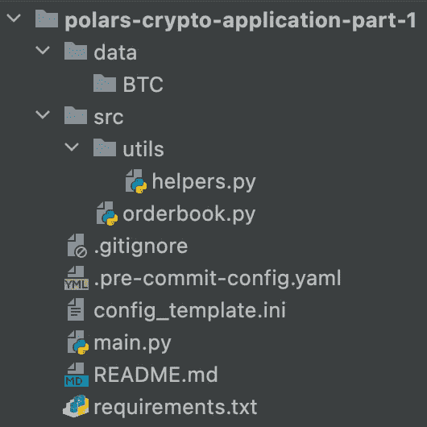
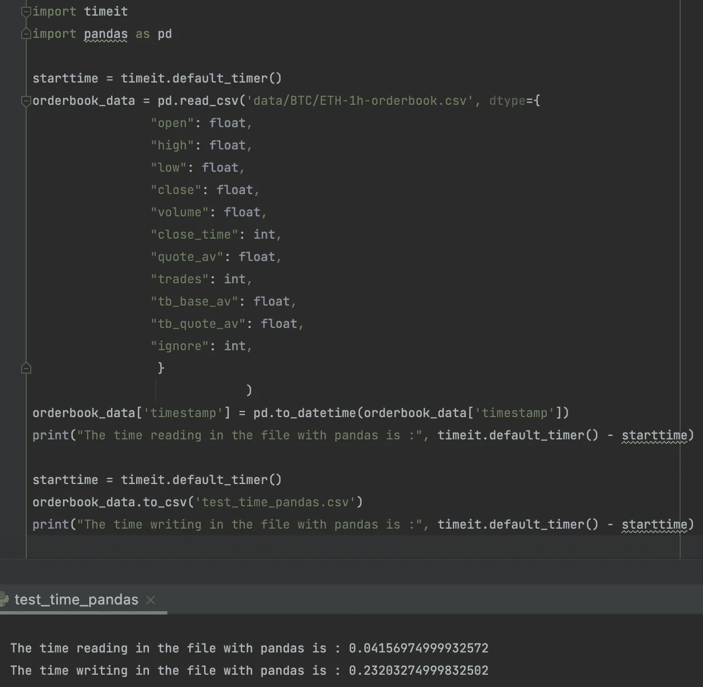
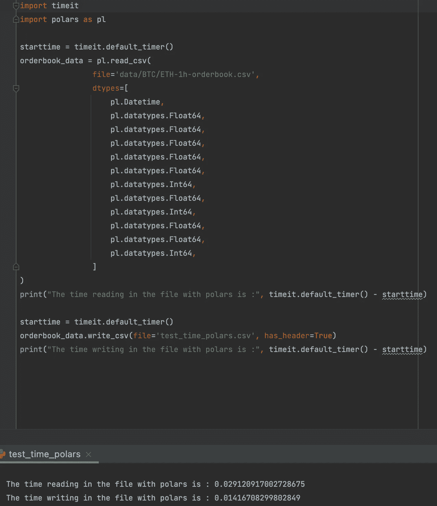

# 使用 Polars 构建加密应用程序(第 1 部分):从币安检索历史数据

> 原文：<https://medium.com/coinmonks/building-a-crypto-application-using-polars-part-1-retrieving-historical-data-from-binance-8b657b1e5cc1?source=collection_archive---------4----------------------->


在这个多篇文章系列中，我们将构建一个加密应用程序，它能够从不同的交换中检索数据，在这些数据的基础上实现一些技术指标，甚至可能在云中部署解决方案。

这个系列的灵感是基于我对这个领域的兴趣，以及可以在[这里](/swlh/retrieving-full-historical-data-for-every-cryptocurrency-on-binance-bitmex-using-the-python-apis-27b47fd8137f)找到的[彼得·尼斯特鲁普](https://medium.com/u/93675cf59306?source=post_page-----8b657b1e5cc1--------------------------------)的博客。在他的文章中，数据是从币安和 Bitmex 用熊猫在一个笔记本上检索的。尽管这样工作，我想通过使用 [Polars](https://github.com/pola-rs/polars) 让它更健壮，更适合生产，尤其是更快。使用这个库，我能够显著提高应用程序的速度，这是至关重要的，因为当你实时交易时，每一毫秒都很重要。因此，这些帖子的主要焦点将集中在 Polars 的使用上，而其余的代码可以在资源库中找到。

## 先决条件

为了从交易所获取数据，你需要一个币安账户。你可以通过[这个](https://accounts.binance.com/en/register?ref=TFYZGJ88)链接注册。按照这个教程，你不需要购买任何东西或者花任何钱。

对于一个有效的币安帐户，我们需要创建一个 API 密钥，以允许应用程序使用您的帐户从交换中读取加密数据。确保只给 API 密匙读的权限，这样，如果你的密匙以某种方式暴露，就不能用它购买任何东西。[在这里](https://www.binance.com/en/support/faq/360002502072)你可以找到如何创建 API 密匙。

我添加了一个 requirements.txt 文件，其中包含运行代码所需的所有 python 库。您可以通过在虚拟环境中运行以下代码来快速安装:

```
pip install -r requirements.txt
```

完成后，我们就可以开始编码了！

在这第一部分中，我们将集中于从币安检索所有的 BTC 对并将它们写入磁盘。这篇文章中使用的代码可以在[这里](https://github.com/romanovacca/polars-crypto-application-part-1)找到。

回购的结构如下所示:



structure of the [repository](https://github.com/romanovacca/polars-crypto-application-part-1) used

这里最重要的两个文件是:

*   main.py
*   订单簿. py

我们还需要使用币安 API 密钥。为此，我们使用一个名为“config.ini”的配置文件，可以在本地存储凭证。我们使用的方法不是最安全的，不推荐在生产环境中使用，但是对于一个简单的本地帖子来说，这很好。

## config.ini

## main.py

现在我们已经完成了设置，我们将创建一个 orderbook 类，它将包含连接到交换机、获取数据、处理数据并将其写入磁盘的代码。这个想法是，这个订单簿可以处理多个不同的交换，但这是未来的帖子。

## 阿辛西奥

因为我们将多次调用 api，所以我们必须考虑速率限制。您从币安请求的数据越多，他们系统上的请求就越“沉重”。币安的速率限制值是每分钟 1500。例如，请求 BTC/ETH 对最后一天的数据可能花费 3 英镑，而检索 2022 年全年的数据可能花费 30 英镑。

为了提高 api 调用的速度，我们使用 [Asyncio](https://docs.python.org/3/library/asyncio.html) 来同时进行调用和从 API 获取数据。接下来，我们实施了一项预防措施，以确保我们不会超过速率限制。

这是这篇文章最终的 main.py 的样子。

我们创建一个名为 main 的异步函数，它是应用程序的入口点。我们初始化 orderbook，并传递我们想要检索数据的基本符号的值。传递“BTC”将意味着我们将检索与 BTC 配对的所有数百枚硬币的数据，如“ETH/BTC”、“XRP/BTC”等。此外，我们定义了检索数据的时间范围，在本例中是每小时。

下一步是创建将调用币安 API 的客户端。我们显式地等待，直到一个客户端被返回，否则我们不能获得任何信息。这里我们传递存储在配置文件中的凭证。

现在在“get_orderbook”函数中，大部分逻辑已经存在。解释那里的一切可以形成一个完整的独立帖子。我相信更有趣的功能将出现在下一部分，在这里我们将实际处理检索到的数据。因此，我将跳过代码中使用 Polars 处理数据的部分。

## **使用 polars**

在上面的要点中，我们使用“_get_klines_data”从 api 中检索数据。在前一步骤中，已经为特定符号确定了最早存储的数据点和最新可用的数据点。接下来，我们创建一个 polars 数据帧，传入数据和列名。

使用 [Polars 表达式 API](https://pola-rs.github.io/polars-book/user-guide/dsl/intro.html#:~:text=Polars%20expressions%20are%20a%20mapping,to%20method%20chaining%20in%20Pandas%20).) 的一个好处是，在一次选择中，我们可以执行不同的动作。我们不仅将所有列转换为正确的类型，还能够创建一个新列。列的原因是在数据集内，我们想要存储硬币的名称。当我们稍后将所有不同的数据集组合在一起并使用该列作为过滤器时，这很有用。

下一步是实际写入我们刚刚检索到的数据。为了做到这一点，我们首先必须检查我们是否已经存储了一些数据。如果是这种情况，我们需要追加数据，我们应该排除头部。将两个数据帧附加在一起的方法可以通过使用 polars 中的“vstack”来实现。

这个项目选择 polars 的原因之一是，在 Polars 中读写 csv 比熊猫快得多。让我给你看一个例子:

## 熊猫



Pandas speed reading and writing

## 极地



Polars speed reading and writing

关于这个测试的数据量的一些上下文:

*   2020 年 1 月 1 日至 2022 年 9 月 21 日的数据
*   行数:23848
*   文件大小:3.1 MB

虽然极地熊读取数据的速度大约是熊猫的 1.5 倍，但我们看到的最大区别是书写。用极坐标书写比用熊猫写字快 16 倍。速度提升现在可能看起来不那么令人印象深刻，但如果你考虑到这只是针对 1 个特定硬币的 2.5 年的每小时数据的事实，想象一下如果你在更长的时间内这样做，并且针对币安上所有的+- 400 BTC 对，性能会有所提高。

# **结论**

本系列的第一部分主要是设置和获取我们将在下一系列中使用的数据。通过这篇文章中的代码，可以用 4 行代码从币安交易所获取所有数据。

在第二篇文章中，我们将使用 Polars 实现一些技术指标。

一旦第二部分完成，我会在这里添加帖子的链接。

## 资源

官方 git 回购 Polars:【https://github.com/pola-rs/polars 

Polars post 入门:[https://medium . com/analytics-vid hya/introduction-to-Polars-ee9e 638 DC 163](/analytics-vidhya/introduction-to-polars-ee9e638dc163)

Git 回购本贴代码:[https://github.com/romanovacca/polars-crypto-application](https://github.com/romanovacca/polars-crypto-application)

本系列的第二部分可以在这里找到:[创造技术指标来预测未来的价格走势](/@romanovacca/building-a-crypto-application-using-polars-part-2-creating-technical-indicators-to-predict-50b263ab65e8)

> 交易新手？试试[密码交易机器人](/coinmonks/crypto-trading-bot-c2ffce8acb2a)或者[复制交易](/coinmonks/top-10-crypto-copy-trading-platforms-for-beginners-d0c37c7d698c)