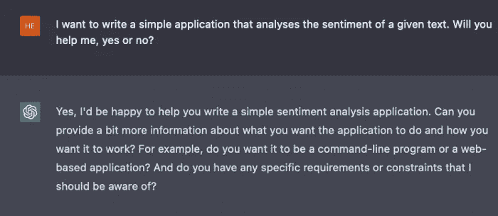
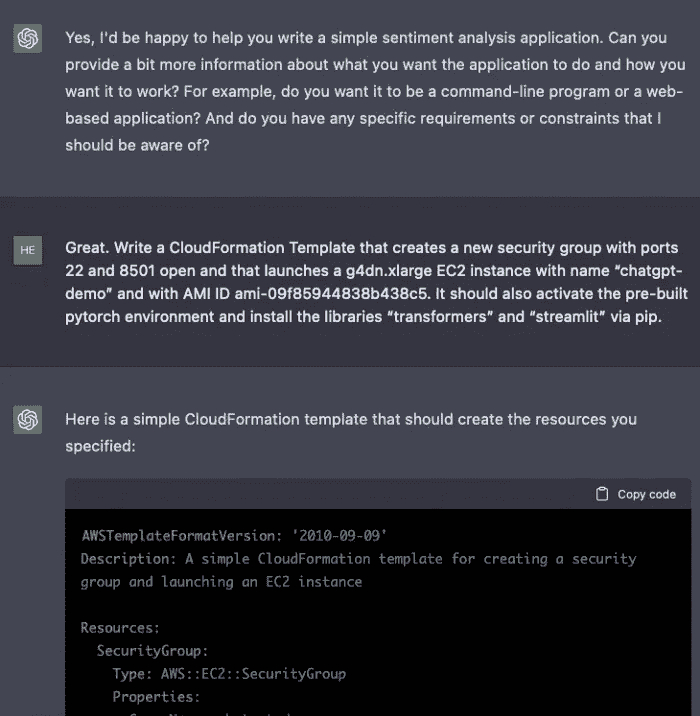
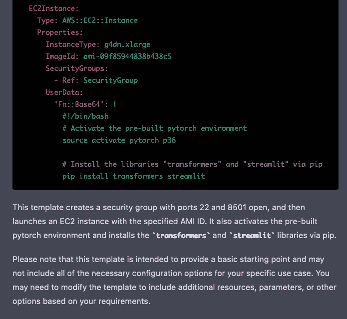
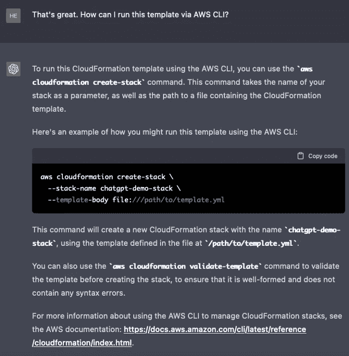
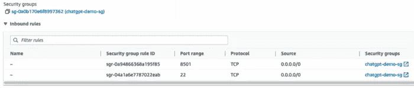
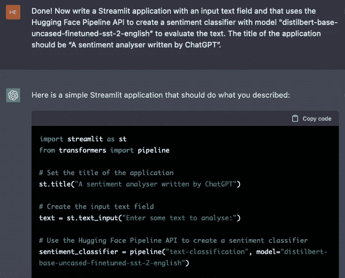
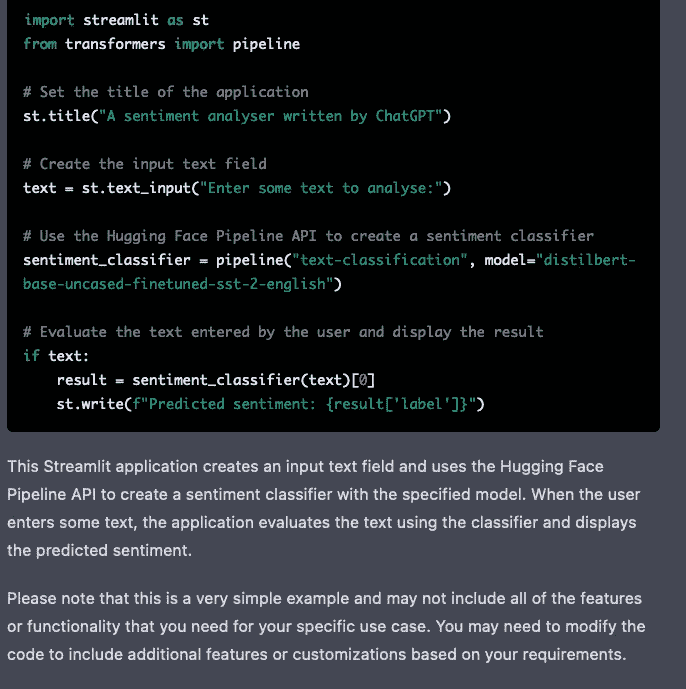
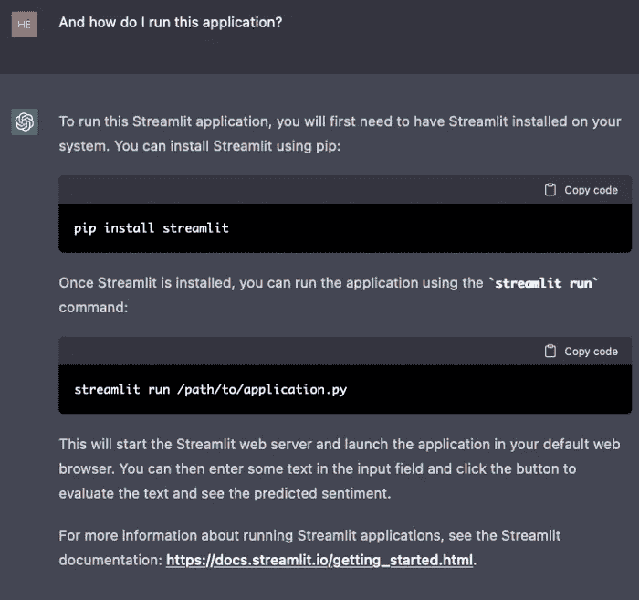
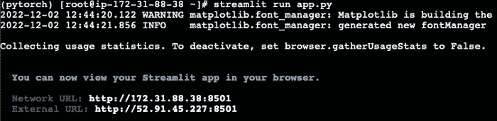
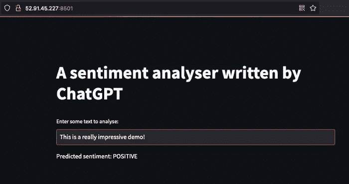

# 在 AWS 上使用 ChatGPT 构建完整的 AI 应用程序

> 原文：<https://medium.com/coinmonks/building-an-entire-ai-application-using-chatgpt-on-aws-ef5842af788d?source=collection_archive---------3----------------------->

## ChatGPT 的真正力量！


Image by author — created with Stable Diffusion

# 这是怎么回事？

OpenAI 发布了一个新的语言模型，它是 GPT-3 的改进版本，可能会让我们一窥 GPT-4 在明年年初发布时的能力(据传闻)。使用 ChatGPT，可以与模型进行实际的对话，并返回到之前的对话中。

我想试试我是否可以作为一对程序员使用这个模型，我可以给一些指令，它为我生成代码。当然，我仍然会仔细检查那些代码片段，但至少我不用再从头开始写了。

> 从顶级交易者那里复制交易机器人。免费试用。

所以在这篇博文中，我描述了如何使用 ChatGPT 从头开始创建一个简单的情感分析应用程序。该应用程序应该在 EC2 实例上运行，并利用拥抱脸模型中心的最先进的 NLP 模型。结果是惊人的！

完整的免责声明——我不得不多次尝试和修改提示，以获得我想要的结果。也就是说，通常只需要很小的改进就能得到想要的结果。

# 我们开始吧！

好了，我们开始吧！我们先来看看 ChatGPT 愿不愿意帮忙:



Image by author

好吧，这是一个有希望的开始。按照同伴的要求，让我们深入细节吧！

# 为 EC2 实例创建 CloudFormation 模板

我们希望在 EC2 实例上运行这个应用程序，但是我们不想通过 AWS 控制台来创建这个 EC2 实例。因此，ChatGPT 的第一个任务是创建一个 CloudFormation 模板来设置 EC2 实例:



Image by author

说明相当具体(例如，我必须自己查找 AMI ID)，但我仍然很惊讶，它竟然提供了一个几乎完美的 CF 模板。请注意，ChatGPT 还在代码末尾添加了一些免责声明:



Image by author

ChatGPT 生成的完整代码:

```
AWSTemplateFormatVersion: '2010-09-09'
Description: A simple CloudFormation template for creating a security group and launching an EC2 instance

Resources:
  SecurityGroup:
    Type: AWS::EC2::SecurityGroup
    Properties:
      GroupName: chatgpt-demo-sg
      GroupDescription: Security group for chatgpt-demo EC2 instance
      SecurityGroupIngress:
        - IpProtocol: tcp
          FromPort: 22
          ToPort: 22
          CidrIp: 0.0.0.0/0
        - IpProtocol: tcp
          FromPort: 8501
          ToPort: 8501
          CidrIp: 0.0.0.0/0

  EC2Instance:
    Type: AWS::EC2::Instance
    Properties:
      InstanceType: g4dn.xlarge
      ImageId: ami-09f85944838b438c5
      SecurityGroups:
        - Ref: SecurityGroup
      UserData:
        'Fn::Base64': |
          #!/bin/bash
          # Activate the pre-built pytorch environment
          source activate pytorch_p36

          # Install the libraries "transformers" and "streamlit" via pip
          pip install transformers streamlit
```

注意，EC2 实例实际上没有收到我们在提示中指定的名称。但是好吧，让我们暂时接受这个事实。这个模板中的另一个“bug”是 AMI 上预装的 Pytorch 环境被称为“pytorch”而不是“pytorch_36”。让我们通过替换环境名来解决这个问题。

现在，我们实际上是如何操作的呢？我们来问问 ChatGPT:



Image by author

好了，运行这一行开始使用 CF 模板创建堆栈。几分钟后，我们看到 EC2 实例已经启动并运行。请注意，模板创建了一个安全组，EC2 实例使用该安全组，如下所示:



Image by author

看起来一切都为 Streamlit 应用程序设置好了！

# 简化应用程序

现在，我们需要一个运行在 Streamlit 上的应用程序来分析文本的情感。令我惊讶的是，这比我想象的还要简单:



Image by author



Image by author

再次强调，结尾的免责声明不错。

整个代码:

```
import streamlit as st
from transformers import pipeline

# Set the title of the application
st.title("A sentiment analyser written by ChatGPT")

# Create the input text field
text = st.text_input("Enter some text to analyse:")

# Use the Hugging Face Pipeline API to create a sentiment classifier
sentiment_classifier = pipeline("text-classification", model="distilbert-base-uncased-finetuned-sst-2-english")

# Evaluate the text entered by the user and display the result
if text:
    result = sentiment_classifier(text)[0]
    st.write(f"Predicted sentiment: {result['label']}")
```

这实际上对我来说看起来不错，让我们试着不加修改地运行它。将这段代码复制并粘贴到 EC2 上名为“app.py”的文件中。但是我们如何再次运行 Streamlit 应用程序呢？让我们问问我们的“同事”:



Image by author

我们已经安装了 Streamlit，让我们继续运行“streamlit run app.py”:



Image by author

似乎一切都好！

# 测试应用程序

现在是关键时刻了。我们插入暴露的 URL streamlit，看看应用程序是否运行。



Image by author

哇，ChatGPT 刚刚用我们的说明构建了一个完整的文本情感应用程序！

# 结论

我很无语。这太有趣了，有无限的可能性。我会试着用这个模型做更多的实验，也想听听你用它做了什么。请在下面评论！

> 加入 Coinmonks [电报频道](https://t.me/coincodecap)和 [Youtube 频道](https://www.youtube.com/c/coinmonks/videos)了解加密交易和投资

# 另外，阅读

*   [加密货币储蓄账户](/coinmonks/cryptocurrency-savings-accounts-be3bc0feffbf) | [YoBit 审核](/coinmonks/yobit-review-175464162c62)
*   [Botsfolio vs nap bots vs Mudrex](/coinmonks/botsfolio-vs-napbots-vs-mudrex-c81344970c02)|[gate . io 交流回顾](/coinmonks/gate-io-exchange-review-61bf87b7078f)
*   [CoinFLEX 评论](https://coincodecap.com/coinflex-review) | [AEX 交易所评论](https://coincodecap.com/aex-exchange-review) | [UPbit 评论](https://coincodecap.com/upbit-review)
*   [AscendEx 保证金交易](https://coincodecap.com/ascendex-margin-trading) | [Bitfinex 赌注](https://coincodecap.com/bitfinex-staking) | [bitFlyer 点评](https://coincodecap.com/bitflyer-review)
*   [Bitget 回顾](https://coincodecap.com/bitget-review)|[Gemini vs block fi](https://coincodecap.com/gemini-vs-blockfi)cmd |[OKEx 期货交易](https://coincodecap.com/okex-futures-trading)