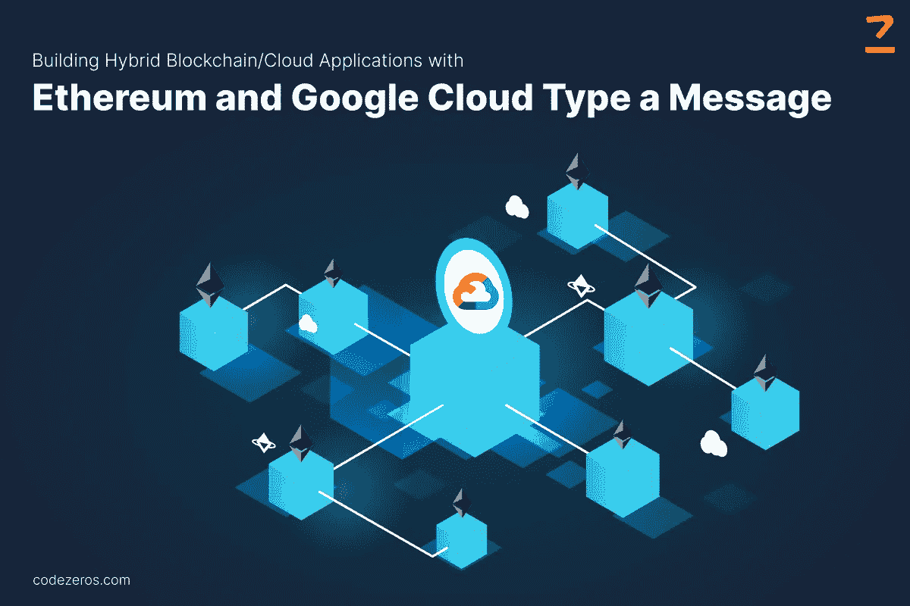

# 使用以太坊和谷歌云构建混合区块链/云应用

> 原文：<https://medium.com/coinmonks/building-hybrid-blockchain-cloud-applications-with-ethereum-and-google-cloud-26cf21801534?source=collection_archive---------30----------------------->

借助公共云和互联网资源，可以加速区块链技术的使用。在这篇博客中，我们将讨论一些基于云的区块链应用程序如何使用 Chainlink oracle smart contract 使 BigQuery 数据在链上可用。

首先，我们来讨论混合区块链云 App

专注于数学的努力，区块链建立了共同的共识和契约。这些智能合约包含在 [**区块链应用程序开发**](https://www.codezeros.com/services/blockchain-development) 中，因此在深入几个街区后就无法更改。您可以提交加密经济资源，在没有第三方参与的情况下自动执行可信的合同条款。

有时，链上添加的数据并不反映数据。在这种情况下，您需要可信的外部数据，如 Oracle。此外，您将看到智能合约平台以太坊如何通过 Chainlink 与云数据仓库 BigQuery 协同工作。

**混合区块链云应用是如何构建的？**

开发的以太坊 Dapps 向 Chainlink 请求数据，这些数据来自使用 BigQuery 和 Google App Engine 创建的 web 服务。智能契约调用 Chainlink oracle 从 BigQuery 中导出数据。 [**区块链 app 开发平台**](https://www.codezeros.com/services/) 调用外部适配器，为可信 API、外部区块链、支付网关提供更好的支持。

之后，Chainlink 节点用返回的数据请求 oracle 契约，这是从 Dapp 契约中导出的。在这种情况下，Chainlink 节点会与 App Engine web 服务联系。

**如何使用 BigQuery Chainlink oracle**

让我们来看看用 Google 云和 Chainlink 构建有用的应用程序的一些方法:

案例 1: **预测市场**

不同的人对不同平台的成功进行不同的量化，因此对他们建议的平台的意见也不同。智能合约的价值基于幂律分布，因此确定哪一个将占主导地位是很有趣的。

人们可以在加密公共数据集的帮助下成功地提取复杂的预测。例如，目前，对以太坊未来状态的 500，000 美元的赌注是在链上完成的。谷歌还记录了 [**以太坊 Dapps 开发**](https://www.codezeros.com/technology/ethereum) 的量、种类、频率和时间，可以通过对特定 Dapps 的每日、每周和每月功能进行检索来测量。

案例二:**对冲区块链平台风险**

由于区块链环境中现有的值得信赖和透明的金融系统，分散式金融被开发商高度采用。然而，在财务和契约的帮助下，企业可以优化和提高其经营资源的效率。

由于来自加密公共数据集的高质量数据，Dapp 开发者可以创建区块链云应用开发，而无需担心暴露的风险。这导致更具创新性和更快速的区块链创作。

您可以找到有关以太坊智能合约与 BigQuery oracle 交互的详细信息，以便在正确的时间返回所需的数据。您还可以学习使用 oracle 来执行抵押合同。

案例 3: **使用潜艇发送**在以太坊上空提供曝光

以太坊区块链作为一种服务的主要挫折是它缺乏交易隐私，并从智能合约用户泄露的链上数据中获益。这也可以是包括分布式交换地址的前端运行事务。

借助 submarine send 方法，您可以提高交易的安全性和隐私性，击败领先对手，并提高 dex 效率。请确保您在 oracle 中使用这种方法来避免其局限性。

然而，如果在实现 sub 潜艇发送时不使用 oracle，它将会导致区块链膨胀。契约可以看到以太坊虚拟机最多 256 块上游或者一个小时左右。这个最大范围提供了无用的反规范化，而所需的数据被重播。但是，有了 oracle，由于包含了所有历史链数据，这种膨胀就消除了。

**结论**:

我们希望现在你对使用基于云的区块链应用程序来获得链上数据集有所了解。这种技术将帮助您减少潜艇发送用例，并为您的智能合同添加新功能。这将有助于许多行业创造新的商业模式，例如预测市场。

这种方法的主要目的是用少量的延迟和事务开销换取可观的经济效益。这将引导开发人员在开发混合区块链云应用时以最佳方式使用智能合约的功能。智能合同充满了惊人的功能，所以请确保您明智地使用它，并符合您的项目要求。

> 交易新手？试试[加密交易机器人](/coinmonks/crypto-trading-bot-c2ffce8acb2a)或者[复制交易](/coinmonks/top-10-crypto-copy-trading-platforms-for-beginners-d0c37c7d698c)