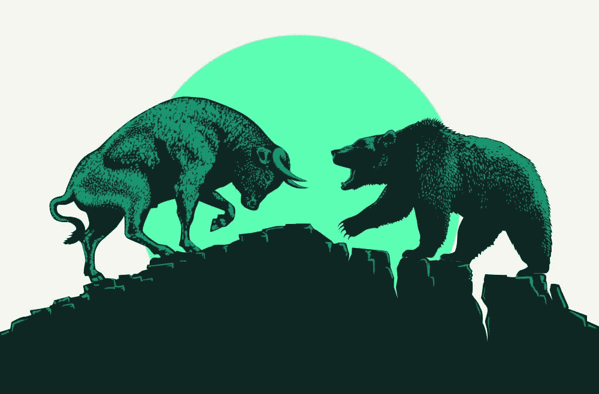

# 在熊市建立还是在牛市建立——动机很重要

> 原文：<https://medium.com/coinmonks/building-in-a-bear-market-vs-building-in-a-bull-run-motivation-matters-a5fbafee073e?source=collection_archive---------5----------------------->

Bull Vs Bear

从专业角度来说，成为一名企业家是人类所能接受的最大挑战之一。你一开始就害怕。你看着面前的这座大山，你不知道自己是否能爬上去……这看起来工作量很大(事实是……这比我们最初预期的工作量还要大……)。但是你被头脑中的这个声音驱使着，告诉你必须去做，去尝试，去为这个愿景而奋斗。你可以感受到到达那里的满足感，你甚至冒险想象一旦你成功了，你的生活会变得多么美好！尽管事实和结果可能与我们的想法有很大不同，不管我们是否达到了这个幸福的结局和我们所有的梦想，有一件事决定了你是否真的能做到，这就是你的动机及其对你控制之外的事情的影响，比如牛市和熊市。

是什么驱动了你的动力？当事情变得艰难时，是什么推动你继续工作/奋斗？你的产品/服务会改变世界并帮助数百万人吗？你只是想向自己证明…是的，你能做到？你只是受金钱的驱使吗？(免责声明…这不是一个好的开始)。

你的动机是让你度过你可能经历的常规倦怠期的东西。经历了很长一段时间没有胜利..只有问题需要解决。

如果你知道如何表达，你的动机就是你将传递给你的团队和你想在这次冒险中与你一起工作的人的东西。

你的动力就是这盏灯，与你同甘共苦。

当建立一家公司时，我们不能总是完全控制一切。尤其是在我们所处的市场/行业。Web3 也不例外。作为一种有风险的资产(阅读我关于有风险/无风险的文章——以下链接),全球宏观经济对其影响很大。无论你是在开发加密货币还是 NFT 项目，熊市都会让观众远离你的辛勤工作，让你很难成功。这是你的动机最重要的地方，去管理你无法控制的外部因素。

让我们来研究一下在牛市和熊市中你可能不得不面对和适应的一些利弊。

**牛市的好处**

*   FOMO &兴奋通常会推动市场。人们情绪化投资，跟风从众。如果你的项目看起来还算过得去，就更容易获得资助。是的……有一群风险投资基金这样的东西！
*   资金在市场上流动，流动性很高，人们正在寻找下一个投资方向。
*   建立一个社区更容易，更多的人使用社交媒体，行业关键词正在成为趋势。
*   FOMO 给投资者造成了时间压力。事情进展得更快。

**牛市弊**

*   竞争激烈。流动性市场吸引着合法项目，也吸引着廉价项目和其他骗子。市场中的大量新进入者，无论是一个分叉还是一个原创想法，都会制造噪音，分散投资者的注意力。
*   对投资者来说，风险更大的是，你可能会失去观众的长期信任。当起点很高，市场崩盘时，一部分观众会走捷径，指责创始人。无论这是不是他们的错，市场的影响都将损害牛市期间建立的关系。创始人需要加倍努力来维护他们所建立的东西。
*   在牛市中，所有东西都要花更多的钱。营销机构，区块链开发商，艺术家，主持人和社区经理…每个人都在寻找关键的技术人员来开发他们的项目，他们很快就需要他们。这推高了价格，增加了交付项目和收回团队初始投资的更大压力。
*   事情进展得更快也可能是负面的。你必须和你的竞争对手一样快，并且达到同样的最低标准。

**熊市的好处**

*   竞争更少，但受众更少。当熊在这里的时候，大多数不合法的、承诺的、非资助的项目正在消失，好的项目越来越少。这样一来，高质量的风险投资就更容易大放异彩，但它的受众也会减少。
*   更多的时间来建造。如果作为创始人，你只有最低限度的资金来维持，那么在熊市中进行建设会给你更多的时间来执行质量。没有必要急于满足“新兴”人群对投资的渴望。也就是说，Web3 观众的不耐烦仍然很高，所以继续执行！一致性更容易达到。
*   建立一个观众群可能会更难，但是你会发现支持者会长期存在。真正理解 Web3 及其潜力的人是那些无论如何都保持活跃的人。向这个群体展示，你的项目为同样的价值观而战，你的核心观众会和你在一起，在牛市回来时成为你最好的销售力量！
*   组建一个强大的技术团队更容易。对人才需求的减少意味着有更多的机会获得合适的成员。人们愿意花更多的时间创造可持续的东西，并成为优质项目的一部分。现在需求降低了，他们必须明智地利用时间。
*   如果你在熊市期间成功启动了你的项目，你就为自己建立了良好的声誉和记录。这将有助于你的企业的可持续性，受到的关注，解锁进一步的投资，从而有助于可扩展性！

**熊市的坏处**

*   资助真的很难。风险投资基金几乎不投资。终端投资者回避有风险的资产。要说服人们信任你，把钱交给你，你需要比牛市时多十倍地证明自己。期待深度尽职调查和观众提问！留在市场上的个人是真正聪明的支持者，他们不会那么容易投资你的项目。
*   发展一个社区是具有挑战性的。尽管竞争不那么激烈，但在熊市期间，人们的参与度会降低。图表很无聊，没什么事情发生，人们说了很多，但没有兴奋感。抓住一个无所事事的观众的注意力变得很困难。保持兴趣更加困难。自熊市开始以来，Twitter Web3 用户数量大幅下降。你可以想发多少就发多少，如果用户不再登录，耐心和一致性是你最好的武器！
*   没有 FOMO/欣快感。你有更多的时间来建立一个高质量的项目，减少竞争，这听起来很好，但也意味着人们会对你和你的团队有更多的期望。在你的项目上投入的每一美元都应该得到回报。如果市场不处于一般的 FOMO 状态，准备好和你的团队进行许多头脑风暴会议，跳出框框思考，想出能在你的观众眼中重燃火焰的主意。
*   你需要有强大的心理素质和毅力。熊市中的建筑不适合胆小的人。熊市让每个人都感到沮丧。对于像投资者这样的建筑商来说，不确定性是真实的。以上都没关系，如果你怀疑自己的能力，怀疑自己能否成功，能否带领团队开发出人们会喜欢的你引以为豪的产品或服务，不管市场环境如何。这是你的动力最重要的地方！你能把它有效地传达给别人吗？

出于不同的原因，牛市和熊市都是充满挑战的时期。在我看来，有一点对熊来说很难，那就是这段时期的心理状态。企业家总是会经历高潮和低谷。熊市感觉就像在低点停滞不前，需要兑现承诺，保持低调，完成工作。回报会更大，但旅程是地狱般的旅程！

所有的建设者们，如果你对自己、你的团队和你的项目有信心，继续保持下去，它会变得更糟，但人们会注意到你的努力和一致性！WAGMI！

感谢您的阅读！

我写一些关于网络 3 和交易的短文。我是一名企业家，喜欢教育人们关于交易的知识，并分享我在金融行业 13 年的经验。我和我的团队正在进行一个令人兴奋的 Web3 生态系统项目。我会在媒体上发布更多的教育内容。欢迎在这里关注我或者直接在我的推特上关注我[*【https://twitter.com/MarkFobo】*](https://twitter.com/MarkFobo)*因为我先在这里发帖。*

# [有风险/无风险资产是什么？](/coinmonks/risk-on-risk-off-assets-what-are-they-df6ad8301781?source=user_profile---------2----------------------------)

 [## 有风险/无风险资产—它们是什么？

### 在这个动荡的时代，理解风险资产的概念以及它如何影响…

medium.com](/coinmonks/risk-on-risk-off-assets-what-are-they-df6ad8301781) 

> *加入 Coinmonks* [*电报频道*](https://t.me/coincodecap) *和* [*Youtube 频道*](https://www.youtube.com/c/coinmonks/videos) *了解加密交易和投资*

# 另外，阅读

*   [有哪些交易信号？](https://coincodecap.com/trading-signal) | [Bitstamp vs 比特币基地](https://coincodecap.com/bitstamp-coinbase) | [买索拉纳](https://coincodecap.com/buy-solana)
*   [密码交易机器人](/coinmonks/crypto-trading-bot-c2ffce8acb2a) | [维护审查](https://coincodecap.com/uphold-review)
*   [如何给 MetaMask 钱包添加 Arbitrum？](https://coincodecap.com/how-to-add-arbitrum-to-metamask-wallet)
*   [KuCoin vs 北海巨妖 vs BitYard](https://coincodecap.com/kucoin-vs-kraken-vs-bityard)
*   [加密交易的最佳 VPN](https://coincodecap.com/best-vpns-for-crypto-trading)