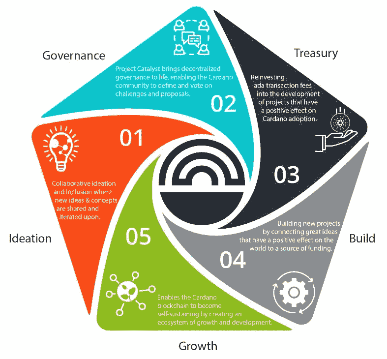

# 通过项目催化剂建立卡尔达诺生态系统

> 原文：<https://medium.com/coinmonks/building-the-cardano-ecosystem-through-project-catalyst-393a185fb49a?source=collection_archive---------9----------------------->

## 为卡尔达诺的建筑提供非 VC 网关

Image from IOHK Blog on Catalyst: [Source](https://iohk.io/en/blog/posts/2022/05/10/project-catalyst-a-virtuous-cycle-of-cardano-ecosystem-development-investing-in-great-ideas-to-make-positive-real-world-changes/)

看看 Project Catalyst，很容易得出结论，它是一家风险投资公司，但这与事实相差甚远。Project Catalyst，简称 Catalyst，是一个分散式平台，构建在 Cardano 生态系统中，旨在建立和实现一种渠道…