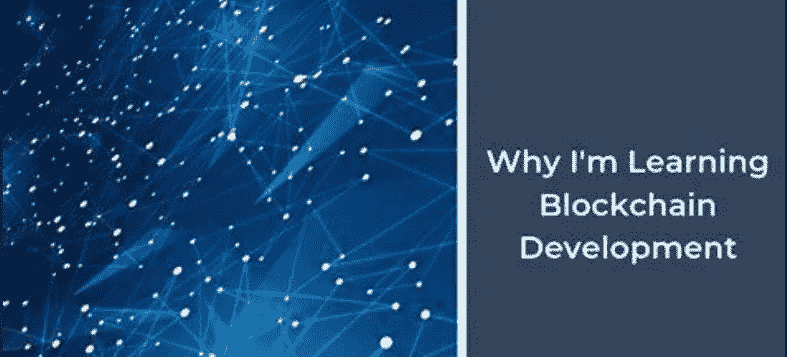
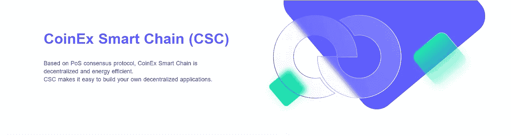

# 建筑与 CSC

> 原文：<https://medium.com/coinmonks/building-with-csc-50b708295727?source=collection_archive---------35----------------------->

## CSC 上的区块链开发(三)

## 为什么要学习区块链开发？

区块链是最新的技术干预，由于各种原因，它一直受到关注。然而，作为一个行业，区块链近年来表现出了强劲的增长势头，并对未来的增长做出了乐观的估计。区块链彻底改变了数字世界中的数据管理方法和传统的业务方式。凭借安全性和多功能性的显著优势，各种商业部门和政府都注意到了区块链的价值。

区块链很受欢迎，许多知名企业都采用了它。所以，这就是你应该追求区块链开发者工作的原因吗？在这里，我们概述了一些重要的原因，以消除你对区块链程序员职业前景的疑虑。

## 学习区块链的理由

1.  **前途光明的职业生涯—** 自从区块链作为运营加密货币网络的新概念被引入以来，它就越来越受欢迎。这反过来为训练有素的区块链专业人士创造了越来越多的就业机会。区块链专业人士的头衔有:*、区块链开发者、加密货币分析师、区块链顾问、区块链解决方案架构师、高级软件工程师(加密货币)、研究分析师、*等。每年，工资的大幅上涨都会激励更多的人在区块链地区接受培训和寻找工作。

*   **丰厚的薪水—** 个人的首要动机可能是区块链开发人员的薪水。候选人有理由担心区块链开发商的收入潜力。知道在为工作做准备的过程中付出努力和奉献之后，你会得到什么是正确的。有趣的是，区块链开发人员的平均年薪在 15 万美元到 17.5 万美元之间。有了这样一个有前途的薪水存根，很难忽视在区块链应用程序开发中追求职业生涯的命题。在未来几年，区块链将更加主流化，为人民创造更好的就业机会。

**2。连锁破坏—** 凭借点对点网络和受加密技术保护的分布式账本的突破性概念，区块链正在破坏现有的流程和链条。已建立的系统表明，必须有一个集中的权力机构来控制每一个潜在的操作和活动。但是有了区块链技术，就不需要中央权威机构，双方可以更快的速度安全地开展业务。这扰乱了银行系统和工业流程链。随着企业和组织未来工作方式的这一重大转变，它可能会为造福人类创造更多机会。

**3。对新技术的支持—** 区块链正在扩展，几乎支持当今流行的每一项新技术。区块链网络在速度、强度和效率方面都有很大提高。区块链提供了通用的基础设施，可以灵活地集成各种新旧技术。它在*投票、银行、商品交易、供应链管理(如上所述)、*等领域有多种应用。除此之外，区块链、智能合同和分布式账本系统的概念非常适用于*物联网(IoT)* 。

**4。高需求**——自问世以来，区块链不断吸引眼球，赢得信誉和声望。据统计，区块链的市场需求每年都在增长。这表明，在未来几年，区块链仍将是一个有就业机会和商业申请的领域。

**5。安全(数字)身份&网络安全**——除了不使用数字银行或交易服务的祖母和祖父，我们中几乎没有人会离开。这场数字革命也给臭名昭著的黑客提供了数百万种实施网络犯罪的可能性。这使得我们的数字身份不安全。许多黑客和欺诈事件被报道，黑客可以侵入系统，知道我们的 id，密码和其他细节来滥用它们。*区块链引入了一个严格的密码系统，在这个系统中，不可能对信息进行黑客攻击和访问。*

*   由于区块链是一个分散的分布式记录系统，我们的信息不会全部存储在一个中央位置。相反，它被分发给它的合法所有者，并使用加密方法进行保护。只有个人信息所属的人才能访问这些信息，并控制其他人对这些信息的使用。如果将重要和机密信息集中存储在该位置，黑客就更容易窃取这些信息。因此，通过实施区块链系统，人们的数字身份是不可能被破解的，并且操作/交易可以安全地发生。

**6。通用基础设施；有意义的变化—** 随着区块链数据记录系统和分布式分类账技术(DLT)的出现，一个新的通用基础设施层已经形成。我们的意思是，任何类型的企业或组织都可以使用区块链，DLT 有一个普遍的网络和数据存储基础设施。企业可以将区块链作为他们的主要操作系统，也可以将其作为一项附加技术。在任何情况下，区块链都可以作为一个通用层或基础设施，通过它可以将数据或信息从 A 点安全地传输到世界上任何地方的 B 点。

*   同样重要的是要注意到，基于区块链的解决方案有可能带来巨大的改变生活的变化。许多行业和领域，包括*医疗保健、房地产、航空、能源&资源、银行、计算、零售、*等。已经开始整合区块链作为他们的运营技术。作为一名区块链开发者，你可以贡献创新的解决方案，改变人们的生活质量。

**7。加密货币和 ico**——众所周知，比特币是第一种在 2009 年中期流行的加密货币。从那以后，它引起了一些严重的关注和流行，并导致了市场上更多类型的加密货币的引入。虽然，加密货币的合法性和可靠性仍然是一个有争议的话题。但如果你是那些对投资加密货币保持真正兴趣的人之一，你必须对区块链和 DLT 体系有一个透彻的了解。这是因为区块链是这些货币的基础系统，处理这些货币意味着必须使用区块链。如果你知道区块链是如何运作的，你就可以明智地投资。同样，学习区块链将有助于你更好地理解和入围 ico。智能合同正在改变获得金融服务的方式以及传统的借贷机制。

**8。透明度和改善治理—** 对任何一个国家的运转来说，最重要的因素是拥有一个透明和负责任的政府。在几乎所有的国家，治理都是不透明的，也就是说，公民不参与进程和决策。此外，他们无权查看记录和信息。*将区块链引入税收、选举、福利、医疗保健等政府系统。，透明度和合法性是可以实现的。*

像德、英、澳这样的国家已经在计划将区块链整合到他们的管理运作中，以确保税收遵从，存储数字记录，用于福利支付等等。鉴于迪拜已经成功地将区块链融入其官方运作，并成为第一个完全由区块链掌权的政府。

我们希望我们提供的理由清单能帮助你下定决心。很明显，区块链将成为一项被广泛接受的技术。这也将为大量新的职业机会打开闸门。因此，最好是乘着趋势波，在它持续的时候充分利用它。我相信你一定已经找到了问题的答案。

# CoinEx 智能链— CSC

*区块链(Blockchain)是一种分布式数字化账本技术，能够通过点对点网络实现合法且极其安全的交易。*区块链持续流行，在许多领域变得越来越有用。虽然我们强调了学习区块链发展的原因，但重要的是要记住哪个区块链最好。我们冒昧地为您推出 CoinEx 智能链——CSC

[CSC 是世界领先的区块链网络，为开发者和用户提供各种增值服务。CSC 是一个用于分散金融的分散高效的公共链。它可以为开发者提供一个高效、低成本的链上环境来运行去中心化智能合约应用(DApps)和存储数字资产。](https://www.coinex.org/?lang=en_US)

> 交易新手？尝试[加密交易机器人](/coinmonks/crypto-trading-bot-c2ffce8acb2a)或[复制交易](/coinmonks/top-10-crypto-copy-trading-platforms-for-beginners-d0c37c7d698c)