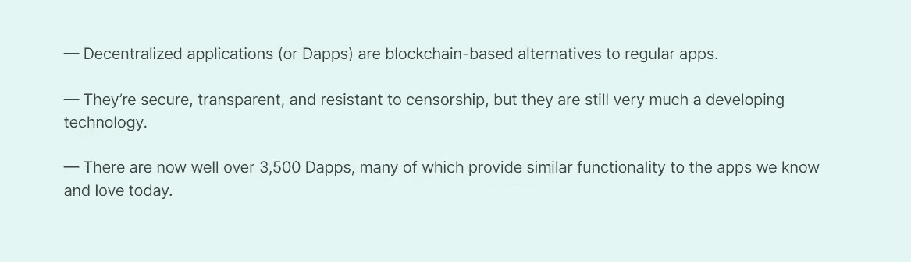
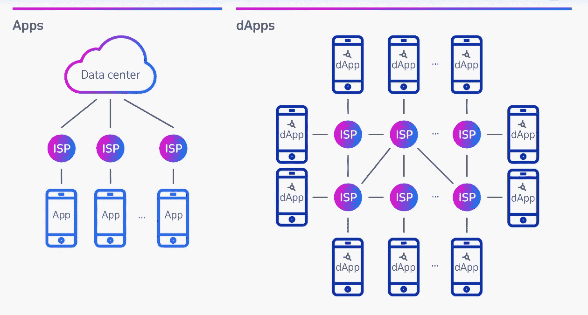

# 建筑与 CSC

> 原文：<https://medium.com/coinmonks/building-with-csc-701220543238?source=collection_archive---------40----------------------->

CSC 上的区块链开发(上)

你是一个对构建 DApps 感兴趣的开发者吗？这份高水平的 DApp 发展指南可以帮助你开始。DApps 开发不是一个简单的即插即用项目，它需要认真的编程。这个 DApp 开发指南并不打算涵盖它的细节，而是提供了一个高层次的步骤概述。它还在文章的第二部分提供了一个“参考资料”部分，指出了有助于简化 DApp 开发的各种工具。

分散式应用程序(dapp)是构建在分散式网络上的应用程序，结合了智能合约和前端用户界面。有了 CSC，智能合约就像开放 API 一样可访问且透明，因此您的 DApp 甚至可以包含其他人编写的智能合约。

# DApp 开发入门指南

1.  学会稳健
2.  获取您的区块链:CSC
3.  与区块链交流
4.  智能合约代码
5.  部署智能合同

***在我们深入上述细节之前，让我们先深入了解一下 DApps 和它们的各种好处***

## 什么是 DApps

DApp 是一个可以自主运行的应用程序，通常通过使用智能合同，运行在分散计算区块链或其他分布式分类帐系统上。然而，与传统的应用程序不同，dapp 在没有人工干预的情况下运行，并且不归任何一个实体所有，而是分发代表所有权的令牌。由于没有任何一个实体来控制系统，因此应用程序是分散的。

## **DApps 的运作方式**

当我们讨论 dApp 区块链连接时，深入了解 dApp 的设计非常重要。分散式应用程序包括前端和后端，这是它们设计中的两个重要组件。前端帮助与用户沟通，而后端代码基本上是一个智能合约。现在，智能合约是区块链回答“什么是 dApp”的地方

分散式应用程序的前端实际上是在应用程序的用户端执行的代码。它基本上充当用户和应用程序之间的通信接口。此外，dApps 的前端还包括一个提供不同功能的数字钱包。

数字钱包保持用户的私有和公共密钥的记录，用于认证目的。此外，数字钱包有助于与区块链互动，管理区块链地址和密钥。dApp 前端的数字钱包也有助于触发后端或智能合同的执行。

分散式应用程序的后端使用运行在应用程序服务器端的智能契约带来了有趣的变化。你在区块链上有 dApps 的后端，在那里它被执行，dApps 的后端本质上是开源的。智能合同执行特别定义的功能，而不管它们周围的条件如何。

## DApps 的特性

*   **去中心化**——你有没有试过找到你最喜欢的应用程序，却发现它在你所在的地区已经被屏蔽或关闭？这就是所谓的审查，这是许多国家的一个主要问题。另一方面，Dapp 运行在一个分散的区块链网络上，就像 CSC 一样——它可以由数千甚至数百万个节点(或计算机)托管，每个节点都有 Dapp 的备份。它们不是由一个实体控制的！Dapps 在区块链 CSC 上运行，CSC 是一个开放的公共分散平台，没有任何个人或团体拥有控制权。
*   **不信任**——通常在完成一项交易或交易时，需要一份合同来确保你的交易对手信守交易——也就是说，除非你*真的*信任他们。有了 Dapps，这种信任不再是等式的一部分——他们本质上是不信任的；因为它们使用智能合约来自动执行您和其他用户达成的任何协议
*   **确定性**—dapp 执行相同的功能，而不管它们执行的环境如何。
*   **图灵完成** —给定所需的资源，Dapps 可以执行任何操作。
*   **隔离的**—dapp 在虚拟环境中执行，因此如果智能合约有缺陷，它不会妨碍区块链网络的正常运行。
*   **开源——与当今大多数消费者应用程序一样，许多 Dapps 的代码都是开源的。这意味着任何有技能或愿望的人都可以检查它的内部工作，以确保没有隐藏的危险。这使得准确了解一个应用程序做什么，它使用什么数据，它需要什么权限等变得容易——这通常不是普通应用程序的情况。**
*   **透明** —基于区块链，Dapp 有一个永久的记录，它的变化历史，以及它所做的一切。这意味着，如果出现错误，很容易准确定位错误发生的时间、受影响的人以及错误是如何发生的，例如，错误是由开发人员的错误、漏洞还是其他原因造成的。这使它们变得超级透明，同时也激励开发人员为您和其他用户的最大利益而工作

## web 应用和 Dapps 的区别

任何 web 应用程序都包含两个基本元素:前端和后端。构建良好的去中心化应用程序的界面看起来与任何 web 应用程序没有任何不同。两者的关键区别在于后端。标准的 web 应用程序使用集中的 web 服务器来存储和处理所有的数据。然而，Dapp 后端使用区块链。这意味着 Dapps 不是通过巨大的集中式服务器传输数据，而是在数千台机器之间分配事务负担。

## DApps 开发的优势

*   **零停机时间** —一旦智能合同部署在区块链上，整个网络将始终能够为希望与合同互动的客户提供服务。因此，恶意行为者不能发起针对单个 dapps 的拒绝服务攻击。
*   **隐私** —你不需要提供真实世界的身份来部署 dapp 或与之交互。
*   **抵制审查**——网络上没有任何一个实体能够阻止用户提交交易、部署 dapps 或从区块链读取数据。
*   **完全的数据完整性** —由于加密原语，存储在区块链上的数据是不可变的、无可争议的。恶意行为者无法伪造已经公开的交易或其他数据。
*   **不可信计算/可验证行为** —智能合同可以被分析，并保证以可预测的方式执行，而无需信任中央机构。这在传统模型中是不成立的；例如，当我们使用网上银行系统时，我们必须相信金融机构不会滥用我们的金融数据、篡改记录或遭到黑客攻击。
*   **隐私—**去中心化应用的最大优势是匿名性，这明显加强了对“什么是 dApp”的理解。您会发现大部分分散式应用程序并不要求用户的真实身份。

## DApps 使用案例

Dapps 执行与传统 web 应用程序相同的功能，甚至更多。在过去的几年里，Dapps 的势头越来越猛，现在已经有数以千计的 Dapps，涵盖了大量的利基市场和行业。如今，你可以找到许多常规应用程序的 Dapp 替代品。

**交易**:像 [Oneswap](https://www.oneswap.net/cet/) 和 [GreenDEX](https://greendex.exchange/) 这样的 Dapps 允许用户安全匿名地交易和交换他们的加密货币。

**社交媒体:**社交媒体也获得了 Dapp 待遇！包括[follow me](https://fmt.lol/)——一种分散的协议，允许内容创作者在开放、完全分散、可互操作的区块链上发起和管理他们的 SNS 赠品活动。

**游戏:**有大量基于 Dapp 的游戏，包括[欧米茄俱乐部](https://omegaclub.finance/)、[真正的密码玩家](https://www.cryptoearnersreal.online/)、 [OwnDAO](https://owl.games/) 等等。

**娱乐:**Dapp 行业也有自己的 YouTube 等价物，被称为[DTube](https://d.tube/)；区块链支持的视频分享平台。

**NFT** :各种 NFT 交易平台也纷纷涌现，如 [CSC frog](https://cscfrogs.com/mint.html) 、 [Byteblock](https://byteblock.io/) 和 [Neutronium](http://www.neutroniumcc.org/) 。

与一般的 app 通常需要下载安装才能使用(除非是 web app)不同，Dapp 一般是通过 Dapp 浏览器访问，不需要安装。

理解一个分散式应用程序的诀窍是识别区块链如何作为其后端的一个重要组件。dApps 不是一个掌控一切的中央实体，而是一个智能合约来促进交易。然而，dApps 也引入了许多挫折，例如对集中化和网络拥塞的担忧。选择一个高效的区块链作为基础是非常重要的

# CoinEx 智能链— CSC

CoinEx 智能链——CSC 是一个完全去中心化的高效公共智能链。CoinEx Smart Chain (CSC)基于`[CPoS](https://docs.coinex.org/#/en-us/consensus)` consensus 协议，是一个支持高性能交易的智能合约链，它还可以为开发人员提供一个高效、低成本的链上环境来运行分散的智能合约应用程序(DApps)和存储数字资产。

既然我们知道了 DApp 是什么，那就更容易理解它们的内部运作，它们是如何建造的，并开始开发我们自己的 DApp。加入本文的第 2 部分，了解 DApp 开发。

> 交易新手？试试[加密交易机器人](/coinmonks/crypto-trading-bot-c2ffce8acb2a)或者[复制交易](/coinmonks/top-10-crypto-copy-trading-platforms-for-beginners-d0c37c7d698c)