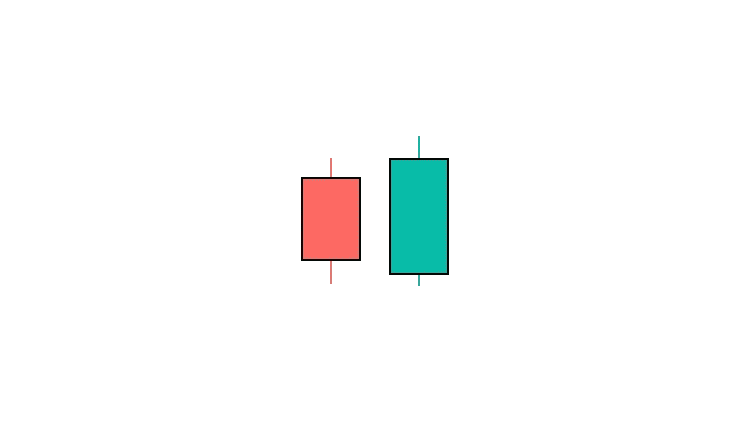

# 多头吞没烛台模式——如何交易

> 原文：<https://medium.com/coinmonks/bullish-engulfing-candlestick-pattern-how-to-trade-them-a1388403aaae?source=collection_archive---------12----------------------->

Bullish engulfing pattern

这是一个具有看涨含义的两天反转模式。这种模式的第一天是一个红色烛台，第二天是一个更大的绿色烛台，打开时低于前一根蜡烛，关闭时高于第一根蜡烛。

# 如何识别？

*   这种图案的第一支蜡烛有一个较小的蜡烛体。
*   第二个烛台完全吞没了第一个烛台。
*   第二个烛台价格比第一天低，比第一天高。

# 如何交易？

看涨吞没形态是最可靠的烛台模式之一。这是一个强烈的信号，表明空头正在失去控制，多头正在接管。你可以这样交易:

1.  在一段时间的看跌后，寻找形成的模式。吞没蜡烛应该是一个大的，大胆的蜡烛，完全吞没前一根蜡烛。
2.  确认形态后，输入多头仓位。当下一根蜡烛收在吞没蜡烛的高点以上时，这个模式就被确认了。
3.  在吞没蜡烛线的低点下方设置止损。
4.  利润目标可以设定在之前的阻力位或斐波纳契水平。

> 交易新手？试试[加密交易机器人](/coinmonks/crypto-trading-bot-c2ffce8acb2a)或者[复制交易](/coinmonks/top-10-crypto-copy-trading-platforms-for-beginners-d0c37c7d698c)