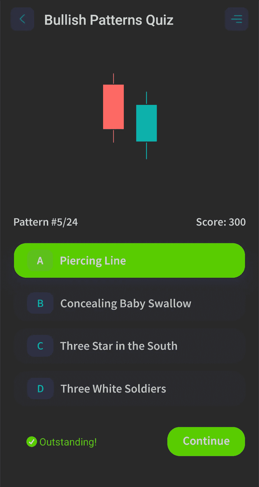

# 看涨的 Hamari 烛台模式——如何交易

> 原文：<https://medium.com/coinmonks/bullish-hamari-candlestick-pattern-how-to-trade-them-4fa4930f149f?source=collection_archive---------13----------------------->

Bullish Harami Candlestick Pattern

看涨的哈拉米烛台模式是在下降趋势底部出现的反转模式。这种模式的第一天是一根大蜡烛体的熊市蜡烛线，第二天是一根小蜡烛体的牛市蜡烛线。作为动能改变的一个标志，小的看涨蜡烛线“跳空”打开，接近前一根蜡烛线的中间位置。一些投资者可能会将看涨的 harami 视为一个良好的迹象，表明他们应该进入一只股票的多头头寸。

# 如何识别？

*   这种模式的第一根蜡烛线是一根熊市蜡烛线，显示出熊市的含义。
*   在这种模式的第二根蜡烛线中，价格从前一根蜡烛线的低点跳起来，以略高的价格开盘。
*   第二根蜡烛线不超过第一天看跌蜡烛线的 25%。

# 如何交易它们？

要交易看涨的哈拉米形态，你要等待第二根蜡烛线形成，然后在第三根蜡烛线开盘时进入多头。你的止损将被放在第二根蜡烛线的低点之下，你的目标将是前一个高点。

# 建议

对了，我只是想分享一下这个叫[烛台模式——股票](https://play.google.com/store/apps/details?id=com.candlestickpatterns)的 app。这个应用程序让你学习不同种类的烛台模式，并采取具有挑战性的测验。目前，该应用程序有 50 多个烛台图案可供学习。该应用程序为您提供了每种烛台模式的描述，如何识别它们，以及如何交易它们。

> 交易新手？试试[密码交易机器人](/coinmonks/crypto-trading-bot-c2ffce8acb2a)或者[复制交易](/coinmonks/top-10-crypto-copy-trading-platforms-for-beginners-d0c37c7d698c)