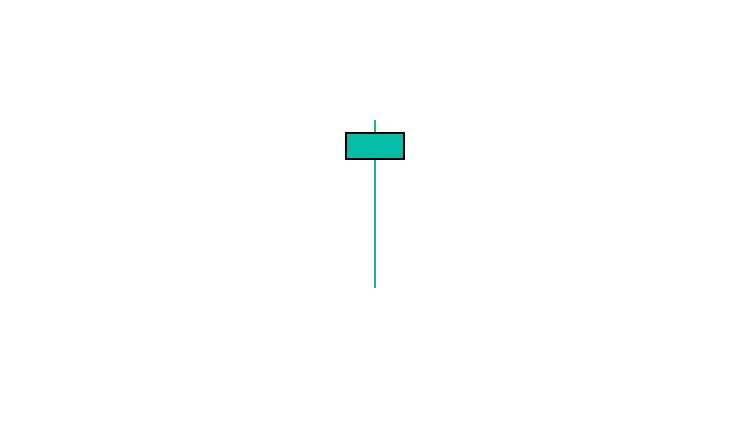

# 看涨锤子烛台模式:如何交易他们

> 原文：<https://medium.com/coinmonks/bullish-hammer-candlestick-pattern-how-to-trade-71b20143b929?source=collection_archive---------11----------------------->

Bullish Hammer

看涨锤子是一个一天的烛台模式，标志着市场转向看涨趋势。股价下跌后会出现锤子，表明市场正试图触底。

在交易时段，卖方压低价格后形成锤子，随后是强大的购买压力，推动价格回升。

# 如何识别？

*   看起来像字母 T
*   开盘价和收盘价非常接近，形成一个非常小的蜡烛体
*   下阴影至少是它身体大小的两倍

# 如何交易？

看涨锤子烛台模式是一个强有力的信号，可以用来交易各种市场。这里有一些关于如何交易这种模式的想法:

1.  在一段时间的价格下跌后，寻找看涨的锤子形态。这表明市场已经准备好反转并走高。
2.  当蜡烛线收在看涨锤子的高点上方时，进入多头仓位。
3.  在看涨锤子的低点下方设置止损。
4.  把前一个高点作为你止盈的目标。
5.  你也可以在更高的时间框架内交易看涨锤子形态，比如日线图或周线图。这可以让你对市场有一个更长远的看法，帮助你更长时间地在交易中获胜。

> 交易新手？试试[加密交易机器人](/coinmonks/crypto-trading-bot-c2ffce8acb2a)或者[复制交易](/coinmonks/top-10-crypto-copy-trading-platforms-for-beginners-d0c37c7d698c)