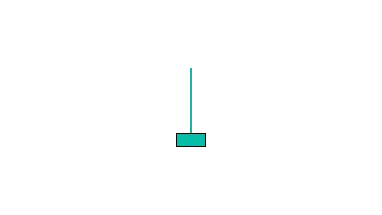

# 看涨倒锤烛台模式——如何交易

> 原文：<https://medium.com/coinmonks/bullish-inverted-hammer-candlestick-pattern-how-to-trade-them-59d17ee27316?source=collection_archive---------19----------------------->

Bullish inverted hammer

倒锤是一种看涨反转形态，可以在下跌趋势的底部找到。它是在开、高、闭大致相等时产生的，有一个小的真实体和一个长的上影。长长的上影线表明空头控制了大部分时间，但是多头能够在接近收盘时推动价格回升，形成锤子形状。

倒锤子是看涨反转形态，这意味着它可以用来标志下跌趋势的结束和上涨趋势的开始。然而，在交易前等待确认是很重要的，因为这种模式偶尔会出现在波动的市场中。确认倒锤的最好方法是在接下来的交易中使用看涨的烛台。

# 如何识别？

*   很少或没有下阴影。
*   开合价格非常接近，形成一个非常小的烛台主体。
*   上影大约是它身体的两倍大。

# 如何交易？

如果你在下跌趋势的底部看到一个倒锤，这是一个好主意，进入一个多头头寸。在倒锤烛台的低点下方设置止损，在近期高点上方寻找目标价。

> 交易新手？试试[加密交易机器人](/coinmonks/crypto-trading-bot-c2ffce8acb2a)或者[复制交易](/coinmonks/top-10-crypto-copy-trading-platforms-for-beginners-d0c37c7d698c)