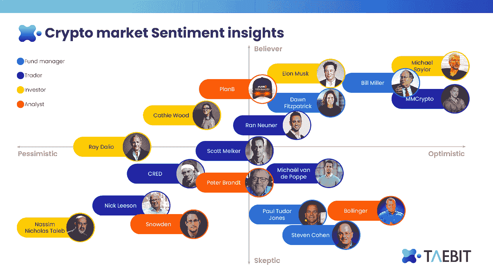
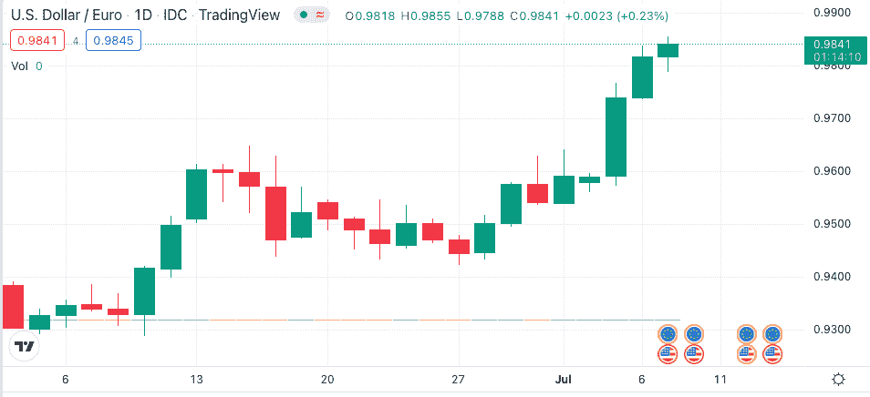
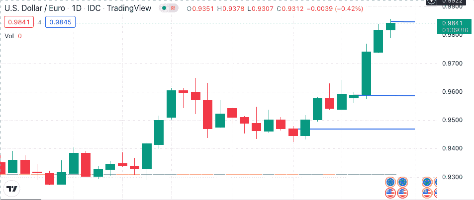

# 多头 vs .空头:驾驭动荡的市场

> 原文：<https://medium.com/coinmonks/bulls-vs-bears-navigating-a-volatile-market-26ea286250b6?source=collection_archive---------39----------------------->

**当前的加密市场情绪**

由于接近创纪录的通胀、供应链扭曲、劳动力短缺、地缘政治冲突和政治不确定性，所有资产类别的全球市场继续经历高度波动——加密货币行业也不例外。

6 月份充斥着来自业内最受欢迎的投资者和思想领袖的各种强烈观点。

像**迈克尔·塞勒**和**埃隆·马斯克**这样的巨头加倍了他们的信念，塞勒额外购买了 [480 个比特币](https://www.coindesk.com/business/2022/06/29/michael-saylors-microstrategy-purchased-another-10m-of-bitcoin-over-past-two-months/)，马斯克宣布他无聊的公司现在将接受 [Dogecoin 作为支付方式](https://www.businessinsider.com/elon-musk-boring-company-accepts-payment-dogecoin-vegas-2022-7)。萨尔瓦多总统 Nayib Bukele 为萨尔瓦多购买了额外的 80 比特币，同样也表达了他对加密技术未来的信心。散文家**纳西布·尼古拉斯·塔勒布**坚持他长期以来的立场，重申他认为[比特币存在投机泡沫](https://www.cnbc.com/2021/07/13/black-swan-author-nassim-taleb-says-bitcoin-is-worth-zero.html)而**彼得·希夫**认为[黄金和白银等商品是唯一真正的价值储存手段](https://www.thestreet.com/investing/peter-schiff-crypto-tweets)。

**CeFi 下降&DeFi 上升**

通常很难穿透数字噪音，发现影响深远的头条新闻背后的真相。在 6 月份，加密行业经历了知名加密对冲基金和风险投资公司 **Three Arrows Capital** 、大型加密货币贷款公司 **Voyager** 、零售和机构加密货币经纪公司 **BlockFi** 以及加密借贷平台 **Celsius** 的破产。虽然这些公司的失败给加密货币市场带来了冲击波，但它也证明了 DeFi 的价值，并确认代码就是法律。

**“上述秘密经营的 CeFi 公司的倒闭很大程度上是由于抵押不足甚至无担保的贷款无处不在，而且没有足够的风险管理”——Aidan Newell**

在最近的牛市中，CeFi 公司对向其他机构出借大量资金感到放心，因为流动性充足，利率有吸引力，而且似乎每项加密资产都处于高速增长轨道。一旦美联储多次加息，传统金融资产就失宠了；流动性枯竭，这些公司发现自己正面临一场危机，而他们的工具箱里几乎没有或根本没有预防措施。这些内部风险管理程序不透明的集中式平台本质上是错误管理用户的资金，希望获得超额回报。在同一时期，分散式协议如 **Uniswap v3、Curve v2、MakerDAO** 和 **AAVE** 功能完善，在保护用户方面非常有效。

**在这种情况下，DeFi 协议的自动化和透明性是代码的强大和去中心化重要性的光辉典范。**

**在熊市期间管理投资组合**

熊市交易需要纪律和根据宏观经济趋势调整市场策略的能力。在这里，我们将深入探讨熊市期间管理投资组合的三个关键方面，然后重点介绍一些使用 [Taebit](https://taebit.io/) 获利的具体方法。

**减少头寸规模**

随着市场波动性的增加和价格波动变得更加激进，减少头寸规模是恰当的。波动性是对给定证券或货币对的回报率离差的统计度量。在高度不稳定的时期，资产可能会快速大幅变动。通过减少头寸规模，你可以通过捕捉这种波动性，用更少的资本获得超额回报。例如，如果你的交易方向是正确的，在 4 倍于正常波动的市场周期中，用 50%的正常头寸，你可以获得 2 倍的利润。此外，较小的仓位可以让你在交易时更加冷静。

**机会成本**

这是最容易被忽视的熊市交易策略之一，但它有助于管理情绪和保持纪律。机会成本代表投资者在选择一个方案时错过的潜在利益。作为交易者，你的工作是在快速波动的市场中寻找具有优势和盈利能力的机会。从长远来看，亏损的头寸往往持有的机会成本不值得潜在的利润。投资者应该保留一份新机会的清单，以克服情绪偏见，避免留在亏损的交易中。相反，这些新的机会可能会提供一个完美的切入点，一个新的立场，将导致利润。

> 交易新手？试试[加密交易机器人](/coinmonks/crypto-trading-bot-c2ffce8acb2a)或者[复制交易](/coinmonks/top-10-crypto-copy-trading-platforms-for-beginners-d0c37c7d698c)

**再活一天交易**

交易的时候要时刻把长远放在心上。正如巴菲特所说。“市场低迷不会困扰我们。这是一个以优惠价格增加我们对大公司所有权的机会”。外汇市场也是如此。对于那些希望从市场波动加剧中获利的人来说，每天都有绝佳的机会。虽然交易是令人兴奋的，但重要的是要记住，一笔交易不应该大到让你完全出局。观察市场的一个好方法是把每一笔交易都看作是一千笔无关紧要的小交易中的一笔，每一笔交易都让你更接近你的目标。

**在波动时期使用 Taebit 进行交易的实际例子**

2022 年，由于越来越担心欧元区 19 国可能陷入衰退，欧元兑美元汇率下跌了 8%。欧元区 6 月份经济增长放缓至 16 个月低点，采购经理人指数(PMI)从 5 月份的 54.8 大幅降至 6 月份的 52，商品生产两年来首次下降。高通胀给家庭带来压力，导致非必要支出减少，由于生活费用危机，制造业和服务业的增长都有所下降，地缘政治紧张局势造成的供应链制约导致燃料价格上涨和全面生产延迟。

作为一个交易者，这个消息将表明欧元和美元之间的关系现在处于疲软状态。美国正面临许多同样的问题，但美联储(federal reserve)已大幅加息以抗击通胀，美国制造业在面临可能的衰退时仍相当强劲。

Source: TradingView

考虑到推动每种货币的潜在催化剂，欧元兑美元的地位显而易见。交易员可以选择通过 Taebit 外汇市场建立头寸，买入美元，卖出相应的欧元。实质上是押注美元相对于欧元走强的交易。

Source: TradingView

在 Taebit DEX 上，用户将能够通过直接的实时数据传输进行加密货币交易，这些加密货币与它们的法定货币以数字方式联系在一起。因此，开立美元相对欧元的多头头寸可以有效执行，利润可以分多次兑现，然后立即转换回您选择的资产。

> ***更从 TAEBIT*** *☯️*
> 
> *白皮书:*
> 
> **推特:*[*https://twitter.com/TaebitDEX*](https://twitter.com/TaebitDEX)*
> 
> **不和:*[【https://discord.gg/gBjqjFXmn2】T21](https://discord.gg/gBjqjFXmn2)*
> 
> **电报:*[*https://t.me/+4kkLYgMPtZw3NjJ*](https://t.me/+4kkLYgMPtZw3NjJl)*

> *交易新手？尝试[加密交易机器人](/coinmonks/crypto-trading-bot-c2ffce8acb2a)或[复制交易](/coinmonks/top-10-crypto-copy-trading-platforms-for-beginners-d0c37c7d698c)*